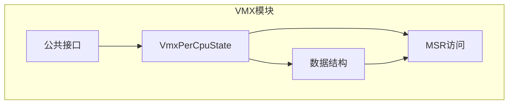
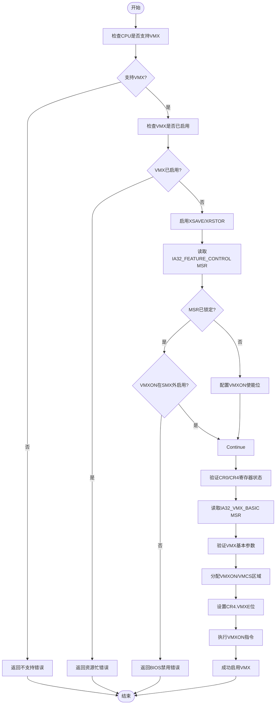
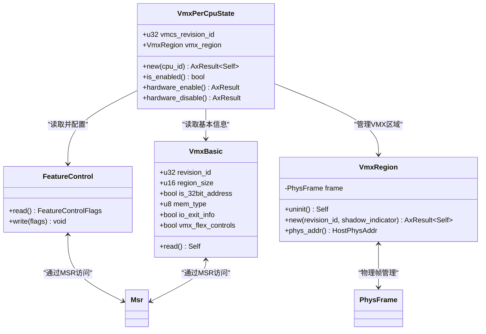
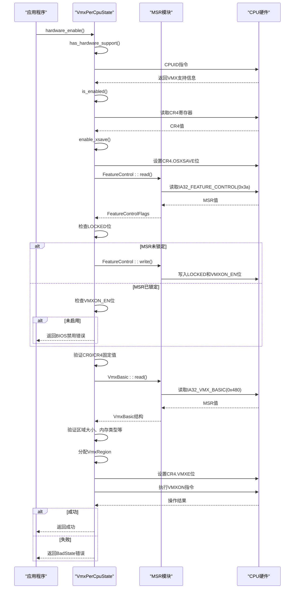
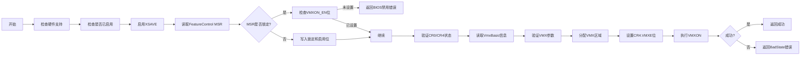
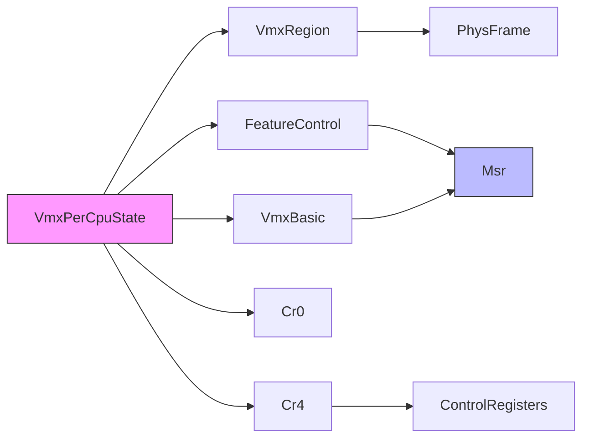

# Per-CPU状态管理API

<cite>
**本文档引用的文件**
- [percpu.rs](file://src/vmx/percpu.rs)
- [structs.rs](file://src/vmx/structs.rs)
- [msr.rs](file://src/msr.rs)
- [mod.rs](file://src/vmx/mod.rs)
</cite>

## 目录
1. [简介](#简介)
2. [项目结构](#项目结构)
3. [核心组件](#核心组件)
4. [架构概述](#架构概述)
5. [详细组件分析](#详细组件分析)
6. [依赖分析](#依赖分析)
7. [性能考虑](#性能考虑)
8. [故障排除指南](#故障排除指南)
9. [结论](#结论)

## 简介
`VmxPerCpuState`模块为每个逻辑CPU核心提供虚拟机扩展（VMX）功能的权威管理。该模块实现了RAII（资源获取即初始化）设计原则，确保在对象生命周期结束时自动禁用VMX操作模式，从而维护系统安全。本API文档详细描述了如何检测CPU对VMX特性的支持、初始化VMXON与VMCS区域、以及在多核环境中正确配置VMX操作。

## 项目结构
该模块位于x86_vcpu仓库的vmx子目录中，采用分层架构设计，将硬件抽象、数据结构和控制指令分离。

**图表来源**
- [percpu.rs](file://src/vmx/percpu.rs#L1-L220)
- [structs.rs](file://src/vmx/structs.rs#L1-L470)

**章节来源**
- [percpu.rs](file://src/vmx/percpu.rs#L1-L50)
- [mod.rs](file://src/vmx/mod.rs#L1-L35)

## 核心组件
`VmxPerCpuState`是管理单个CPU核心VMX状态的核心结构体。它负责检测硬件支持、分配内存区域、启用VMX模式，并在析构时确保安全关闭。

**章节来源**
- [percpu.rs](file://src/vmx/percpu.rs#L1-L220)
- [structs.rs](file://src/vmx/structs.rs#L1-L470)

## 架构概述
该模块遵循严格的初始化序列，确保在启用VMX模式前满足所有硬件和软件要求。

**图表来源**
- [percpu.rs](file://src/vmx/percpu.rs#L50-L150)
- [structs.rs](file://src/vmx/structs.rs#L200-L300)

## 详细组件分析

### VmxPerCpuState创建过程分析
`create()`静态方法（在Rust中为`new()`和`hardware_enable()`）执行一系列关键步骤来准备CPU进入VMX模式。

#### 创建流程类图

**图表来源**
- [percpu.rs](file://src/vmx/percpu.rs#L1-L220)
- [structs.rs](file://src/vmx/structs.rs#L1-L470)

#### VMX启用序列图

**图表来源**
- [percpu.rs](file://src/vmx/percpu.rs#L50-L150)
- [msr.rs](file://src/msr/msr.rs#L1-L187)

**章节来源**
- [percpu.rs](file://src/vmx/percpu.rs#L50-L150)
- [structs.rs](file://src/vmx/structs.rs#L200-L300)

### enable_vmxe实例方法分析
`enable_vmxe()`方法（在`hardware_enable`中实现）负责全局启用VMX操作模式。

**图表来源**
- [percpu.rs](file://src/vmx/percpu.rs#L100-L150)

## 依赖分析
该模块与其他组件存在明确的依赖关系，确保了良好的模块化设计。

**图表来源**
- [percpu.rs](file://src/vmx/percpu.rs#L1-L220)
- [structs.rs](file://src/vmx/structs.rs#L1-L470)
- [msr.rs](file://src/msr/msr.rs#L1-L187)

**章节来源**
- [percpu.rs](file://src/vmx/percpu.rs#L1-L220)
- [msr.rs](file://src/msr/msr.rs#L1-L187)

## 性能考虑
该模块的设计考虑了性能因素：
- 使用静态方法避免不必要的实例化开销
- 在初始化时一次性验证所有硬件约束
- 采用零成本抽象，Rust代码直接映射到硬件指令
- 内存分配在初始化阶段完成，避免运行时开销

## 故障排除指南
以下是常见问题及其解决方案：

| 错误类型 | 原因 | 解决方案 |
|---------|------|---------|
| Unsupported: CPU does not support feature VMX | CPU不支持VMX特性 | 更换支持虚拟化的CPU |
| Unsupported: VMX disabled by BIOS | BIOS禁用了VMX | 进入BIOS设置启用Intel VT-x |
| BadState: host CR0 is not valid in VMX operation | CR0寄存器状态不符合VMX要求 | 确保操作系统正确配置控制寄存器 |
| ResourceBusy: VMX is already turned on | VMX已被其他hypervisor启用 | 关闭现有虚拟化软件或确保独占访问 |

**章节来源**
- [percpu.rs](file://src/vmx/percpu.rs#L70-L150)
- [definitions.rs](file://src/vmx/definitions.rs#L1-L274)

## 结论
`VmxPerCpuState`模块提供了安全、可靠的VMX模式管理机制。通过严格的RAII设计原则，确保了资源的正确管理和系统的安全性。每个CPU核心必须独立创建实例的设计决策，保证了多核环境下的正确性和隔离性。该API为构建高性能虚拟化解决方案提供了坚实的基础。