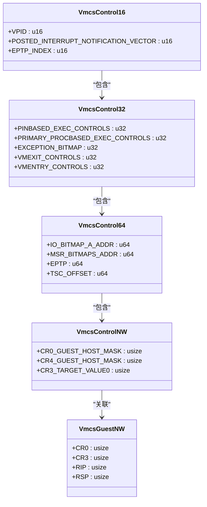
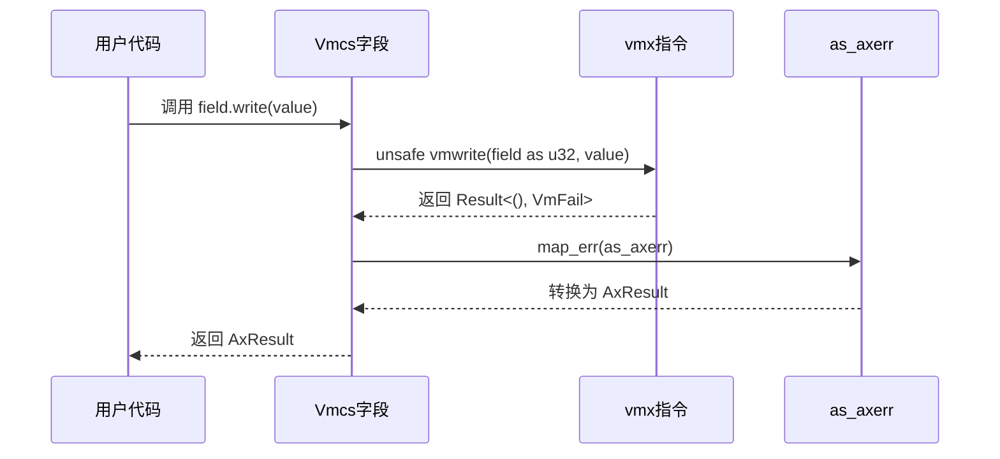
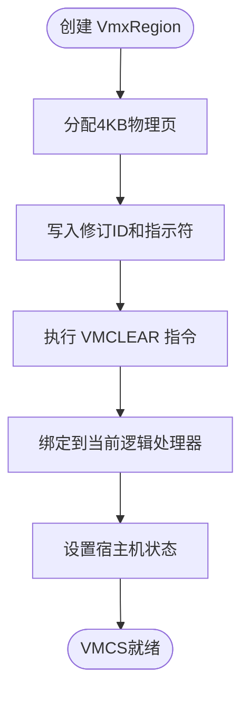

# VMCS操作API

<cite>
**本文档引用的文件**
- [vmcs.rs](file://src/vmx/vmcs.rs)
- [vcpu.rs](file://src/vmx/vcpu.rs)
- [structs.rs](file://src/vmx/structs.rs)
- [instructions.rs](file://src/vmx/instructions.rs)
- [definitions.rs](file://src/vmx/definitions.rs)
</cite>

## 目录
1. [简介](#简介)
2. [VMCS结构体与字段分类](#vmcs结构体与字段分类)
3. [安全访问机制](#安全访问机制)
4. [初始化与生命周期管理](#初始化与生命周期管理)
5. [控制字段配置示例](#控制字段配置示例)
6. [错误处理与调试](#错误处理与调试)

## 简介
`Vmcs`（虚拟机控制结构）是Intel VT-x技术的核心数据结构，用于存储虚拟机状态、控制虚拟化行为并管理VM-exit事件。本API文档详细说明了`Vmcs`相关类型的实现细节，包括字段访问的安全封装、处理器控制配置、生命周期管理以及错误处理机制。

## VMCS结构体与字段分类

### 字段枚举类型
VMCS字段根据其宽度和用途被划分为多个枚举类型，每种类型对应不同的硬件寄存器范围：



**图源**
- [vmcs.rs](file://src/vmx/vmcs.rs#L44-L485)

#### 控制字段
- **16位控制字段**：如`VPID`（虚拟处理器标识符），用于优化TLB刷新。
- **32位控制字段**：关键执行控制，如`CTRL_PIN_BASED_VM_EXEC_CONTROL`（基于引脚的VM执行控制）、`CTRL_CPU_BASED_VM_EXEC_CONTROL`（基于处理器的VM执行控制）等。
- **64位控制字段**：指向外部数据结构的地址，如I/O位图、MSR位图和EPT指针。
- **自然宽度控制字段**：用于CR0/CR4的掩码和影子值，影响权限检查。

#### 客户机状态字段
- **自然宽度客户机字段**：直接反映客户机CPU状态，如`GUEST_RIP`（客户机指令指针）、`GUEST_RSP`（堆栈指针）、`GUEST_CR3`（页表基址）等。

**章节来源**
- [vmcs.rs](file://src/vmx/vmcs.rs#L44-L485)

## 安全访问机制

### read_field() 与 write_field() 封装
对VMCS字段的读写通过`vmread`和`vmwrite`汇编指令完成，Rust代码使用宏进行安全封装，防止直接调用底层指令。

```rust
// 宏定义确保类型安全和错误转换
vmcs_read!(VmcsControl32, u32);
vmcs_write!(VmcsControl32, u32);
```

#### 字段编码规则
每个字段枚举成员的值为其在VMCS中的32位编码，例如：
- `PINBASED_EXEC_CONTROLS = 0x4000`
- `PRIMARY_PROCBASED_EXEC_CONTROLS = 0x4002`
- `GUEST_RIP = 0x681E`

这些编码由Intel SDM规范定义，确保与硬件兼容。

#### 访问权限检查
所有`read()`和`write()`方法返回`AxResult<T>`，内部调用`as_axerr`将`x86::vmx::VmFail`转换为`axerrno::AxError`，实现了统一的错误处理路径。



**图源**
- [vmcs.rs](file://src/vmx/vmcs.rs#L44-L94)
- [mod.rs](file://src/vmx/mod.rs#L30-L35)

**章节来源**
- [vmcs.rs](file://src/vmx/vmcs.rs#L44-L94)

## 初始化与生命周期管理

### Vmcs::new() 初始化流程
`Vmcs`的初始化涉及物理内存分配、区域清除和活动状态绑定。



#### 关键步骤
1. **区域分配**：通过`PhysFrame::alloc_zero()`分配一个4KB对齐的物理页。
2. **写入修订ID**：将`IA32_VMX_BASIC[31:0]`的修订号写入页首部。
3. **VMCLEAR**：调用`vmclear`指令将该区域标记为“已清除”，准备后续的VMLAUNCH。
4. **绑定处理器**：使用`vmptrld`加载VMCS指针，使其成为当前处理器的活动VMCS。

### 多核环境下的VMCS关联性
每个逻辑处理器在同一时间只能有一个活动的VMCS。当VCPU切换时，必须先调用`vmclear`解除当前绑定，再通过`vmptrld`加载新的VMCS。

#### 切换时机
- **上下文切换**：调度器决定运行另一个VCPU时。
- **系统调用或中断**：宿主机需要接管控制权时。

#### 性能影响
频繁的VMCS切换会导致性能下降，因为：
- `vmptrld`和`vmclear`是相对昂贵的指令。
- 缓存和TLB可能因模式切换而失效。

**章节来源**
- [structs.rs](file://src/vmx/structs.rs#L10-L35)
- [vcpu.rs](file://src/vmx/vcpu.rs#L175-L185)

## 控制字段配置示例

### 配置处理器控制字段以启用VM-exit拦截
以下代码片段演示如何配置`PRIMARY_PROCBASED_EXEC_CONTROLS`以拦截特定事件。

```rust
// 启用中断窗口退出
pub fn set_interrupt_window(&mut self, enable: bool) -> AxResult {
    let mut ctrl = VmcsControl32::PRIMARY_PROCBASED_EXEC_CONTROLS.read()?;
    let bits = vmcs::controls::PrimaryControls::INTERRUPT_WINDOW_EXITING.bits();
    if enable {
        ctrl |= bits;
    } else {
        ctrl &= !bits;
    }
    VmcsControl32::PRIMARY_PROCBASED_EXEC_CONTROLS.write(ctrl)?;
    Ok(())
}
```

此函数修改了主处理器基于的VM执行控制，使得当`RFLAGS.IF=1`且无其他阻塞时，在任何指令开始时都会发生VM-exit。

**章节来源**
- [vcpu.rs](file://src/vmx/vcpu.rs#L449-L465)

## 错误处理与调试

### 可能的错误类型
| 错误类型 | 描述 | 触发条件 |
|---------|------|--------|
| InvalidField | 无效的VMCS字段编码 | 使用了未定义或保留的字段编号 |
| VmFailInvalid | VMCS指针无效 | `vmptrld`或`vmclear`传入了非法物理地址 |
| VmFailValid | VM指令失败（有详细原因） | 如VM-entry时控制字段不合法 |

### 调试建议
1. **检查错误码**：调用`instruction_error()`获取详细的VM指令错误信息。
2. **验证字段值**：确保写入的控制字段值符合MSR中`IA32_VMX_*_CTLS`规定的允许范围。
3. **状态一致性**：确认在`VMLAUNCH`前VMCS处于“已清除”状态，在`VMRESUME`前处于“已启动”状态。

```rust
pub fn instruction_error() -> VmxInstructionError {
    VmcsReadOnly32::VM_INSTRUCTION_ERROR.read().unwrap().into()
}
```

**章节来源**
- [definitions.rs](file://src/vmx/definitions.rs#L0-L30)
- [vmcs.rs](file://src/vmx/vmcs.rs#L447-L485)