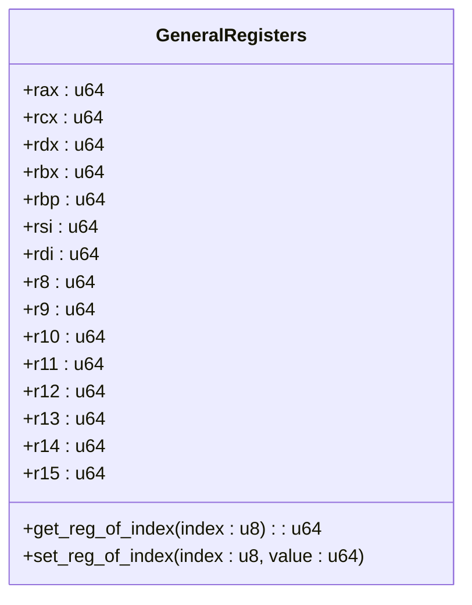

# vCPU控制API

<cite>
**本文档中引用的文件**  
- [vcpu.rs](file://src/vmx/vcpu.rs)
- [definitions.rs](file://src/vmx/definitions.rs)
- [vmcs.rs](file://src/vmx/vmcs.rs)
- [mod.rs](file://src/regs/mod.rs)
- [accessors.rs](file://src/regs/accessors.rs)
</cite>

## 目录
1. [VmxVcpu结构体概述](#vmxvcpu结构体概述)
2. [构造函数new()参数详解](#构造函数new参数详解)
3. [run()方法行为分析](#run方法行为分析)
4. [register_accessors()方法与寄存器访问](#register_accessors方法与寄存器访问)
5. [调用示例](#调用示例)
6. [安全限制](#安全限制)

## VmxVcpu结构体概述

`VmxVcpu`是用于管理虚拟CPU（vCPU）的核心结构体，它封装了VMX（Virtual Machine Extensions）模式下运行虚拟机所需的所有状态和配置。该结构体通过VMCS（Virtual Machine Control Structure）来控制虚拟机的执行环境，并提供了创建、配置和运行vCPU实例的完整接口。

**Section sources**
- [vcpu.rs](file://src/vmx/vcpu.rs#L183-L221)

## 构造函数new()参数详解

`new()`方法用于创建一个新的`VmxVcpu`实例。此方法接受两个参数：`vm_id`和`vcpu_id`，分别表示虚拟机ID和虚拟CPU ID。在初始化过程中，`new()`方法会设置以下关键字段：

- **guest_regs**: 初始化为默认值的通用寄存器集合。
- **launched**: 标记VMCS是否已启动，默认为`false`。
- **entry**: 入口RIP地址，初始为空。
- **ept_root**: EPT根指针，初始为空。
- **vmcs**: 创建新的VMCS区域，使用从硬件读取的修订ID。
- **io_bitmap** 和 **msr_bitmap**: 分别初始化为允许所有I/O端口和MSR访问的位图。
- **pending_events**: 用于存储待注入事件的队列，容量预设为8。
- **vlapic**: 初始化模拟的本地APIC。
- **xstate**: 初始化扩展状态管理器。

这些参数的作用域和生命周期约束如下：
- `vm_id`和`vcpu_id`在整个vCPU生命周期内保持不变。
- `entry`和`ept_root`在调用`setup()`方法后被赋值，并且在vCPU运行期间不可更改。
- `launched`标志在首次调用`run()`方法时置为`true`，此后不能再重置。

**Section sources**
- [vcpu.rs](file://src/vmx/vcpu.rs#L183-L221)

## run()方法行为分析

`run()`方法负责执行虚拟机代码并处理VM退出事件。其返回值是一个`VmExitReason`枚举类型，携带有关退出原因的具体数据。以下是不同退出情况下的行为描述：

### VmExitReason枚举类型及其携带的数据
- **VMCALL**: 表示来宾调用了`vmcall`指令。此时，`rax`寄存器包含超调用号，其他参数通过`rdi`, `rsi`, `rdx`, `rcx`, `r8`, `r9`传递。
- **IO_INSTRUCTION**: I/O指令导致的退出。相关信息包括端口号（port）、访问宽度（width）以及方向（输入或输出）。对于写操作，数据来自`rax`寄存器的相应位段。
- **EXTERNAL_INTERRUPT**: 外部中断发生。向量号由`interrupt_exit_info().vector`提供。
- **MSR_READ/MSR_WRITE**: MSR寄存器读/写操作。MSR地址由`rcx`寄存器指定；写操作的数据由`edx:eax`组合而成。

### 状态机差异
`run()`方法的行为根据`launched`字段的状态而有所不同：
- 首次调用时，`launched`为`false`，将执行`VMLAUNCH`指令以开始新的虚拟机执行。
- 后续调用时，`launched`为`true`，则执行`VMRESUME`指令以恢复之前的执行状态。

这种设计确保了虚拟机能够正确地从暂停状态恢复，同时避免了重复初始化的问题。

**Section sources**
- [vcpu.rs](file://src/vmx/vcpu.rs#L254-L284)
- [definitions.rs](file://src/vmx/definitions.rs#L61-L101)
- [vmcs.rs](file://src/vmx/vmcs.rs#L487-L523)

## register_accessors()方法与寄存器访问

`register_accessors()`方法通过暴露`GeneralRegisters`结构体的安全接口来实现对通用寄存器的访问。`GeneralRegisters`定义了一组64位寄存器（如`rax`, `rcx`, `rdx`等），并通过宏生成相应的getter和setter方法。

### get/set操作的实现机制
- **get_reg_of_index(index)**: 根据索引获取对应寄存器的值。例如，索引0对应`rax`，索引1对应`rcx`。
- **set_reg_of_index(index, value)**: 设置指定索引处寄存器的值。如果索引超出范围或指向未使用的寄存器（如`rsp`），则会触发panic。

此外，还提供了针对特定子寄存器的操作，比如`eax`, `ax`, `al`等，它们都是基于主寄存器进行位操作实现的。例如，`set_eax(value)`会清除`rax`的高32位，然后填入新值。



**Diagram sources**
- [mod.rs](file://src/regs/mod.rs#L33-L48)
- [accessors.rs](file://src/regs/accessors.rs#L58-L111)

**Section sources**
- [mod.rs](file://src/regs/mod.rs#L33-L48)
- [accessors.rs](file://src/regs/accessors.rs#L58-L111)

## 调用示例

以下是如何创建vCPU实例、设置初始状态并进入运行循环的示例代码路径：

1. 使用`VmxVcpu::new(vm_id, vcpu_id)`创建一个新的vCPU实例。
2. 调用`setup(ept_root, entry)`方法配置EPT根指针和入口RIP地址。
3. 绑定当前逻辑处理器到vCPU：`bind_to_current_processor()`。
4. 在一个循环中反复调用`run()`方法，直到收到终止信号或其他异常条件。

```rust
let mut vcpu = VmxVcpu::new(vm_id, vcpu_id)?;
vcpu.setup(ept_root, entry)?;
vcpu.bind_to_current_processor()?;
loop {
    match vcpu.run()? {
        AxVCpuExitReason::Hypercall { nr, args } => handle_hypercall(nr, &args),
        AxVCpuExitReason::IoRead { port, width } => handle_io_read(port, width),
        AxVCpuExitReason::IoWrite { port, width, data } => handle_io_write(port, width, data),
        AxVCpuExitReason::ExternalInterrupt { vector } => handle_interrupt(vector),
        AxVCpuExitReason::SystemDown => break,
        _ => panic!("Unsupported VM-exit"),
    }
}
```

**Section sources**
- [vcpu.rs](file://src/vmx/vcpu.rs#L1318-L1349)

## 安全限制

使用`VmxVcpu`必须遵守以下关键安全限制：
- 必须在启用了VMX功能的CPU上执行。尝试在不支持VMX的处理器上运行会导致`VMXON`指令失败。
- vCPU不能跨核心迁移。一旦`bind_to_current_processor()`被调用，该vCPU就绑定到了当前逻辑处理器，直到显式调用`unbind_from_current_processor()`为止。
- 所有对VMCS的修改都必须在非根模式下完成，否则可能导致系统不稳定或崩溃。

违反这些规则可能会导致不可预测的行为，包括但不限于系统挂起、数据损坏或安全漏洞。

**Section sources**
- [vcpu.rs](file://src/vmx/vcpu.rs#L223-L258)