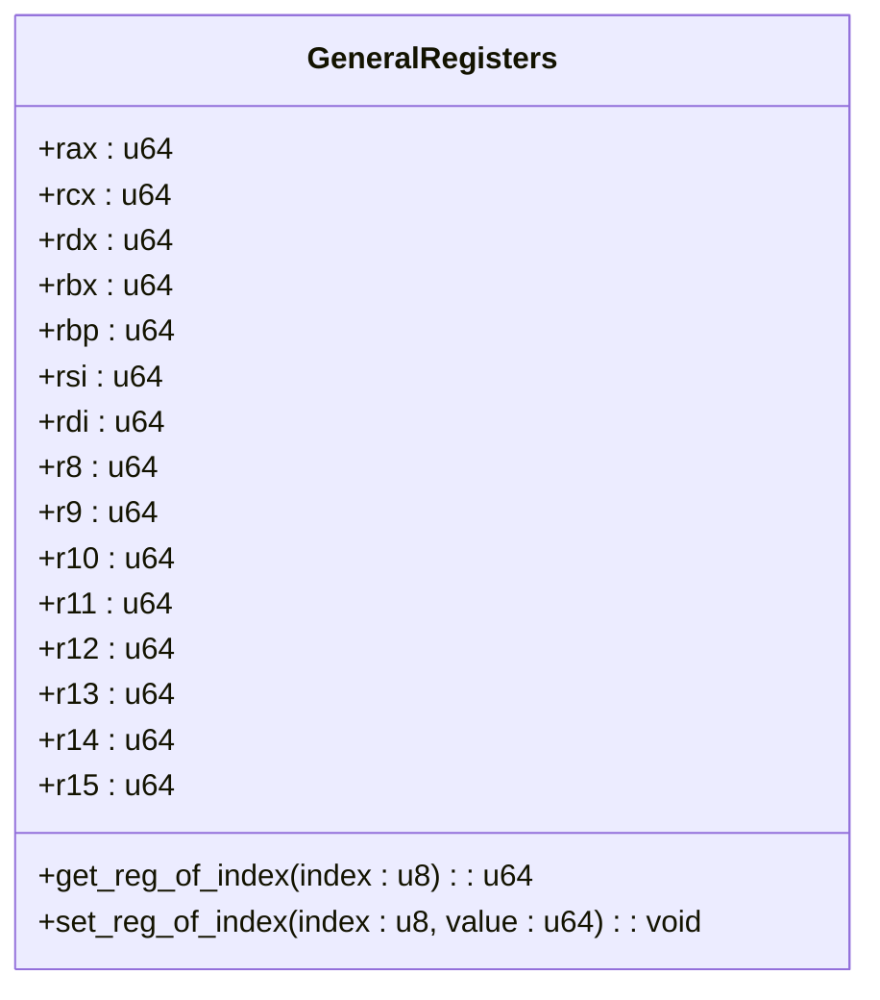
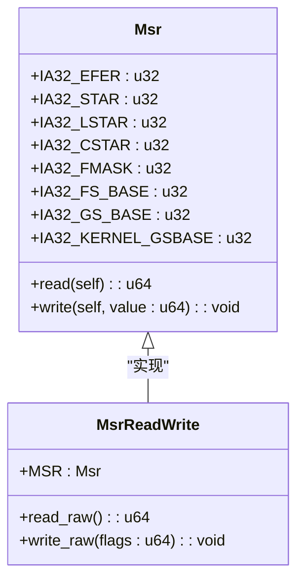
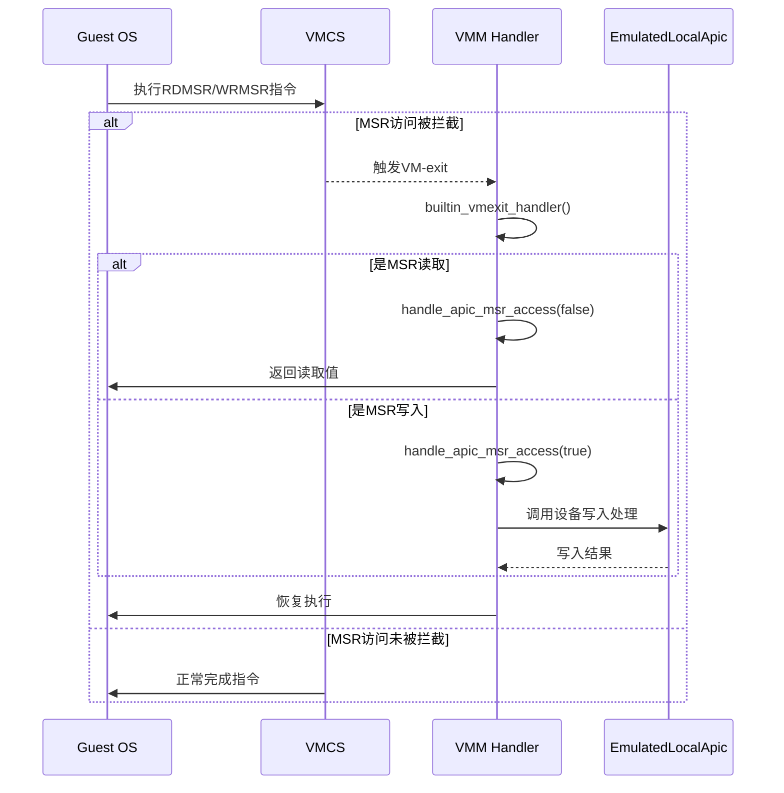
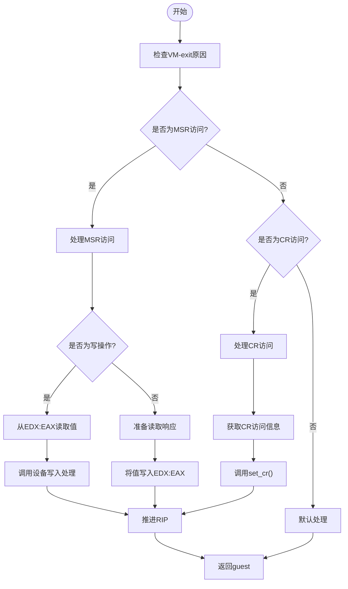
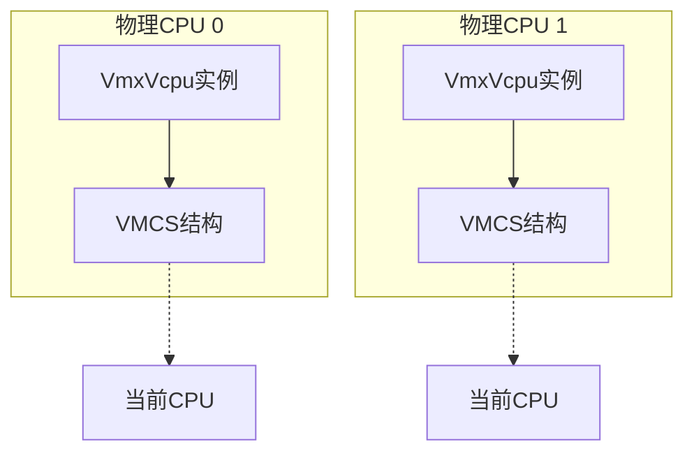

# 寄存器访问API

<cite>
**本文档中引用的文件**  
- [GeneralRegisters](file://src/regs/mod.rs)
- [accessors.rs](file://src/regs/accessors.rs)
- [msr.rs](file://src/msr.rs)
- [vcpu.rs](file://src/vmx/vcpu.rs)
- [vmcs.rs](file://src/vmx/vmcs.rs)
</cite>

## 目录
1. [简介](#简介)
2. [通用寄存器访问接口](#通用寄存器访问接口)
3. [MSR寄存器访问接口](#msr寄存器访问接口)
4. [VM-exit拦截与处理机制](#vm-exit拦截与处理机制)
5. [实际使用示例](#实际使用示例)
6. [线程安全性与上下文依赖](#线程安全性与上下文依赖)

## 简介
本文档全面记录了x86_vcpu项目中通用寄存器和模型特定寄存器（MSR）的访问接口。重点介绍`GeneralRegisters`结构体提供的寄存器操作方法，以及`msr.rs`模块中MSR读写函数的实现细节。文档详细说明了这些寄存器访问如何通过VM-exit被拦截并转发到相应的处理程序，并强调了线程安全性和per-CPU上下文依赖等关键问题。

## 通用寄存器访问接口

`GeneralRegisters`结构体定义了x86_64架构下的通用寄存器集合，包括RAX、RBX、RCX、RDX、RBP、RSI、RDI以及R8至R15等16个64位寄存器。该结构体通过`get_reg_of_index()`和`set_reg_of_index()`方法提供基于索引的寄存器访问功能。



**图源**
- [mod.rs](file://src/regs/mod.rs#L1-L108)
- [accessors.rs](file://src/regs/accessors.rs#L0-L111)

**节源**
- [mod.rs](file://src/regs/mod.rs#L1-L108)
- [accessors.rs](file://src/regs/accessors.rs#L0-L111)

### 访问方法说明
`get_reg_of_index()`和`set_reg_of_index()`方法通过索引值来访问对应的寄存器，索引映射关系如下：
- 0: `rax`
- 1: `rcx`
- 2: `rdx`
- 3: `rbx`
- 5: `rbp`
- 6: `rsi`
- 7: `rdi`
- 8: `r8`
- 9: `r9`
- 10: `r10`
- 11: `r11`
- 12: `r12`
- 13: `r13`
- 14: `r14`
- 15: `r15`

需要注意的是，索引4对应于未使用的`_unused_rsp`字段，因此在访问时会引发panic。这些方法直接操作`GeneralRegisters`结构体中的字段，提供了对guest状态的直接访问能力。

此外，还提供了针对不同位宽的寄存器访问宏`define_reg_getter_setters!`，支持对32位（如eax）、16位（如ax）和8位（如al）子寄存器的访问。

## MSR寄存器访问接口

`msr.rs`模块定义了x86架构下模型特定寄存器（MSR）的访问接口，通过`Msr`枚举类型列出所有支持的MSR寄存器，并提供统一的读写方法。



**图源**
- [msr.rs](file://src/msr.rs#L0-L187)

**节源**
- [msr.rs](file://src/msr.rs#L0-L187)

### 支持的MSR列表
`Msr`枚举类型定义了以下主要MSR寄存器：
- **基础功能控制**：`IA32_FEATURE_CONTROL`, `IA32_PAT`
- **VMX相关**：`IA32_VMX_BASIC`, `IA32_VMX_PINBASED_CTLS`, `IA32_VMX_PROCBASED_CTLS`等
- **系统调用相关**：`IA32_EFER`, `IA32_STAR`, `IA32_LSTAR`, `IA32_CSTAR`, `IA32_FMASK`
- **段基址相关**：`IA32_FS_BASE`, `IA32_GS_BASE`, `IA32_KERNEL_GSBASE`
- **扩展状态**：`IA32_XSS`

### 权限级别与异常行为
MSR读写操作需要在特权模式下执行，通常只能由操作系统内核或虚拟机监控器（VMM）进行。`read()`方法是安全的，而`write()`方法标记为`unsafe`，因为不正确的写入可能导致系统不稳定或安全漏洞。例如，修改`IA32_EFER`寄存器可能影响处理器的运行模式（如启用长模式），必须谨慎操作。

## VM-exit拦截与处理机制

当guest尝试访问受控的寄存器时，会触发VM-exit，控制权转移到VMM。这一过程通过VMCS（虚拟机控制结构）中的各种控制字段来配置和管理。



**图源**
- [vcpu.rs](file://src/vmx/vcpu.rs#L965-L1200)
- [vmcs.rs](file://src/vmx/vmcs.rs#L0-L836)

**节源**
- [vcpu.rs](file://src/vmx/vcpu.rs#L819-L1018)
- [vmcs.rs](file://src/vmx/vmcs.rs#L0-L836)

### 拦截配置
在`setup_vmcs_control()`方法中，通过设置`PRIMARY_PROCBASED_EXEC_CONTROLS`控制字段启用了MSR位图拦截：
```rust
(CpuCtrl::USE_IO_BITMAPS | CpuCtrl::USE_MSR_BITMAPS | CpuCtrl::SECONDARY_CONTROLS).bits()
```
同时，MSR位图的地址通过`MSR_BITMAPS_ADDR`字段设置，指向`msr_bitmap.phys_addr()`。

### 处理流程
`builtin_vmexit_handler()`方法负责处理各种VM-exit原因，对于MSR访问，它会根据退出原因（`MSR_READ`或`MSR_WRITE`）调用`handle_apic_msr_access()`方法。该方法首先通过`advance_rip()`推进guest的指令指针，然后根据是读还是写操作分别处理。

对于写操作，它会从`EDX:EAX`寄存器对中读取64位值，并调用`EmulatedLocalApic`的写入处理函数；对于读操作，则执行相反的过程。

## 实际使用示例

以下代码示例展示了如何在处理CR或MSR访问异常时查询或修改guest状态：



**图源**
- [vcpu.rs](file://src/vmx/vcpu.rs#L965-L1200)

**节源**
- [vcpu.rs](file://src/vmx/vcpu.rs#L965-L1200)

具体实现中，`handle_cr()`方法处理CR寄存器访问异常：
1. 获取CR访问信息（`cr_access_info`）
2. 根据访问类型（MOV to CR等）判断操作
3. 对于允许的操作（如设置CR0、CR4），调用`set_cr()`方法更新VMCS中的相应字段
4. 推进guest的指令指针以跳过原指令

类似地，`handle_apic_msr_access()`方法处理APIC相关的MSR访问，将其转发给`EmulatedLocalApic`设备进行模拟。

## 线程安全性与per-CPU上下文依赖

寄存器访问接口的设计必须考虑线程安全性和CPU上下文依赖问题。每个VCPU实例都绑定到特定的物理CPU核心，其状态存储在独立的VMCS结构中。



**图源**
- [vcpu.rs](file://src/vmx/vcpu.rs#L0-L799)

**节源**
- [vcpu.rs](file://src/vmx/vcpu.rs#L0-L799)

`bind_to_current_processor()`和`unbind_from_current_processor()`方法确保VCPU实例与物理CPU的正确绑定和解绑。这种设计保证了每个VCPU的状态隔离，避免了跨CPU的竞争条件。同时，由于VMCS是per-CPU的数据结构，不需要额外的锁机制来保护寄存器状态的访问，从而提高了性能。

然而，在多VCPU环境中，仍需注意共享资源（如内存映射I/O设备）的同步问题，这通常通过更高层次的锁机制来解决。