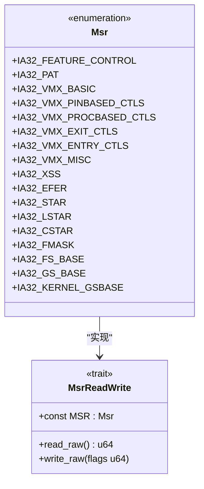
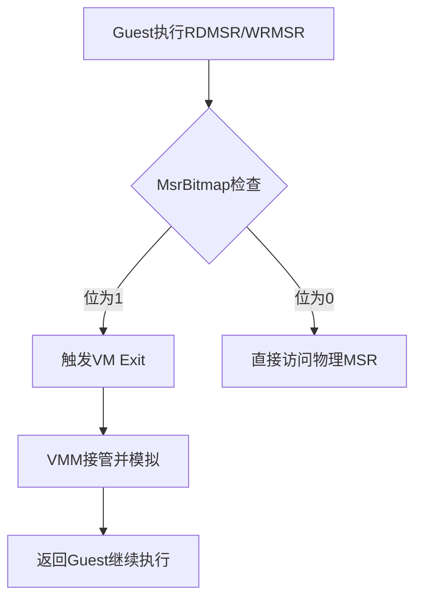
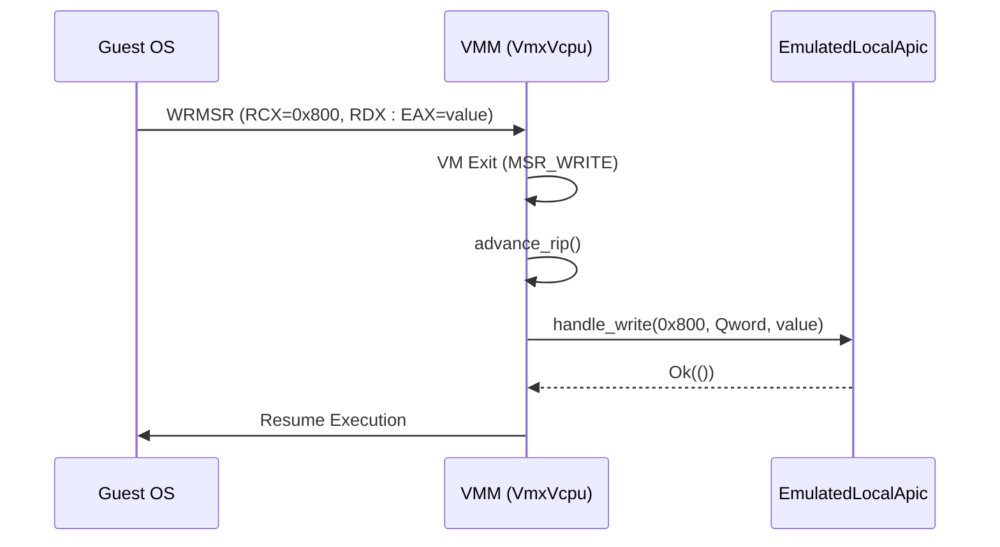

# MSR与I/O拦截机制

<cite>
**本文档引用的文件**
- [msr.rs](file://src/msr.rs)
- [vcpu.rs](file://src/vmx/vcpu.rs)
- [structs.rs](file://src/vmx/structs.rs)
- [instructions.rs](file://src/vmx/instructions.rs)
</cite>

## 目录
1. [引言](#引言)
2. [MSR寄存器拦截机制](#msr寄存器拦截机制)
3. [I/O端口拦截机制](#io端口拦截机制)
4. [指令处理与模拟](#指令处理与模拟)
5. [安全与性能考量](#安全与性能考量)
6. [结论](#结论)

## 引言
本文系统性地讲解基于Intel VT-x技术的MSR寄存器与I/O端口的拦截与模拟机制。通过分析x86_vcpu项目中的核心组件，详细阐述了虚拟机如何通过VMCS（Virtual Machine Control Structure）中的MsrBitmap和IOBitmap来控制对特定MSR寄存器和I/O端口的访问截获。文档将结合代码实现，解释如何安全地模拟这些硬件行为而不暴露宿主机状态，并讨论相关配置的最佳实践。

**Section sources**
- [msr.rs](file://src/msr.rs#L0-L187)
- [vcpu.rs](file://src/vmx/vcpu.rs#L0-L799)

## MSR寄存器拦截机制

### 显式支持的MSR寄存器
在`msr.rs`文件中，定义了一个`Msr`枚举类型，列出了所有受支持的模型特定寄存器（Model-Specific Registers, MSR）。这些寄存器涵盖了处理器的基本功能、虚拟化扩展以及系统调用相关的控制。其中，关键的MSR包括：

- **IA32_EFER (0xc000_0080)**: 扩展功能启用寄存器，用于控制长模式（Long Mode）等高级特性。
- **IA32_STAR (0xc000_0081)**: 系统调用目标地址寄存器，配合LSTAR和CSTAR使用。
- **IA32_LSTAR (0xc000_0082)**: 长模式系统调用目标地址寄存器。
- **IA32_CSTAR (0xc000_0083)**: 兼容模式系统调用目标地址寄存器。
- **IA32_FMASK (0xc000_0084)**: 系统调用标志掩码寄存器。
- **IA32_FS_BASE (0xc000_0100) 和 IA32_GS_BASE (0xc000_0101)**: 分段寄存器FS和GS的基址寄存器。
- **IA32_KERNEL_GSBASE (0xc000_0102)**: 内核模式下GS寄存器的基址。
- **IA32_XSS (0xda0)**: XSAVE状态掩码寄存器，用于管理扩展处理器状态。

此外，该文件还定义了大量与VMX（Virtual Machine Extensions）相关的MSR，如`IA32_VMX_BASIC`、`IA32_VMX_PINBASED_CTLS`等，它们是配置和查询虚拟化功能的基础。



**Diagram sources**
- [msr.rs](file://src/msr.rs#L0-L187)

**Section sources**
- [msr.rs](file://src/msr.rs#L0-L187)

### MsrBitmap与读写截获
MSR的拦截是通过VMCS中的`MSR_BITMAPS_ADDR`字段指向的一个位图（bitmap）来实现的。这个位图被划分为四个连续的1KB区域，分别对应不同范围MSR的读写操作：
- **低MSR读取位图**: 处理0x0000_0000到0x0000_1FFF范围内MSR的读取。
- **高MSR读取位图**: 处理0xC000_0000到0xC000_1FFF范围内MSR的读取。
- **低MSR写入位图**: 处理0x0000_0000到0x0000_1FFF范围内MSR的写入。
- **高MSR写入位图**: 处理0xC000_0000到0xC000_1FFF范围内MSR的写入。

在`structs.rs`文件中，`MsrBitmap<H>`结构体封装了这一机制。当需要拦截某个特定MSR时，例如`IA32_EFER`，可以通过调用`set_read_intercept`或`set_write_intercept`方法，在对应的位图中将该MSR编号的相应位设置为1。一旦配置完成，任何对被拦截MSR的RDMSR或WRMSR指令都会触发VM Exit，从而将控制权交还给VMM（虚拟机监控器）进行处理。



**Diagram sources**
- [structs.rs](file://src/vmx/structs.rs#L0-L470)

**Section sources**
- [structs.rs](file://src/vmx/structs.rs#L0-L470)

### RDMSR/WRMSR指令的安全模拟
在`vcpu.rs`文件中，`VmxVcpu`结构体的`builtin_vmexit_handler`方法负责处理各种VM Exit事件。当发生由MSR读写引起的VM Exit时（即`VmxExitReason::MSR_READ`或`VmxExitReason::MSR_WRITE`），该方法会根据退出信息判断是否为x2APIC相关的MSR访问。

对于x2APIC MSR（范围0x800-0x8ff），`handle_apic_msr_access`函数会被调用。此函数首先通过`advance_rip`推进Guest的指令指针，以模拟指令已完成。然后，它根据是读还是写操作，从`RCX`寄存器获取MSR地址，并从`RDX:EAX`组合出64位值（写操作）或向其写入64位值（读操作）。最终，它通过`EmulatedLocalApic`设备的`handle_read`或`handle_write`方法来完成对虚拟APIC状态的读写，从而实现了对真实硬件的完全隔离和安全模拟。



**Diagram sources**
- [vcpu.rs](file://src/vmx/vcpu.rs#L965-L1204)

**Section sources**
- [vcpu.rs](file://src/vmx/vcpu.rs#L965-L1204)

## I/O端口拦截机制

### IOBitmap数据结构设计
与MSR拦截类似，I/O指令的拦截依赖于VMCS中的`IO_BITMAP_A_ADDR`和`IO_BITMAP_B_ADDR`两个字段，它们分别指向两个独立的1KB位图。这种设计巧妙地将整个16位I/O端口空间（0x0000-0xFFFF）分割开来：
- **IO Bitmap A**: 负责端口0x0000至0x7FFF的访问控制。
- **IO Bitmap B**: 负责端口0x8000至0xFFFF的访问控制。

每个端口地址对应位图中的一个比特位。如果某位被置为1，则对该端口的IN/OUT指令将引发VM Exit；若为0，则允许直接访问。这种按位映射的设计使得VMM可以精确地选择性地拦截任意单个或一组I/O端口，而无需为每个端口维护复杂的元数据。

在`structs.rs`中，`IOBitmap<H>`结构体提供了`set_intercept_of_range`等方法，方便批量设置拦截范围。例如，代码中明确设置了对QEMU退出端口（0x604）的拦截，以便于测试和调试。

```mermaid
erDiagram
IO_BITMAP_A ||--o{ PORT_RANGE_A : "controls"
IO_BITMAP_B ||--o{ PORT_RANGE_B : "controls"
class IO_BITMAP_A {
0x0000 - 0x7FFF
size: 1KB
}
class IO_BITMAP_B {
0x8000 - 0xFFFF
size: 1KB
}
class PORT_RANGE_A {
start: 0x0000
end: 0x7FFF
}
class PORT_RANGE_B {
start: 0x8000
end: 0xFFFF
}
```

**Diagram sources**
- [structs.rs](file://src/vmx/structs.rs#L0-L470)

**Section sources**
- [structs.rs](file://src/vmx/structs.rs#L0-L470)

### 注册I/O handler响应in/out指令
当Guest执行IN或OUT指令并命中被拦截的端口时，会触发`VmxExitReason::IO_INSTRUCTION`类型的VM Exit。在`vcpu.rs`的`run`方法中，此情况被识别后，会构造一个`AxVCpuExitReason::IoRead`或`AxVCpuExitReason::IoWrite`事件并返回给上层VMM。

上层VMM接收到此事件后，可以根据端口号和数据宽度，调用预先注册的I/O handler来处理请求。handler可以模拟真实的硬件行为，例如读取虚拟设备的状态或向虚拟设备写入命令，然后将结果返回给Guest，从而完成一次完整的I/O交互。这种方式实现了硬件无关的设备模拟，极大地增强了虚拟化的灵活性。

**Section sources**
- [vcpu.rs](file://src/vmx/vcpu.rs#L1200-L1400)

## 指令处理与模拟

### 端口地址提取与方向判断
在处理I/O VM Exit时，可以从VMCS的`VM-exit interruption-information`字段中获取详细的退出信息。`io_exit_info`方法返回的`VmxIoExitInfo`结构体包含了关键信息：
- **port**: 发生I/O操作的具体端口地址。
- **access_size**: 数据传输的大小（字节、字、双字）。
- **is_in**: 布尔值，指示操作方向。`true`表示IN指令（从端口读取数据到CPU），`false`表示OUT指令（从CPU向端口写入数据）。
- **is_string**: 指示是否为字符串I/O指令（如INS/OUTS）。

通过解析`is_in`字段，VMM可以准确判断数据流的方向，进而决定是从虚拟设备读取数据填充到`RAX`寄存器（IN），还是从`RAX`寄存器中取出数据写入虚拟设备（OUT）。

```mermaid
flowchart LR
A[VM Exit: IO_INSTRUCTION] --> B[io_exit_info()]
B --> C[Port: 0x3f8]
B --> D[Access Size: Word]
B --> E[Direction: is_in=true]
E --> F[执行IN指令模拟]
F --> G[从虚拟串口读取2字节]
G --> H[写入RAX]
```

**Section sources**
- [vcpu.rs](file://src/vmx/vcpu.rs#L1200-L1400)

## 安全与性能考量

### bitmap配置错误的风险
不正确的bitmap配置可能导致严重的后果：
- **性能下降**: 如果错误地将大量不需要拦截的MSR或I/O端口设置为拦截状态，会导致频繁的VM Exit。每次VM Exit都需要保存和恢复上下文，消耗大量CPU周期，显著降低Guest的性能。
- **安全漏洞**: 反之，如果本应被拦截的关键寄存器（如`IA32_EFER`）或敏感端口未被正确拦截，Guest可能通过直接读写这些资源来探测宿主机环境、绕过安全限制，甚至发起攻击。例如，恶意Guest可能修改自身页表或中断描述符表，破坏虚拟机的隔离性。

### 最佳实践建议
1. **最小权限原则**: 仅拦截Guest实际需要访问的MSR和I/O端口。对于大多数通用操作系统，只需拦截少数几个关键的虚拟化相关MSR和必要的设备端口。
2. **动态配置**: 根据Guest的操作系统类型和运行的应用动态调整拦截策略，避免一刀切的静态配置。
3. **严格验证**: 在VMM处理MSR或I/O请求时，必须对输入参数进行严格的边界检查和合法性验证，防止缓冲区溢出等安全问题。
4. **利用硬件特性**: 合理配置VMCS中的其他控制位，如`SECONDARY_CONTROLS`下的`UNRESTRICTED_GUEST`，可以在某些情况下减少不必要的VM Exit，提升性能。

**Section sources**
- [vcpu.rs](file://src/vmx/vcpu.rs#L0-L799)
- [structs.rs](file://src/vmx/structs.rs#L0-L470)

## 结论
通过对`msr.rs`、`vcpu.rs`和`structs.rs`等核心文件的分析，我们深入理解了基于VT-x的MSR与I/O拦截机制。该机制利用MsrBitmap和IOBitmap这两个高效的数据结构，实现了对硬件资源访问的精确控制。VMM通过捕获特定的VM Exit事件，能够安全地模拟RDMSR/WRMSR和IN/OUT指令的行为，为Guest提供了一个隔离且可控的执行环境。正确理解和应用这些机制，对于构建高性能、高安全性的虚拟化平台至关重要。