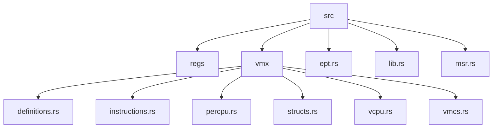
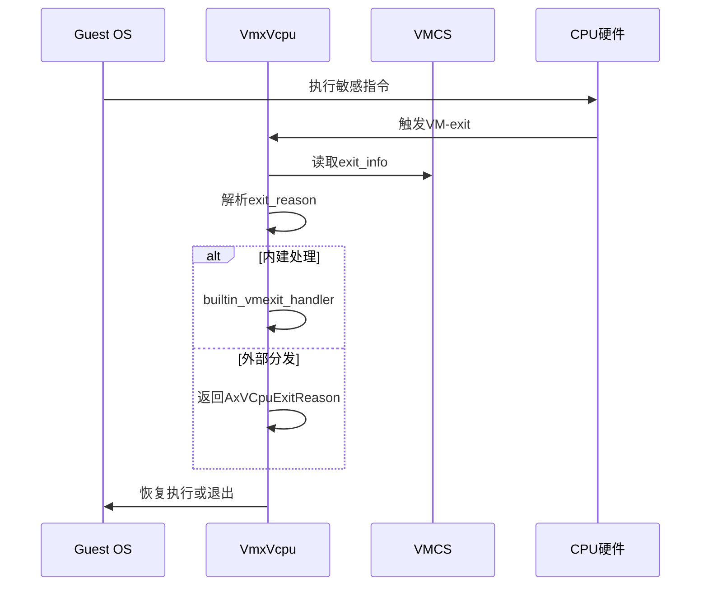
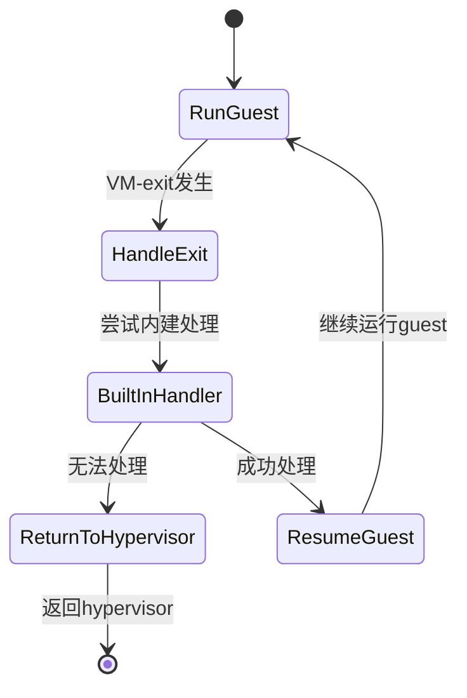
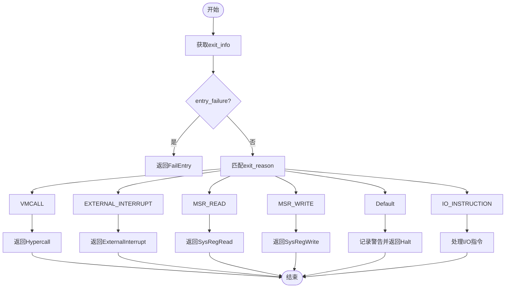
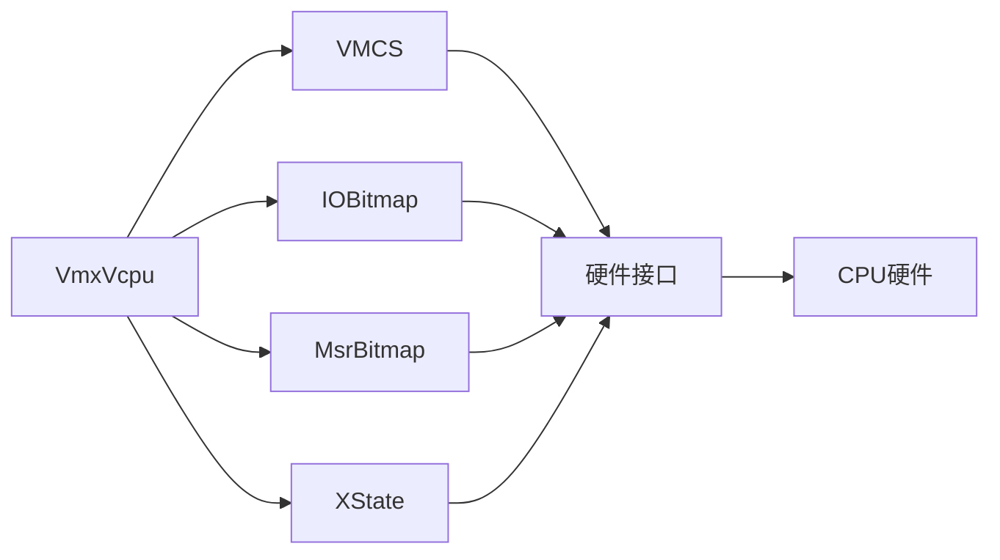

# VM-exit处理机制

<cite>
**本文档中引用的文件**
- [vcpu.rs](file://src/vmx/vcpu.rs)
- [vmcs.rs](file://src/vmx/vmcs.rs)
- [instructions.rs](file://src/vmx/instructions.rs)
- [definitions.rs](file://src/vmx/definitions.rs)
- [structs.rs](file://src/vmx/structs.rs)
</cite>

## 目录
1. [简介](#简介)
2. [项目结构](#项目结构)
3. [核心组件](#核心组件)
4. [架构概述](#架构概述)
5. [详细组件分析](#详细组件分析)
6. [依赖分析](#依赖分析)
7. [性能考虑](#性能考虑)
8. [故障排除指南](#故障排除指南)
9. [结论](#结论)

## 简介
本文深入分析x86_vcpu中VM-exit的完整处理流程。当guest执行敏感指令（如I/O、CR/MR访问）时，CPU会触发VM-exit，并通过VmxVcpu::run函数进入hypervisor模式。结合vcpu.rs中的逻辑，解释exit_reason的解析过程以及基于ExitReason枚举的分发机制。重点剖析instructions.rs中对IN/OUT、MOV_CR、RDMSR/WRMSR等指令的模拟实现，包括如何从VMCS读取指令信息、解码并安全执行对应操作。提供代码示例展示IOBitmap和MsrBitmap的配置方式及其在性能优化中的作用。讨论不同exit reason的处理延迟与安全性权衡，并给出常见错误（如未处理的exit reason）的调试策略。

## 项目结构
该项目实现了基于Intel VT-x技术的虚拟化支持，主要包含以下模块：
- `regs`：寄存器访问和差异比较功能
- `vmx`：VT-x相关的核心实现，包括VMCS管理、VCPU控制、指令模拟等
- `ept.rs`：扩展页表（Extended Page Table）支持
- `msr.rs`：模型特定寄存器（Model Specific Register）访问接口



**图源**
- [vcpu.rs](file://src/vmx/vcpu.rs)
- [vmcs.rs](file://src/vmx/vmcs.rs)
- [instructions.rs](file://src/vmx/instructions.rs)

**节源**
- [vcpu.rs](file://src/vmx/vcpu.rs)
- [vmcs.rs](file://src/vmx/vmcs.rs)

## 核心组件
`VmxVcpu`是虚拟CPU的核心数据结构，负责管理guest状态、VMCS配置及VM-exit处理。`Vmcs`模块提供了对VMCS字段的安全访问接口，而`IOBitmap`和`MsrBitmap`则用于控制I/O和MSR访问的拦截策略。

**节源**
- [vcpu.rs](file://src/vmx/vcpu.rs#L254-L284)
- [structs.rs](file://src/vmx/structs.rs#L0-L470)

## 架构概述
系统采用分层设计，底层通过VT-x指令直接与硬件交互，中间层封装VMCS操作，上层实现VCPU调度和异常处理。当guest触发VM-exit时，控制流经由`inner_run`→`builtin_vmexit_handler`→具体处理函数传递。



**图源**
- [vcpu.rs](file://src/vmx/vcpu.rs#L320-L359)
- [vmcs.rs](file://src/vmx/vmcs.rs#L0-L836)

## 详细组件分析

### VM-exit处理流程分析
`VmxVcpu::run`方法是VM-exit处理的入口点，它首先调用`inner_run`执行guest代码，遇到VM-exit后根据exit_reason进行分类处理。

#### VM-exit处理状态机


**图源**
- [vcpu.rs](file://src/vmx/vcpu.rs#L1318-L1349)

#### Exit Reason分发机制


**图源**
- [vcpu.rs](file://src/vmx/vcpu.rs#L1318-L1421)

**节源**
- [vcpu.rs](file://src/vmx/vcpu.rs#L1318-L1421)

### 敏感指令模拟实现
对于I/O和MSR访问指令，系统通过读取VMCS中的退出信息来重建原始指令语义，并在hypervisor上下文中安全地执行相应操作。

#### I/O指令处理
当guest执行IN/OUT指令时，系统通过`io_exit_info()`获取端口地址、数据宽度等信息，并根据方向构造相应的IoRead/IoWrite事件。

**节源**
- [vcpu.rs](file://src/vmx/vcpu.rs#L1349-L1369)

#### MSR访问模拟
RDMSR/WRMSR指令的处理依赖于RCX寄存器指定的MSR地址，通过RAX/RDX组合读写64位MSR值。

**节源**
- [vcpu.rs](file://src/vmx/vcpu.rs#L1398-L1421)

### 性能优化机制
通过精心配置IOBitmap和MsrBitmap，可以精确控制哪些I/O端口和MSR需要拦截，从而在安全性和性能间取得平衡。

#### IOBitmap配置示例
```mermaid
flowchart LR
A[初始化IOBitmap] --> B[设置默认策略]
B --> C{是否拦截?}
C --> |是| D[set_intercept(port, true)]
C --> |否| E[set_intercept(port, false)]
D --> F[更新VMCS指针]
E --> F
F --> G[完成配置]
```

**图源**
- [structs.rs](file://src/vmx/structs.rs#L0-L470)

#### MsrBitmap工作原理
MSR位图分为四个区域：低MSR读、低MSR写、高MSR读、高MSR写，每个MSR占用1位表示是否需要拦截。

**节源**
- [structs.rs](file://src/vmx/structs.rs#L0-L470)

## 依赖分析
系统依赖于底层VT-x硬件特性，通过MSR寄存器查询和配置VMX功能。各模块间通过清晰的接口定义保持松耦合。



**图源**
- [vcpu.rs](file://src/vmx/vcpu.rs)
- [structs.rs](file://src/vmx/structs.rs)

**节源**
- [vcpu.rs](file://src/vmx/vcpu.rs#L254-L284)
- [structs.rs](file://src/vmx/structs.rs#L0-L470)

## 性能考虑
VM-exit处理的开销直接影响虚拟化性能。频繁的exit会导致上下文切换成本增加，因此应尽量减少不必要的拦截。对于高频访问的MSR（如时间相关寄存器），可考虑透传以提升性能。

[无节源，因为本节提供一般性指导]

## 故障排除指南
常见问题包括未处理的exit reason导致guest挂起，可通过启用日志记录查看具体的exit_info。对于QEMU_EXIT_PORT特殊处理，需确保RAX寄存器包含正确的magic值。

**节源**
- [vcpu.rs](file://src/vmx/vcpu.rs#L1349-L1369)
- [vcpu.rs](file://src/vmx/vcpu.rs#L1398-L1421)

## 结论
本文档详细解析了x86_vcpu中VM-exit的完整处理流程，涵盖了从硬件触发到软件分发的各个环节。通过合理利用IOBitmap和MsrBitmap，可以在保证安全性的同时优化性能表现。未来可进一步完善对更多exit reason的支持，并引入更精细的性能监控机制。

[无节源，因为本节总结而不分析特定文件]