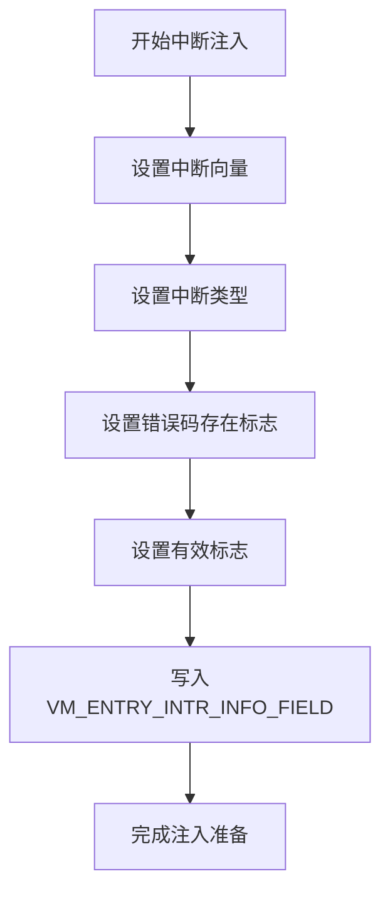
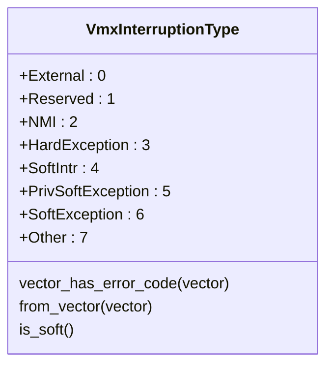
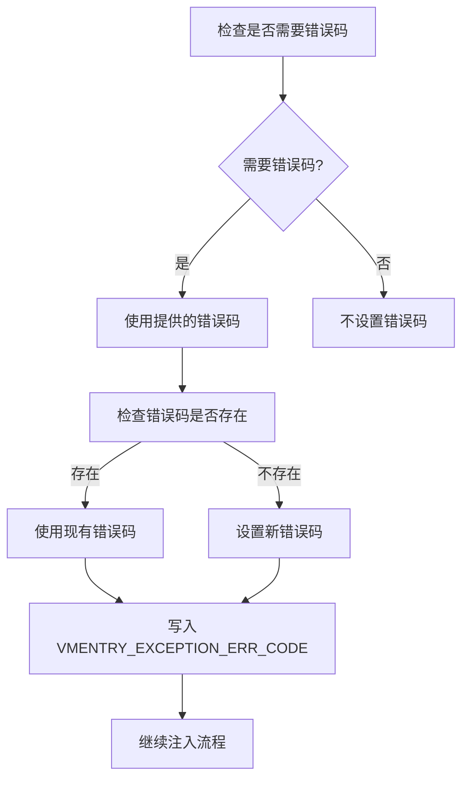
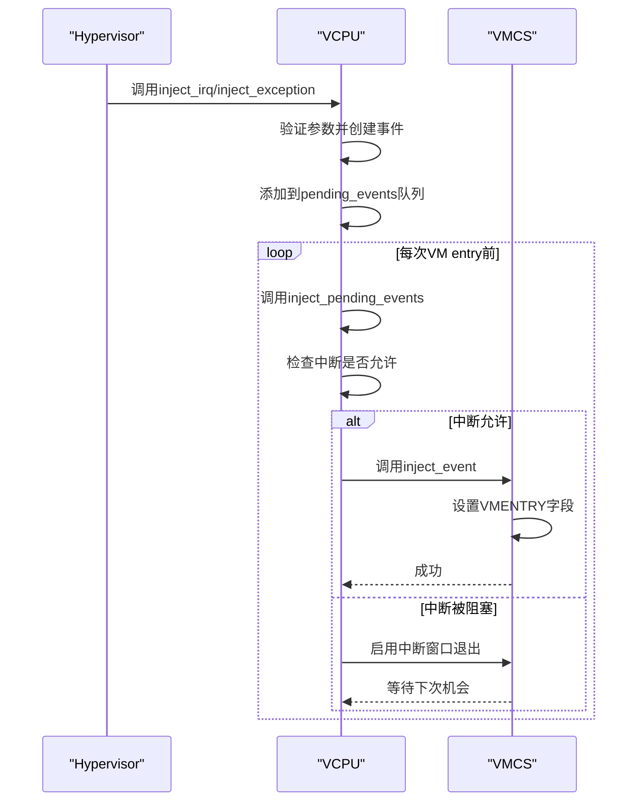
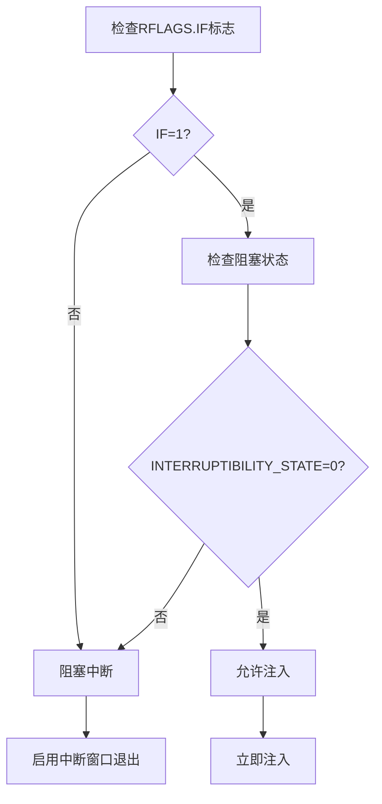
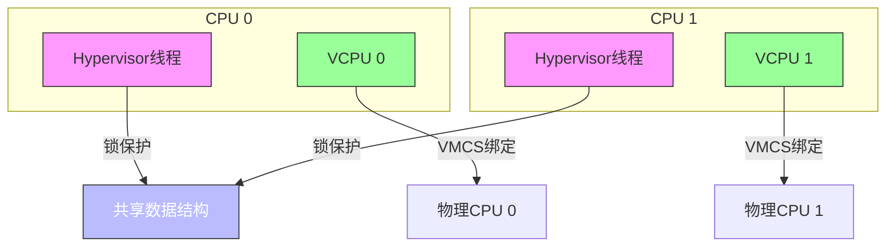

# 中断与异常注入

<cite>
**本文档中引用的文件**
- [vmcs.rs](file://src/vmx/vmcs.rs)
- [vcpu.rs](file://src/vmx/vcpu.rs)
- [definitions.rs](file://src/vmx/definitions.rs)
</cite>

## 目录
1. [简介](#简介)
2. [中断注入机制概述](#中断注入机制概述)
3. [VMCS字段配置](#vmcs字段配置)
4. [中断类型编码规则](#中断类型编码规则)
5. [错误码处理](#错误码处理)
6. [注入方法调用流程](#注入方法调用流程)
7. [前置条件检查](#前置条件检查)
8. [PIC/IOAPIC中断模拟示例](#picioapic中断模拟示例)
9. [注入失败原因分析](#注入失败原因分析)
10. [多核环境同步注意事项](#多核环境同步注意事项)

## 简介
本文档详细描述了在x86虚拟化环境中向guest vCPU注入外部中断、异常和软中断的机制。基于Intel VT-x技术，通过VMCS（Virtual Machine Control Structure）结构实现中断注入控制。

## 中断注入机制概述
中断注入是虚拟化管理程序控制guest操作系统执行流的关键机制。当需要向guest注入中断时，hypervisor通过设置VMCS中的特定字段，在下一次VM entry时触发相应的中断处理。

**Section sources**
- [vmcs.rs](file://src/vmx/vmcs.rs#L707-L743)
- [vcpu.rs](file://src/vmx/vcpu.rs#L942-L960)

## VMCS字段配置
通过`VmcsControl32::VMENTRY_INTERRUPTION_INFO_FIELD`字段配置中断注入信息。该字段包含中断向量号、中断类型和有效性标志等信息。



**Diagram sources**
- [vmcs.rs](file://src/vmx/vmcs.rs#L707-L743)

**Section sources**
- [vmcs.rs](file://src/vmx/vmcs.rs#L707-L743)

## 中断类型编码规则
根据`definitions.rs`中的`VmxInterruptionType`枚举定义中断类型：



**Diagram sources**
- [definitions.rs](file://src/vmx/definitions.rs#L150-L180)

**Section sources**
- [definitions.rs](file://src/vmx/definitions.rs#L150-L180)

## 错误码处理
对于需要错误码的异常，系统会自动从`VMEXIT_INTERRUPTION_ERR_CODE`字段获取或使用提供的错误码：



**Diagram sources**
- [vmcs.rs](file://src/vmx/vmcs.rs#L720-L725)

**Section sources**
- [vmcs.rs](file://src/vmx/vmcs.rs#L720-L725)

## 注入方法调用流程
`inject_irq`和`inject_exception`方法通过以下流程完成中断注入：



**Diagram sources**
- [vcpu.rs](file://src/vmx/vcpu.rs#L942-L960)
- [vmcs.rs](file://src/vmx/vmcs.rs#L707-L743)

**Section sources**
- [vcpu.rs](file://src/vmx/vcpu.rs#L942-L960)
- [vmcs.rs](file://src/vmx/vmcs.rs#L707-L743)

## 前置条件检查
在注入中断前需要检查以下条件：



**Diagram sources**
- [vcpu.rs](file://src/vmx/vcpu.rs#L955-L960)

**Section sources**
- [vcpu.rs](file://src/vmx/vcpu.rs#L955-L960)

## PIC/IOAPIC中断模拟示例
模拟传统PIC或IOAPIC中断注入的代码路径：


**Diagram sources**
- [vcpu.rs](file://src/vmx/vcpu.rs#L466)
- [vcpu.rs](file://src/vmx/vcpu.rs#L1443)

**Section sources**
- [vcpu.rs](file://src/vmx/vcpu.rs#L466)
- [vcpu.rs](file://src/vmx/vcpu.rs#L1443)

## 注入失败原因分析
中断注入可能失败的原因及应对策略：

```mermaid
erDiagram
FAILURE_REASONS {
string reason PK
string description
string solution
}
GUEST_STATE ||--o{ FAILURE_REASONS : causes
GUEST_STATE {
string state PK
boolean interruptible
boolean in_system_call
}
FAILURE_REASONS }|--|| ERROR_HANDLING : has
ERROR_HANDLING {
string strategy PK
string implementation
}
GUEST_STATE {
"不可中断状态"
"系统调用中"
"NMI窗口"
"MOV SS阻塞"
}
FAILURE_REASONS {
"guest处于不可中断状态" "RFLAGS.IF=0或阻塞状态非零" "启用中断窗口退出"
"guest正在执行敏感指令" "如MOV SS后" "等待指令完成"
"优先级不足" "当前中断优先级过高" "调整注入时机"
}
ERROR_HANDLING {
"延迟注入" "将事件加入队列"
"修改guest状态" "临时启用中断"
"忽略" "某些非关键中断"
}
```

**Diagram sources**
- [vcpu.rs](file://src/vmx/vcpu.rs#L942-L960)
- [vmcs.rs](file://src/vmx/vmcs.rs#L707-L743)

**Section sources**
- [vcpu.rs](file://src/vmx/vcpu.rs#L942-L960)
- [vmcs.rs](file://src/vmx/vmcs.rs#L707-L743)

## 多核环境同步注意事项
在多核环境下进行中断注入时需要注意的同步问题：



**Diagram sources**
- [vcpu.rs](file://src/vmx/vcpu.rs#L254-L284)

**Section sources**
- [vcpu.rs](file://src/vmx/vcpu.rs#L254-L284)