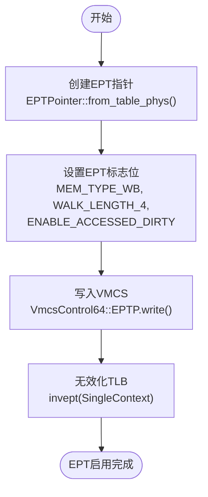

# 功能详解

<cite>
**本文档中引用的文件**
- [vcpu.rs](file://src/vmx/vcpu.rs)
- [instructions.rs](file://src/vmx/instructions.rs)
- [ept.rs](file://src/ept.rs)
- [definitions.rs](file://src/vmx/definitions.rs)
- [structs.rs](file://src/vmx/structs.rs)
- [vmcs.rs](file://src/vmx/vmcs.rs)
</cite>

## 目录
1. [VM-exit处理流程](#vm-exit处理流程)
2. [敏感指令模拟策略](#敏感指令模拟策略)
3. [EPT内存虚拟化实现](#ept内存虚拟化实现)
4. [中断与异常注入机制](#中断与异常注入机制)
5. [QEMU退出端口兼容性支持](#qemu退出端口兼容性支持)

## VM-exit处理流程

x86_vcpu通过Intel VT-x技术实现虚拟化，当发生特定事件时会触发VM-exit，控制权从客户机转移到hypervisor。VM-exit的处理流程始于`VmxVcpu::inner_run()`方法，该方法首先注入待处理事件，然后加载guest的XState状态，最后根据VCPU是否已启动来决定执行`vmx_launch()`或`vmx_resume()`指令进入客户机模式。

当发生VM-exit时，系统会读取VMCS（虚拟机控制结构）中的退出信息，包括退出原因、退出指令长度和guest RIP等。这些信息通过`vmcs::exit_info()`函数获取，并封装在`VmxExitInfo`结构体中。核心处理逻辑位于`builtin_vmexit_handler()`方法中，该方法根据不同的退出原因分发到相应的处理器：

- **I/O指令访问**：通过IOBitmap机制进行拦截和处理
- **CR寄存器访问**：通过`handle_cr()`方法处理
- **MSR读写**：通过`handle_apic_msr_access()`等方法处理
- **CPUID指令**：通过`handle_cpuid()`方法处理
- **APIC访问**：通过`handle_apic_access()`方法处理

对于无法由hypervisor直接处理的退出事件，系统会返回`VmxExitInfo`供上层处理。这种分层处理机制确保了关键虚拟化事件能够被高效处理，同时保持系统的可扩展性。

**Section sources**
- [vcpu.rs](file://src/vmx/vcpu.rs#L283-L359)
- [vmcs.rs](file://src/vmx/vmcs.rs#L470-L485)

## 敏感指令模拟策略

对特定敏感指令的模拟策略主要在`instructions.rs`和`vcpu.rs`中实现。系统通过配置VMCS中的各种位图和控制字段来决定哪些指令需要触发VM-exit。

对于I/O指令的处理，系统使用IOBitmap来精确控制端口访问。`IOBitmap`结构体维护两个4KB的位图（A和B），分别对应0x0000-0x7FFF和0x8000-0xFFFF端口范围。每个端口对应一个比特位，当该位为1时，对应的I/O操作将触发VM-exit。这一机制在`setup_io_bitmap()`方法中配置，特别地，QEMU退出端口（0x604）被显式设置为需要拦截。

MSR读写的处理采用类似的位图机制。`MsrBitmap`结构体管理四个1KB的区域，分别对应低MSR和高MSR的读写操作。系统通过`set_read_intercept()`和`set_write_intercept()`方法配置需要拦截的MSR，如IA32_UMWAIT_CONTROL（0xe1）和x2APIC相关MSR（0x800-0x83f范围）。

CR寄存器的访问处理在`handle_cr()`方法中实现，目前主要支持CR0和CR4的写操作。当客户机尝试修改这些控制寄存器时，hypervisor会更新内部状态并推进RIP指针。特别地，当启用分页时，系统会调用`vmcs::update_efer()`确保IA32_EFER寄存器的LONG_MODE_ACTIVE位被正确设置。

**Section sources**
- [vcpu.rs](file://src/vmx/vcpu.rs#L962-L1111)
- [structs.rs](file://src/vmx/structs.rs#L100-L180)

## EPT内存虚拟化实现

EPT（扩展页表）内存虚拟化实现在`ept.rs`和`vmcs.rs`中。系统通过构建多级页表来实现客户机物理地址到主机物理地址的转换。EPT的核心数据结构是`EPTPointer`，它包含指向PML4表的物理地址以及各种属性标志。

`EPTPointer`的创建通过`from_table_phys()`方法完成，该方法接收PML4表的物理地址作为参数，并自动设置必要的标志位：
- 内存类型为Write-back (WB)
- 页表遍历长度为4级
- 启用访问和脏位跟踪

这些配置通过`set_ept_pointer()`函数写入VMCS的EPTP字段，从而激活EPT功能。当发生EPT违规异常时，系统通过`ept_violation_info()`函数解析退出资格信息，获取故障的客户机物理地址和访问类型（读、写、执行）。

EPT违规处理的关键在于`NestedPageFaultInfo`结构体，它包含了访问标志和故障地址等信息，为上层内存管理提供了必要的上下文。这种设计使得hypervisor能够精确控制内存访问权限，实现安全的内存隔离。

**Diagram sources**
- [structs.rs](file://src/vmx/structs.rs#L231-L269)
- [vmcs.rs](file://src/vmx/vmcs.rs#L450-L469)

**Section sources**
- [ept.rs](file://src/ept.rs#L0-L27)
- [vmcs.rs](file://src/vmx/vmcs.rs#L450-L469)

## 中断与异常注入机制

中断与异常注入机制通过VMCS字段实现，主要涉及`inject_event()`函数和相关的VM-entry控制字段。当需要向客户机注入中断或异常时，系统会设置VM-entry中断信息字段（VMENTRY_INTERRUPTION_INFO_FIELD）以及其他相关字段。

具体实现中，`inject_event()`函数负责构造中断信息结构体`VmxInterruptInfo`，其中包含中断向量、中断类型和错误代码等信息。根据中断类型的不同，还需要设置额外的字段：
- 对于带有错误代码的异常，需要设置VMENTRY_EXCEPTION_ERR_CODE字段
- 对于软件中断，需要设置VMENTRY_INSTRUCTION_LEN字段

中断注入的触发条件在`set_interrupt_window()`方法中配置，通过设置PRIMARY_PROCBASED_EXEC_CONTROLS的INTERRUPT_WINDOW_EXITING位，当RFLAGS.IF=1且没有其他中断阻塞时，会在每条指令开始时产生VM-exit，从而提供中断注入的机会。

外部中断的处理在`interrupt_exit_info()`函数中实现，该函数解析VM-exit中断信息字段，提取中断向量和其他相关信息。这种机制确保了外部设备中断能够及时传递给客户机操作系统。

**Section sources**
- [vmcs.rs](file://src/vmx/vmcs.rs#L430-L449)
- [vcpu.rs](file://src/vmx/vcpu.rs#L200-L220)

## QEMU退出端口兼容性支持

QEMU退出端口兼容性支持通过特殊的I/O端口拦截机制实现。系统在`setup_io_bitmap()`方法中将QEMU退出端口（0x604）添加到需要拦截的端口列表中。当客户机向该端口执行写操作时，会触发VM-exit并进入I/O指令处理流程。

关键的兼容性检查在`run()`方法中实现，当检测到向端口0x604写入字（Word）宽度的数据，且RAX寄存器值等于QEMU_EXIT_MAGIC（0x2000）时，系统会返回`AxVCpuExitReason::SystemDown`，表示请求关机。这一机制允许客户机通过标准的I/O操作与hypervisor通信，实现了与QEMU的兼容性。

这种设计既保持了与现有工具链的兼容性，又不会影响其他正常的I/O操作性能。通过精确的端口和数据匹配，确保只有特定的关机请求才会被特殊处理，其他对同一端口的访问仍按常规I/O处理流程进行。

**Section sources**
- [vcpu.rs](file://src/vmx/vcpu.rs#L1371-L1399)
- [vcpu.rs](file://src/vmx/vcpu.rs#L1318-L1349)