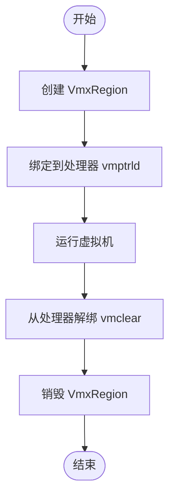

# 安全编码

<cite>
**本文档引用的文件**
- [vcpu.rs](file://src/vmx/vcpu.rs)
- [percpu.rs](file://src/vmx/percpu.rs)
- [structs.rs](file://src/vmx/structs.rs)
- [vmcs.rs](file://src/vmx/vmcs.rs)
</cite>

## 目录
1. [引言](#引言)
2. [unsafe代码使用边界与风险控制](#unsafecode使用边界与风险控制)
3. [物理内存地址的安全操作](#物理内存地址的安全操作)
4. [CPU控制寄存器访问安全](#cpu控制寄存器访问安全)
5. [VMCS生命周期管理](#vmcs生命周期管理)
6. [RAII模式在资源释放中的应用](#raii模式在资源释放中的应用)
7. [CPU本地状态保护机制](#cpu本地状态保护机制)
8. [VMX指令调用配对与作用域限制](#vmx指令调用配对与作用域限制)
9. [常见漏洞场景与防御性编程](#常见漏洞场景与防御性编程)

## 引言
本文档总结了在x86_vcpu开发中必须遵循的安全编码实践，重点强调了unsafe代码的使用边界与风险控制。通过分析`vcpu.rs`中的`VmxVcpu`实现和`percpu.rs`中的CPU本地状态保护机制，详细说明如何安全地操作物理内存地址、访问CPU控制寄存器以及管理VMCS生命周期，防止因指针越界或状态不一致导致系统崩溃。

## unsafe代码使用边界与风险控制
在x86_vcpu开发中，unsafe代码主要用于执行底层硬件操作，如VMX指令调用和物理内存访问。这些操作必须严格限制在必要的范围内，并确保所有指针操作都经过验证以避免越界访问。例如，在`vcpu.rs`中，`vmx_launch`和`vmx_resume`函数被标记为`#[unsafe(naked)]`，因为它们直接操作寄存器而不会返回，这要求编译器不要优化掉`&mut self`参数。

**Section sources**
- [vcpu.rs](file://src/vmx/vcpu.rs#L892-L911)

## 物理内存地址的安全操作
为了安全地操作物理内存地址，代码库使用`PhysFrame`来封装物理页帧，从而避免裸指针泄漏。`PhysFrame`提供了分配和释放物理内存的方法，确保每次内存操作都在受控环境下进行。此外，`phys_addr()`方法用于获取物理地址，保证了对物理内存的访问是类型安全的。

**Section sources**
- [structs.rs](file://src/vmx/structs.rs#L13-L24)
- [structs.rs](file://src/vmx/structs.rs#L44-L52)

## CPU控制寄存器访问安全
访问CPU控制寄存器时，需要确保当前环境支持VMX功能，并且相关控制寄存器处于正确的状态。在`percpu.rs`中，`hardware_enable`函数首先检查CPU是否支持VMX特性，然后启用XSAVE/XRSTOR指令集，最后设置特征控制寄存器以允许VMXON操作。此过程还包括验证CR0和CR4寄存器值是否符合VMX操作的要求。

**Section sources**
- [percpu.rs](file://src/vmx/percpu.rs#L39-L83)

## VMCS生命周期管理
VMCS（虚拟机控制结构）的生命周期由创建、绑定、解绑和销毁四个阶段组成。每个阶段都需要正确处理相关的资源。例如，在`vcpu.rs`中，`bind_to_current_processor`函数将VMCS加载到当前处理器上，而`unbind_from_current_processor`则清除该关联。当`VmxVcpu`实例被丢弃时，其`Drop`实现会自动调用`vmclear`来清理VMCS。

**Diagram sources**
- [vcpu.rs](file://src/vmx/vcpu.rs#L223-L258)
- [vcpu.rs](file://src/vmx/vcpu.rs#L1233-L1276)

## RAII模式在资源释放中的应用
RAII（Resource Acquisition Is Initialization）模式确保了资源的自动释放。在`vcpu.rs`中，`VmxVcpu`实现了`Drop` trait，这意味着当对象离开作用域时，它所持有的资源会被自动清理。具体来说，`Drop`实现会在`vmcs.phys_addr()`上调用`vmclear`，确保即使发生异常也能正确释放VMCS资源。

**Section sources**
- [vcpu.rs](file://src/vmx/vcpu.rs#L1233-L1276)

## CPU本地状态保护机制
`percpu.rs`中的`VmxPerCpuState`结构体负责维护每个CPU核心的VMX状态。它包含一个`vmcs_revision_id`字段用于标识VMCS版本，以及一个`vmx_region`字段指向实际的VMX区域。通过`new`方法初始化时，`vmx_region`被设置为未初始化状态；而在`hardware_enable`成功后，它会被赋予有效的物理地址。这种设计保证了每颗CPU都有独立的状态管理，减少了跨核干扰的风险。

**Section sources**
- [percpu.rs](file://src/vmx/percpu.rs#L0-L41)

## VMX指令调用配对与作用域限制
所有对VMXON、VMCLEAR等指令的调用都必须配对且受作用域限制。例如，在`percpu.rs`中，`hardware_enable`调用了`vmxon`来开启VMX模式，相应地，`hardware_disable`则调用`vmxoff`来关闭该模式。这两个操作形成了一个完整的配对，确保了VMX状态的一致性。同时，这些调用都被限制在特定的作用域内，防止意外泄露或重复执行。

**Section sources**
- [percpu.rs](file://src/vmx/percpu.rs#L85-L124)
- [percpu.rs](file://src/vmx/percpu.rs#L121-L167)

## 常见漏洞场景与防御性编程
常见的漏洞包括未初始化的VMCS字段、错误的控制寄存器配置以及不当的内存管理。为应对这些问题，代码采用了多种防御性编程策略：
- 在`setup_vmcs_guest`中显式设置了所有必要的VMCS字段，避免默认值带来的不确定性。
- 使用`set_control`函数根据MSR能力位动态调整控制位，确保只设置合法的选项。
- 通过`Drop`机制自动清理资源，减少手动释放可能引发的遗漏。

**Section sources**
- [vcpu.rs](file://src/vmx/vcpu.rs#L567-L595)
- [vmcs.rs](file://src/vmx/vmcs.rs#L638-L680)