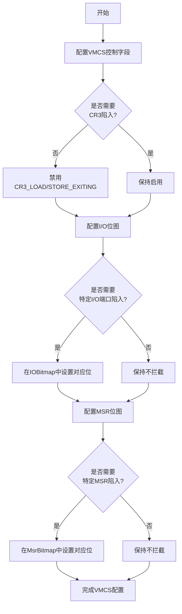
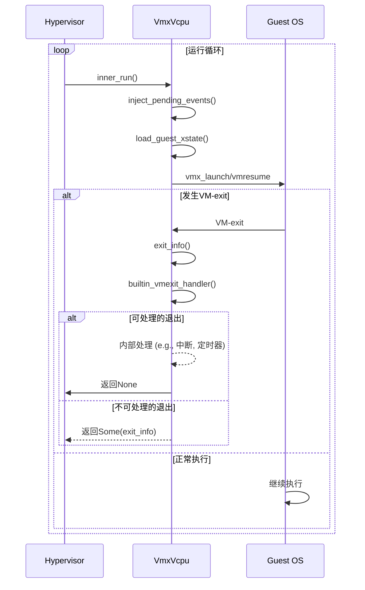

# 性能优化

<cite>
**本文档中引用的文件**
- [vmcs.rs](file://src/vmx/vmcs.rs)
- [vcpu.rs](file://src/vmx/vcpu.rs)
- [ept.rs](file://src/ept.rs)
- [definitions.rs](file://src/vmx/definitions.rs)
</cite>

## 目录
1. [引言](#引言)
2. [VMCS字段配置策略](#vmcs字段配置策略)
3. [VCPU运行循环与I/O处理](#vcpu运行循环与io处理)
4. [EPT预映射与大页映射](#ept预映射与大页映射)
5. [APIC虚拟化与TSC偏移](#apic虚拟化与tsc偏移)
6. [性能测量方法](#性能测量方法)

## 引言
本文档旨在为x86_vcpu模块提供全面的性能调优指南，重点围绕减少VM-exit频率和降低上下文切换开销展开。通过深入分析代码库中的关键组件，包括`vmcs.rs`中的VMCS字段配置、`vcpu.rs`中的VCPU运行循环以及`ept.rs`中的内存虚拟化机制，我们将揭示如何通过合理的配置和优化策略来提升虚拟化性能。文档将详细介绍如何利用CR/LDR拦截位图最小化不必要的陷入，阐述延迟处理I/O请求与批处理事件的优势，并介绍EPT预映射技术以减少EPT违规次数。此外，还将探讨启用APIC虚拟化和TSC偏移对时间相关操作的加速效果，并提供实际的性能测量方法。

## VMCS字段配置策略
在`vmcs.rs`文件中，定义了用于管理虚拟机控制结构（VMCS）的各种字段枚举，这些字段直接决定了虚拟机的执行行为和陷入条件。为了最小化不必要的VM-exit，必须精心配置这些字段。例如，`VmcsControl32::PRIMARY_PROCBASED_EXEC_CONTROLS`字段通过`set_control`函数进行设置，该函数确保了控制位的合法性和有效性。在`setup_vmcs_control`函数中，通过禁用`CR3_LOAD_EXITING`和`CR3_STORE_EXITING`等不必要的陷入位，可以显著减少因CR3寄存器访问导致的VM-exit。同时，通过启用`USE_IO_BITMAPS`和`USE_MSR_BITMAPS`，可以精确控制哪些I/O端口和MSR访问会触发陷入，从而避免全局拦截带来的性能开销。对于异常处理，通过`EXCEPTION_BITMAP`字段可以选择性地屏蔽某些异常（如#UD），仅对必要的异常进行陷入处理。



**图表来源**
- [vmcs.rs](file://src/vmx/vmcs.rs#L0-L799)
- [vcpu.rs](file://src/vmx/vcpu.rs#L0-L1719)

**章节来源**
- [vmcs.rs](file://src/vmx/vmcs.rs#L0-L799)
- [vcpu.rs](file://src/vmx/vcpu.rs#L0-L1719)

## VCPU运行循环与I/O处理
`vcpu.rs`文件中的`inner_run`函数构成了VCPU的核心运行循环。该循环首先尝试注入挂起的事件，然后加载guest的XState，接着根据VCPU是否已启动来决定执行`vmx_launch`或`vmx_resume`指令进入guest模式。当发生VM-exit时，控制权返回到`inner_run`，此时会读取退出信息并调用`builtin_vmexit_handler`处理内置的退出原因。这种设计允许将一些高频且可快速处理的退出（如中断窗口、预emption timer）在hypervisor内部消化，而无需将控制权交还给上层管理程序，从而减少了上下文切换的开销。对于I/O请求，`run`函数在检测到`IO_INSTRUCTION`退出时，会根据`io_exit_info`解析出端口号和访问宽度，并通过`AxVCpuExitReason::IoRead`或`AxVCpuExitReason::IoWrite`将请求传递出去。通过延迟处理这些I/O请求并可能进行批处理，可以有效减少频繁的陷入-退出循环。



**图表来源**
- [vcpu.rs](file://src/vmx/vcpu.rs#L0-L1719)

**章节来源**
- [vcpu.rs](file://src/vmx/vcpu.rs#L0-L1719)

## EPT预映射与大页映射
扩展页表（EPT）是实现内存虚拟化的关键技术，但EPT违规（EPT violation）会导致严重的性能下降。`ept.rs`文件中的`GuestPageWalkInfo`结构体包含了进行页表遍历所需的所有信息，这为实现EPT预映射提供了基础。通过预先分析guest的页表结构，在guest首次访问某段内存前就在EPT中建立好相应的映射关系，可以有效避免后续的EPT违规。此外，`structs.rs`中的`EPTPointer`结构体支持配置EPT页表的walk length和内存类型。通过使用更大的页面（如2MB或1GB大页）来构建EPT，可以显著减少页表层级和TLB未命中率。在`setup_vmcs_control`函数中，通过设置`ENABLE_EPT`并调用`set_ept_pointer`来激活EPT功能，同时`EPTPointer::from_table_phys`默认启用了4级页表遍历（WALK_LENGTH_4）和写回内存类型（MEM_TYPE_WB），这些都是优化内存性能的关键配置。

```mermaid
graph TD
A[Guest物理地址] --> B[EPT查找]
B --> C{EPT条目存在?}
C --> |是| D[地址转换成功]
C --> |否| E[EPT违规]
E --> F[调用ept_violation_info()]
F --> G[获取违规详情]
G --> H[更新EPT映射]
H --> I[恢复guest执行]
D --> J[访问物理内存]
```

**图表来源**
- [ept.rs](file://src/ept.rs#L0-L28)
- [vmcs.rs](file://src/vmx/vmcs.rs#L0-L799)
- [structs.rs](file://src/vmx/structs.rs#L0-L471)

**章节来源**
- [ept.rs](file://src/ept.rs#L0-L28)
- [vmcs.rs](file://src/vmx/vmcs.rs#L0-L799)

## APIC虚拟化与TSC偏移
高级可编程中断控制器（APIC）的虚拟化和时间戳计数器（TSC）的偏移是提升虚拟机性能的两个重要方面。虽然当前代码中`handle_apic_access`函数尚未完全实现，但其框架表明了对APIC访问的支持。通过虚拟化APIC，可以避免每次访问APIC寄存器都产生VM-exit，而是由hypervisor模拟其行为，这对于频繁进行中断处理的系统至关重要。关于TSC，`vmcs.rs`中的`VmcsControl64::TSC_OFFSET`字段允许为每个VCPU设置一个TSC偏移量。在`setup_vmcs_control`函数中，虽然没有直接设置TSC_OFFSET，但通过启用`LOAD_IA32_EFER`和`SAVE_IA32_EFER`，可以确保guest的TSC状态被正确保存和恢复。合理利用TSC_OFFSET可以校准不同VCPU之间的时钟差异，或者实现更安全的时间源，从而加速与时间相关的操作，如定时器和性能计数。

**章节来源**
- [vmcs.rs](file://src/vmx/vmcs.rs#L0-L799)
- [vcpu.rs](file://src/vmx/vcpu.rs#L0-L1719)

## 性能测量方法
为了评估和验证上述优化措施的效果，必须采用有效的性能测量方法。一种直接的方法是利用RDTSC指令在VM-exit处理的入口和出口处读取时间戳，计算单次VM-exit的耗时。通过统计一段时间内所有VM-exit的总耗时及其发生次数，可以得到平均陷入开销。此外，结合Intel VTune这样的专业性能分析工具，可以进行更深层次的热点分析。VTune能够识别出hypervisor中最消耗CPU周期的函数和代码路径，帮助开发者定位性能瓶颈。例如，可以通过VTune分析`builtin_vmexit_handler`中各个分支的执行频率和耗时，判断哪些类型的VM-exit是主要的性能杀手，进而有针对性地进行优化。同时，监控EPT违规和I/O陷入的发生率也是衡量优化效果的重要指标。

**章节来源**
- [vmcs.rs](file://src/vmx/vmcs.rs#L0-L799)
- [vcpu.rs](file://src/vmx/vcpu.rs#L0-L1719)