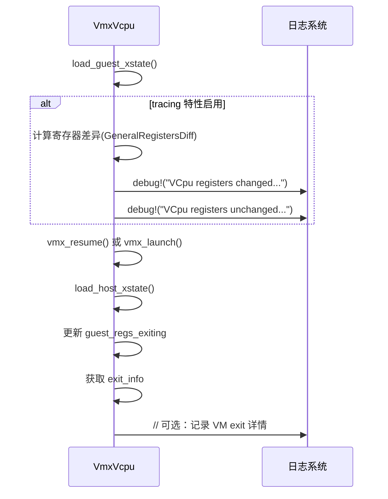

# 日志记录与监控

<cite>
**本文档中引用的文件**  
- [vcpu.rs](file://src/vmx/vcpu.rs)
- [vmcs.rs](file://src/vmx/vmcs.rs)
- [diff.rs](file://src/regs/diff.rs)
- [definitions.rs](file://src/vmx/definitions.rs)
- [mod.rs](file://src/regs/mod.rs)
- [Cargo.toml](file://Cargo.toml)
</cite>

## 目录
1. [引言](#引言)
2. [日志规范设计](#日志规范设计)
3. [关键路径日志点插入](#关键路径日志点插入)
4. [结构化日志格式定义](#结构化日志格式定义)
5. [高频事件采样策略](#高频事件采样策略)
6. [VMCS状态差异输出](#vmcs状态差异输出)
7. [监控指标体系](#监控指标体系)
8. [性能敏感路径日志建议](#性能敏感路径日志建议)

## 引言
本规范旨在为x86_vcpu模块建立统一的日志记录与运行时监控体系，以支持故障排查和性能分析。通过集成tracing功能、定义标准事件格式、实施采样策略以及构建监控指标，提升系统的可观测性。

## 日志规范设计
为实现结构化日志输出，建议启用`tracing`特性以激活相关日志功能。该特性通过条件编译控制，在编译时决定是否包含调试信息收集代码。

```mermaid
flowchart TD
Start([启用 tracing 特性]) --> Conditional["#[cfg(feature = \"tracing\")]"]
Conditional --> |启用| IncludeTracing["包含 diff 模块和寄存器差异检测"]
Conditional --> |禁用| ExcludeTracing["排除调试相关代码"]
IncludeTracing --> RegisterDiff["在 VM-exit 时计算寄存器变化"]
RegisterDiff --> LogOutput["输出结构化 trace 级日志"]
```

**图源**
- [mod.rs](file://src/regs/mod.rs#L1-L5)
- [vcpu.rs](file://src/vmx/vcpu.rs#L194-L216)

## 关键路径日志点插入
在虚拟机进入（VM-entry）和退出（VM-exit）等关键执行路径上应插入trace级日志点，用于追踪控制流变化。

### VM-exit 处理流程中的日志点


**图源**
- [vcpu.rs](file://src/vmx/vcpu.rs#L283-L320)

## 结构化日志格式定义
定义标准化的日志事件格式，确保所有关键事件包含一致的上下文信息。

### 标准事件字段
| 字段名称 | 类型 | 描述 |
|---------|------|------|
| 时间戳 | u64 | 事件发生的时间（纳秒级） |
| CPU ID | u32 | 物理CPU核心标识 |
| vCPU ID | VCpuId | 虚拟CPU标识符 |
| 退出原因码 | VmxExitReason | VM-exit 基本原因 |
| RIP | usize | 客户机指令指针 |
| 指令长度 | u32 | 触发exit的指令字节数 |

**节源**
- [definitions.rs](file://src/vmx/definitions.rs#L97-L143)
- [vmcs.rs](file://src/vmx/vmcs.rs#L583-L620)

## 高频事件采样策略
为防止日志爆炸，对高频发生的VM-exit事件实施采样记录机制。

### 采样策略建议
- **低频事件**（如VMCALL、INIT）：全量记录
- **中频事件**（如MSR访问、I/O指令）：周期性采样（例如每100次记录1次）
- **高频事件**（如EPT violation、APIC access）：触发式采样（异常模式下开启）

可通过配置参数动态调整采样率，避免在生产环境中产生过多I/O开销。

**节源**
- [vcpu.rs](file://src/vmx/vcpu.rs#L1318-L1399)

## VMCS状态差异输出
利用`diff.rs`模块提供的功能，将VMCS相关寄存器的状态差异输出至日志，便于调试状态异常问题。

### 寄存器差异检测实现
```mermaid
classDiagram
class GeneralRegisters {
+rax : u64
+rcx : u64
+rdx : u64
+rbx : u64
+rbp : u64
+rsi : u64
+rdi : u64
+r8 : u64
+r9 : u64
+get_reg_of_index(index : u8) u64
+register_name(index : u8) &'static str
}
class GeneralRegistersDiff {
-old : GeneralRegisters
-new : GeneralRegisters
+new(old, new) GeneralRegistersDiff
+is_same() bool
}
GeneralRegistersDiff ..> GeneralRegisters : 使用
note right of GeneralRegistersDiff
实现Debug trait，自动格式化
显示发生变化的寄存器及其
新旧值十六进制
end note
```

**图源**
- [diff.rs](file://src/regs/diff.rs#L0-L48)
- [mod.rs](file://src/regs/mod.rs#L0-L35)

## 监控指标体系
建立全面的运行时监控指标体系，支持性能分析与健康检查。

### 推荐监控指标
| 指标名称 | 数据类型 | 采集方式 | 用途 |
|---------|--------|--------|------|
| 每秒VM-exit次数 | 计数器 | 原子递增+定时汇总 | 性能瓶颈分析 |
| 平均处理延迟 | 毫秒 | 时间差统计 | 响应时间评估 |
| 各类exit分布 | 分类计数 | 枚举统计 | 异常行为检测 |
| EPT缺页率 | 百分比 | 缺页数/总内存访问 | 内存性能优化 |

建议对接外部观测系统（如Prometheus），实现实时监控与告警。

**节源**
- [vmcs.rs](file://src/vmx/vmcs.rs#L649-L655)
- [vcpu.rs](file://src/vmx/vcpu.rs#L320-L359)

## 性能敏感路径日志建议
在性能敏感路径中应谨慎使用日志功能，避免引入显著性能开销。

### 日志级别使用建议
- **trace级**：仅用于关键路径追踪，必须受`tracing`特性控制
- **debug级**：禁止在VM-entry/VM-exit主路径中启用
- **info级**：可用于vCPU创建、销毁等生命周期事件
- **warn/error级**：用于异常情况报告

特别注意不得在`inner_run()`等热路径中执行字符串格式化操作或复杂日志输出。

**节源**
- [vcpu.rs](file://src/vmx/vcpu.rs#L236-L249)
- [Cargo.toml](file://Cargo.toml#L40-L42)