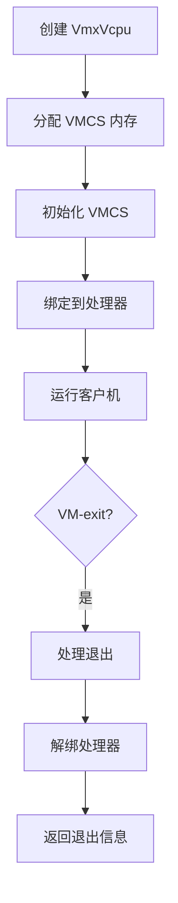
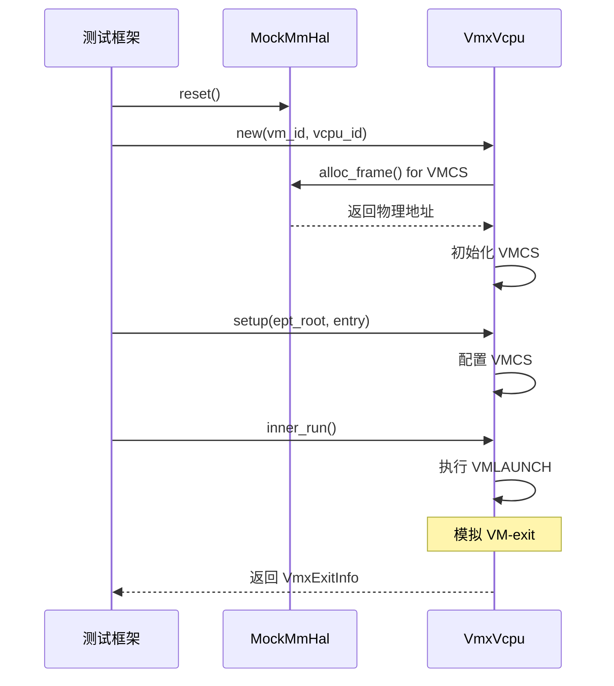

# 最佳实践

<cite>
**本文档中引用的文件**  
- [vcpu.rs](file://src/vmx/vcpu.rs)
- [vmcs.rs](file://src/vmx/vmcs.rs)
- [percpu.rs](file://src/vmx/percpu.rs)
- [definitions.rs](file://src/vmx/definitions.rs)
- [test_utils.rs](file://src/test_utils.rs)
- [Cargo.toml](file://Cargo.toml)
</cite>

## 目录
1. [简介](#简介)
2. [安全编码规范](#安全编码规范)
3. [资源管理与RAII模式](#资源管理与raii模式)
4. [VMCS配置优化](#vmcs配置优化)
5. [测试策略](#测试策略)
6. [中断与锁管理](#中断与锁管理)
7. [日志记录规范](#日志记录规范)
8. [静态分析工具使用](#静态分析工具使用)

## 简介
`x86_vcpu` 是一个为 Arceos 超级管理程序设计的 x86_64 架构虚拟 CPU 实现库。该库提供了完整的 Intel VT-x (VMX) 虚拟化支持，包括 VMCS 管理、寄存器状态管理、EPT 内存虚拟化和 MSR 处理等功能。本最佳实践文档旨在指导开发团队如何正确、高效且安全地使用此库，以提升代码质量和系统稳定性。

## 安全编码规范
在使用 `x86_vcpu` 库时，必须严格遵守安全编码原则，尤其是在处理底层硬件交互和特权指令时。

### 输入验证
所有外部输入，特别是涉及物理内存指针和 VMCS 字段的操作，都必须进行严格的验证。例如，在 `VmxVcpu::setup_vmcs_guest` 方法中设置客户机寄存器时，必须确保提供的入口地址（entry）和 EPT 根地址（ept_root）是有效的物理地址，并且符合页对齐等硬件要求。

### 特权指令处理
执行 VMX 指令（如 `VMLAUNCH`, `VMRESUME`）属于高风险操作。这些操作通过 `x86` crate 的 unsafe 接口实现，因此调用者必须确保在调用前已正确初始化 VMCS 并绑定了当前处理器。任何错误的调用顺序或状态都会导致系统崩溃。例如，`VmxPerCpuState::hardware_enable` 在启用 VMX 模式前会检查控制寄存器（CR0, CR4）的状态是否符合 VMX 运行要求。

**Section sources**
- [vcpu.rs](file://src/vmx/vcpu.rs#L223-L258)
- [percpu.rs](file://src/vmx/percpu.rs#L50-L100)

## 资源管理与RAII模式
推荐采用 RAII（Resource Acquisition Is Initialization）模式来管理 vCPU 和 VMCS 资源，确保在异常发生时能自动清理。

### VMCS 生命周期管理
`VmxRegion<H::MmHal>` 结构体负责管理 VMCS 区域的生命周期。它通过 `AxMmHal` trait 分配和释放物理内存。当 `VmxVcpu` 对象被创建时，`VmxRegion::new` 会分配一个页面大小的内存用于存储 VMCS 数据结构。当对象被销毁时，内存将被自动回收。

### 绑定与解绑
`VmxVcpu` 提供了 `bind_to_current_processor` 和 `unbind_from_current_processor` 方法来显式管理 VMCS 与当前逻辑处理器的绑定关系。这遵循了 RAII 原则：在进入临界区前绑定，在退出后立即解绑，即使发生 panic 也能保证资源被正确释放。

**Diagram sources**
- [vcpu.rs](file://src/vmx/vcpu.rs#L223-L258)
- [vmcs.rs](file://src/vmx/vmcs.rs#L0-L100)

**Section sources**
- [vcpu.rs](file://src/vmx/vcpu.rs#L223-L258)
- [vmcs.rs](file://src/vmx/vmcs.rs#L0-L100)

## VMCS配置优化
合理的 VMCS 配置可以显著减少不必要的 VM-exit，从而提高性能。

### 控制字段配置
`VmcsControl32` 和 `VmcsControl64` 枚举定义了所有可配置的 VMCS 控制字段。通过 `set_control` 函数，可以根据硬件能力（从 IA32_VMX_*_CTLS MSRs 读取）安全地设置这些字段。

- **Pin-based Controls**: 启用外部中断和 NMI 退出。
- **Primary Processor-based Controls**: 启用 I/O 位图和 MSR 位图，禁用 CR3 加载/存储退出。
- **Secondary Controls**: 启用 EPT、RDTSCP、INVPCID 和无限制客户机模式。

### 异常与I/O拦截
通过配置 `EXCEPTION_BITMAP` 可以选择性地拦截特定异常（如 #UD）。对于 I/O 操作，应使用 `IOBitmap` 结构体精确指定需要拦截的端口范围，避免全局拦截带来的性能开销。例如，默认情况下只拦截 QEMU 退出端口（0x604）。

**Section sources**
- [vmcs.rs](file://src/vmx/vmcs.rs#L154-L194)
- [vcpu.rs](file://src/vmx/vcpu.rs#L700-L800)

## 测试策略
建议编写全面的单元测试和集成测试，并利用 `test_utils.rs` 提供的工具模拟各种 VM-exit 场景。

### 模拟环境
`test_utils.rs` 模块提供了一个 `mock` 子模块，其中包含 `MockMmHal` 和 `MockVCpuHal`。`MockMmHal` 使用一个固定的内存池来模拟物理内存分配，这对于测试内存管理逻辑非常有用。

### 单元测试示例
`VmxPerCpuState` 的测试展示了如何验证 per-CPU 状态的独立性和正确性。`test_multiple_cpu_states_independence` 确保了不同 CPU 的状态不会相互干扰。

**Diagram sources**
- [test_utils.rs](file://src/test_utils.rs#L0-L160)
- [vcpu.rs](file://src/vmx/vcpu.rs#L254-L284)

**Section sources**
- [test_utils.rs](file://src/test_utils.rs#L0-L160)
- [vcpu.rs](file://src/vmx/vcpu.rs#L254-L284)

## 中断与锁管理
在中断上下文中应避免持有锁或执行长时间运行的操作。

### 中断窗口
`VmxVcpu::set_interrupt_window` 方法允许在客户机 RFLAGS.IF=1 且没有其他中断阻塞时触发 VM-exit。这使得 hypervisor 可以及时注入外部中断，但相关处理逻辑必须尽可能轻量，避免在中断上下文中长时间占用资源。

### 锁竞争
由于 `VmxVcpu` 操作通常涉及对共享硬件状态（如 VMCS）的修改，因此在多核环境中必须注意锁的竞争。建议将耗时的计算或 I/O 操作移出临界区，仅在必要时获取锁。

**Section sources**
- [vcpu.rs](file://src/vmx/vcpu.rs#L254-L284)
- [vcpu.rs](file://src/vmx/vcpu.rs#L794-L814)

## 日志记录规范
建立统一的日志记录规范对于故障排查和性能分析至关重要。

### 日志级别
- **info!**: 记录关键事件，如成功启用 VMX (`[AxVM] succeeded to turn on VMX.`)。
- **debug!**: 记录详细的调试信息，如 VMCS 字段的修改 (`set {:?}: {:#x} (+{:#x}, -{:#x})`)。
- **warn!**: 记录潜在问题。
- **error!**: 记录严重错误。

### 条件编译
通过 `tracing` feature flag 可以有条件地启用更详细的日志记录。例如，当启用 `tracing` 时，`inner_run` 方法会比较 VM-exit 前后的寄存器状态并输出差异。

**Section sources**
- [vcpu.rs](file://src/vmx/vcpu.rs#L254-L284)
- [vmcs.rs](file://src/vmx/vmcs.rs#L447-L485)

## 静态分析工具使用
鼓励使用静态分析工具检查 `unsafe` 代码块的正确性。

### 工具链集成
应在 CI/CD 流程中集成 `clippy` 等 Rust linter 工具。`vmcs.rs` 文件顶部的 `#![deny(missing_docs)]` 和 `#![allow(dead_code)]` 属性表明了对代码质量和文档的重视。

### Unsafe代码审查
所有标记为 `unsafe` 的代码（如 `vmx::vmptrld`, `vmx::vmclear` 的调用）都必须有充分的理由和注释说明其安全性。开发者应确保这些调用发生在正确的上下文和状态中。

**Section sources**
- [vmcs.rs](file://src/vmx/vmcs.rs#L0-L10)
- [vcpu.rs](file://src/vmx/vcpu.rs#L223-L258)