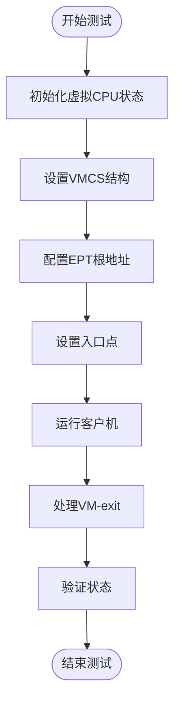
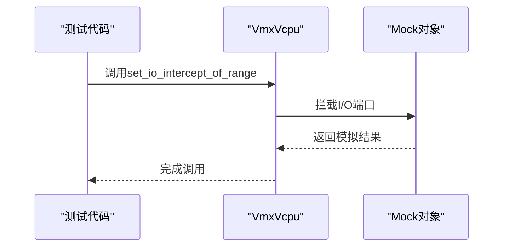
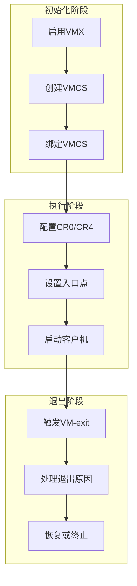

# 测试策略

<cite>
**本文档中引用的文件**
- [test_utils.rs](file://src/test_utils.rs)
- [vcpu.rs](file://src/vmx/vcpu.rs)
- [vmcs.rs](file://src/vmx/vmcs.rs)
- [msr.rs](file://src/msr.rs)
- [instructions.rs](file://src/vmx/instructions.rs)
</cite>

## 目录
1. [引言](#引言)
2. [单元测试环境构建](#单元测试环境构建)
3. [硬件交互模拟](#硬件交互模拟)
4. [集成测试方案](#集成测试方案)
5. [属性测试与边界错误检测](#属性测试与边界错误检测)
6. [异常路径覆盖](#异常路径覆盖)
7. [持续集成与KVM兼容性检查](#持续集成与kvm兼容性检查)

## 引言
本测试策略旨在为x86_vcpu模块建立全面可靠的测试保障体系。通过利用`test_utils.rs`提供的模拟框架，我们将构建可重复的单元测试环境，确保虚拟CPU状态初始化、VM-exit注入与响应验证的准确性。同时，提出集成测试方案以验证从VMX启动到vCPU执行再到异常退出的完整流程，并建议采用属性测试生成随机化VMCS配置来发现潜在的边界错误。

## 单元测试环境构建
基于`test_utils.rs`中的`MockMmHal`和`MockVCpuHal`，可以构建一个可重复的单元测试环境。该环境允许在不依赖真实硬件的情况下对虚拟CPU的状态进行初始化和管理。

**图表来源**
- [test_utils.rs](file://src/test_utils.rs#L0-L160)
- [vcpu.rs](file://src/vmx/vcpu.rs#L0-L799)

**章节来源**
- [test_utils.rs](file://src/test_utils.rs#L0-L160)
- [vcpu.rs](file://src/vmx/vcpu.rs#L0-L799)

## 硬件交互模拟
使用mock对象可以有效地模拟MSR读写、I/O端口访问等硬件交互行为。例如，在`vcpu.rs`中定义了`set_io_intercept_of_range`和`set_msr_intercept_of_range`方法，用于设置I/O和MSR拦截。

**图表来源**
- [vcpu.rs](file://src/vmx/vcpu.rs#L0-L799)
- [test_utils.rs](file://src/test_utils.rs#L0-L160)

**章节来源**
- [vcpu.rs](file://src/vmx/vcpu.rs#L0-L799)

## 集成测试方案
集成测试应覆盖从VMX启动到vCPU执行再到异常退出的完整流程。这包括启用VMX模式、创建并绑定VMCS、配置控制寄存器以及最终的VM-exit处理。

**图表来源**
- [vcpu.rs](file://src/vmx/vcpu.rs#L0-L799)
- [percpu.rs](file://src/vmx/percpu.rs#L0-L219)

**章节来源**
- [vcpu.rs](file://src/vmx/vcpu.rs#L0-L799)

## 属性测试与边界错误检测
推荐采用属性测试（property-based testing）生成随机化的VMCS配置，以发现可能存在的边界错误。通过对各种输入组合进行自动化测试，能够有效提高代码健壮性。

**章节来源**
- [vmcs.rs](file://src/vmx/vmcs.rs#L0-L799)

## 异常路径覆盖
特别强调对异常路径（如VMFAIL_INVALID）的测试覆盖。确保所有可能的错误情况都被正确捕获和处理，从而提升系统的稳定性和可靠性。

**章节来源**
- [instructions.rs](file://src/vmx/instructions.rs#L0-L50)
- [vmcs.rs](file://src/vmx/vmcs.rs#L0-L799)

## 持续集成与KVM兼容性检查
建议在持续集成过程中运行KVM兼容性检查，以确保实现的真实硬件一致性。通过定期执行这些检查，可以在早期发现问题并及时修复。

**章节来源**
- [msr.rs](file://src/msr.rs#L0-L187)
- [vcpu.rs](file://src/vmx/vcpu.rs#L0-L799)