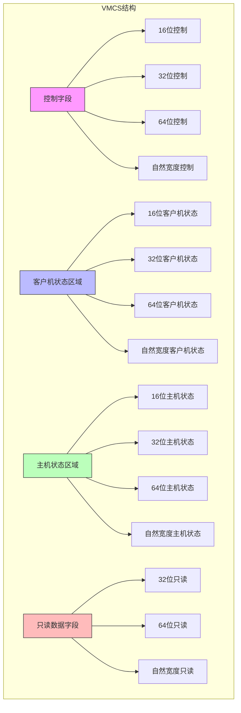

# VMCS结构

<cite>
**本文档中引用的文件**
- [vmcs.rs](file://src/vmx/vmcs.rs)
- [definitions.rs](file://src/vmx/definitions.rs)
- [instructions.rs](file://src/vmx/instructions.rs)
- [structs.rs](file://src/vmx/structs.rs)
- [vcpu.rs](file://src/vmx/vcpu.rs)
</cite>

## 目录
1. [简介](#简介)
2. [VMCS设计与实现概述](#vmcs设计与实现概述)
3. [字段编码方式](#字段编码方式)
4. [安全封装机制](#安全封装机制)
5. [VMREAD/VMWRITE操作](#vmreadvmwrite操作)
6. [VMCS指针与内存分配](#vmcs指针与内存分配)
7. [典型配置用例](#典型配置用例)
8. [调试技巧](#调试技巧)
9. [整体结构示意图](#整体结构示意图)

## 简介
虚拟机控制结构（Virtual Machine Control Structure, VMCS）是Intel VT-x技术的核心数据结构，用于管理虚拟CPU的状态。它作为虚拟CPU状态的核心容器，存储了Guest State Area、Host State Area和VM-control fields三类关键数据。本文档基于`src/vmx/vmcs.rs`中的Vmcs结构体实现，全面解析其设计原理与具体实现。

## VMCS设计与实现概述

VMCS结构在代码中通过多个枚举类型来表示不同类型的字段，包括控制字段、客户机状态字段、主机状态字段和只读数据字段。这些字段按照位宽分为16位、32位、64位和自然宽度（natural-width）四种类型。

### 三类核心数据区域

#### 控制字段（VM-control fields）
控制字段决定了处理器在VMX非根模式下的行为。主要包括：
- **16位控制字段**：如VPID（虚拟处理器标识符）、EPTP索引等
- **32位控制字段**：如异常位图、CR3目标计数、VM退出控制等
- **64位控制字段**：如I/O位图地址、MSR位图地址、EPT指针等
- **自然宽度控制字段**：如CR0/CR4的客户机/主机掩码

[SPEC SYMBOL](file://src/vmx/vmcs.rs#L44-L241)

#### 客户机状态区域（Guest State Area）
当发生VM退出时，处理器会自动将当前客户机状态保存到此区域；当执行VMLAUNCH或VMRESUME时，处理器会从该区域恢复客户机状态。
- **16位客户机状态字段**：段选择子（CS、DS、SS等）
- **32位客户机状态字段**：段界限、访问权限、中断状态等
- **64位客户机状态字段**：调试控制寄存器、性能监控寄存器等
- **自然宽度客户机状态字段**：通用寄存器（RIP、RSP、RFLAGS）、系统基址（GDTR、IDTR）等

[SPEC SYMBOL](file://src/vmx/vmcs.rs#L196-L321)

#### 主机状态区域（Host State Area）
当发生VM退出时，处理器会自动加载此区域中的值到相应的处理器状态中，以便VMM能够正常运行。
- **16位主机状态字段**：段选择子（CS、DS、SS等）
- **32位主机状态字段**：SYSENTER_CS
- **64位主机状态字段**：PAT、EFER、性能全局控制
- **自然宽度主机状态字段**：CR0、CR3、CR4、RSP、RIP等

[SPEC SYMBOL](file://src/vmx/vmcs.rs#L369-L407)

## 字段编码方式

VMCS字段使用特定的编码方案来标识不同的字段类型和位置。每种字段类型都有对应的枚举定义，并通过宏展开生成读写方法。

### 四种位宽类型

| 类型 | 枚举前缀 | 示例字段 | 地址偏移 |
|------|----------|---------|---------|
| 16位 | VmcsControl16/VmcsGuest16/VmcsHost16 | VPID | 0x0000 |
| 32位 | VmcsControl32/VmcsGuest32/VmcsHost32 | EXCEPTION_BITMAP | 0x4004 |
| 64位 | VmcsControl64/VmcsGuest64/VmcsHost64 | EPTP | 0x201A |
| 自然宽度 | VmcsControlNW/VmcsGuestNW/VmcsHostNW | CR0_GUEST_HOST_MASK | 0x6000 |

[SPEC SYMBOL](file://src/vmx/vmcs.rs#L44-L485)

### 编码规则
- **控制字段**：以0x0000、0x2000、0x4000、0x6000为起始基址
- **客户机状态字段**：以0x0800、0x2800、0x4800、0x6800为起始基址  
- **主机状态字段**：以0x0C00、0x2C00、0x4C00、0x6C00为起始基址
- **只读数据字段**：以0x2400、0x4400、0x6400为起始基址

## 安全封装机制

尽管底层的VMREAD和VMWRITE指令需要unsafe操作，但代码通过精心设计的API提供了安全的访问接口。

### 宏定义实现的安全抽象
```rust
macro_rules! vmcs_read {
    ($field_enum: ident, u64) => {
        impl $field_enum {
            pub fn read(self) -> AxResult<u64> {
                #[cfg(target_pointer_width = "64")]
                unsafe {
                    vmx::vmread(self as u32).map_err(as_axerr)
                }
                #[cfg(target_pointer_width = "32")]
                unsafe {
                    let field = self as u32;
                    Ok(vmx::vmread(field).map_err(as_axerr)?
                        + (vmx::vmread(field + 1).map_err(as_axerr)? << 32))
                }
            }
        }
    };
}
```

### 安全性保障措施
1. **类型安全**：每个字段都定义为独立的枚举成员，避免直接操作原始数值
2. **错误传播**：所有操作返回`AxResult<T>`类型，统一处理可能的错误
3. **条件编译**：针对32位和64位平台分别处理64位字段的读写
4. **边界检查**：通过SDM规范确保字段值的合法性

[SPEC SYMBOL](file://src/vmx/vmcs.rs#L44-L94)

## VMREAD/VMWRITE操作

VMCS的读写操作通过专门的指令VMREAD和VMWRITE完成，代码中对此进行了封装。

### 操作流程
1. 将字段枚举转换为对应的32位字段编码
2. 调用底层的`vmx::vmread`或`vmx::vmwrite`函数
3. 处理可能的错误并返回结果

### 写操作特殊处理
对于64位字段，在32位平台上需要分两次写入：
```rust
#[cfg(target_pointer_width = "32")]
unsafe {
    let field = self as u32;
    vmx::vmwrite(field, value & 0xffff_ffff).map_err(as_axerr)?;
    vmx::vmwrite(field + 1, value >> 32).map_err(as_axerr)?;
    Ok(())
}
```

[SPEC SYMBOL](file://src/vmx/vmcs.rs#L44-L94)

## VMCS指针与内存分配

VMCS指针指向一个物理对齐的内存区域，该区域用于存储VMCS数据结构。

### 对齐要求
- 必须按页大小（4KB）对齐
- 物理地址低12位必须为0

### 内存分配策略
使用`VmxRegion<H>`结构进行内存分配：
```rust
pub struct VmxRegion<H: AxMmHal> {
    frame: PhysFrame<H>,
}
```
其中`PhysFrame<H>`负责实际的物理内存分配和管理。

### 初始化过程
1. 分配一页物理内存
2. 设置修订ID和阴影指示器
3. 返回物理地址供VMXON等指令使用

[SPEC SYMBOL](file://src/vmx/structs.rs#L10-L30)

## 典型配置用例

### 基于EPT的内存虚拟化配置
```rust
pub fn set_ept_pointer(pml4_paddr: HostPhysAddr) -> AxResult {
    let eptp = super::structs::EPTPointer::from_table_phys(pml4_paddr).bits();
    VmcsControl64::EPTP.write(eptp)?;
    unsafe { invept(InvEptType::SingleContext, eptp).map_err(as_axerr)? };
    Ok(())
}
```
此函数设置EPT指针并使TLB失效，启用扩展页表功能。

[SPEC SYMBOL](file://src/vmx/vmcs.rs#L740-L747)

### I/O位图控制启用
```rust
let io_bitmap = IOBitmap::<H>::passthrough_all()?;
let (io_bitmap_a, io_bitmap_b) = io_bitmap.phys_addr();
VmcsControl64::IO_BITMAP_A_ADDR.write(io_bitmap_a.as_usize() as u64)?;
VmcsControl64::IO_BITMAP_B_ADDR.write(io_bitmap_b.as_usize() as u64)?;
```
通过设置I/O位图地址，可以精确控制哪些I/O端口访问会导致VM退出。

[SPEC SYMBOL](file://src/vmx/structs.rs#L32-L55)

### 中断信息字段设置
```rust
pub fn inject_event(vector: u8, err_code: Option<u32>) -> AxResult {
    let int_info = VmxInterruptInfo::from(vector, err_code);
    if let Some(err_code) = int_info.err_code {
        VmcsControl32::VMENTRY_EXCEPTION_ERR_CODE.write(err_code)?;
    }
    VmcsControl32::VMENTRY_INTERRUPTION_INFO_FIELD.write(int_info.bits())?;
    Ok(())
}
```
用于向客户机注入中断事件。

[SPEC SYMBOL](file://src/vmx/vmcs.rs#L770-L780)

## 调试技巧

### 验证VMCS字段合法性
利用只读字段获取VM执行相关信息：
```rust
pub fn exit_info() -> AxResult<VmxExitInfo> {
    let full_reason = VmcsReadOnly32::EXIT_REASON.read()?;
    Ok(VmxExitInfo {
        exit_reason: full_reason
            .get_bits(0..16)
            .try_into()
            .expect("Unknown VM-exit reason"),
        entry_failure: full_reason.get_bit(31),
        exit_instruction_length: VmcsReadOnly32::VMEXIT_INSTRUCTION_LEN.read()?,
        guest_rip: VmcsGuestNW::RIP.read()?,
    })
}
```

[SPEC SYMBOL](file://src/vmx/vmcs.rs#L750-L760)

### 处理VM-fail错误
当出现无效字段值导致VM失败时，可通过以下方式诊断：
1. 检查`VM_INSTRUCTION_ERROR`只读字段
2. 使用`instruction_error()`函数获取具体的错误码
3. 根据错误码定位问题根源

```rust
pub fn instruction_error() -> VmxInstructionError {
    VmcsReadOnly32::VM_INSTRUCTION_ERROR.read().unwrap().into()
}
```

[SPEC SYMBOL](file://src/vmx/vmcs.rs#L749)

### 常见错误类型
| 错误码 | 描述 |
|-------|------|
| 7 | VM入口时控制字段无效 |
| 8 | VM入口时主机状态字段无效 |
| 12 | 不支持的VMCS组件读写 |
| 13 | 向只读VMCS组件写入 |

[SPEC SYMBOL](file://src/vmx/definitions.rs#L3-L30)

## 整体结构示意图



**图源**
- [vmcs.rs](file://src/vmx/vmcs.rs#L44-L485)

**节源**
- [vmcs.rs](file://src/vmx/vmcs.rs#L44-L485)
- [definitions.rs](file://src/vmx/definitions.rs#L3-L30)