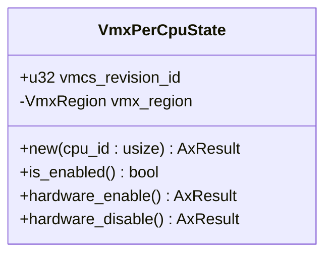
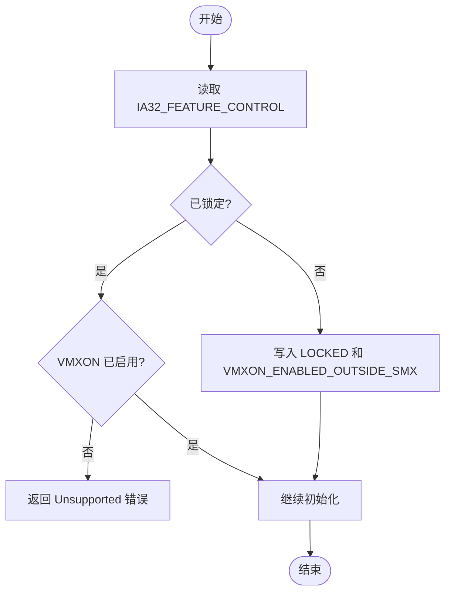
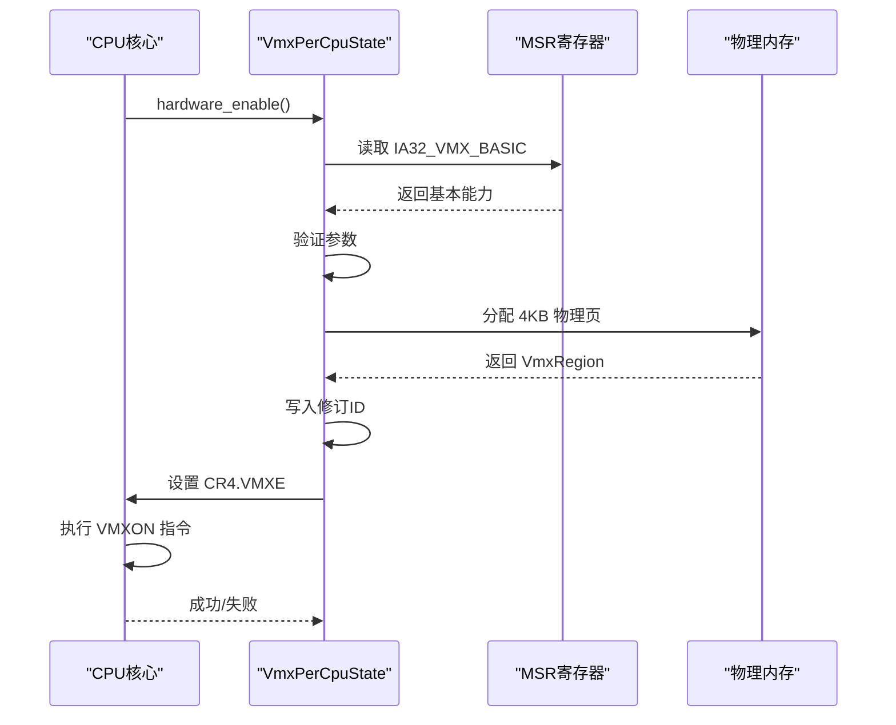
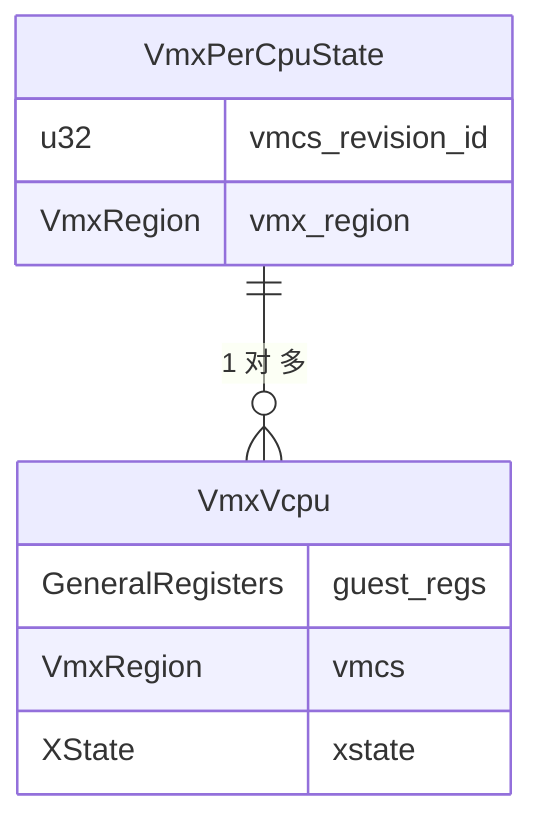

# per-CPU状态管理

<cite>
**本文档中引用的文件**  
- [percpu.rs](file://src/vmx/percpu.rs)
- [structs.rs](file://src/vmx/structs.rs)
- [vcpu.rs](file://src/vmx/vcpu.rs)
- [vmcs.rs](file://src/vmx/vmcs.rs)
- [mod.rs](file://src/vmx/mod.rs)
</cite>

## 目录
1. [引言](#引言)  
2. [VmxPerCpuState设计目的与核心原理](#vmxpercpustate设计目的与核心原理)  
3. [VMXON指令的CPU局部性要求](#vmxon指令的cpu局部性要求)  
4. [Feature Control MSR的操作机制](#feature-control-msr的操作机制)  
5. [VMXON区域的分配与激活流程](#vmxon区域的分配与激活流程)  
6. [跨核误操作的安全防护机制](#跨核误操作的安全防护机制)  
7. [VmxPerCpuState与VmxVcpu的关系](#vmxpercpustate与vmxvcpu的关系)  
8. [初始化与资源清理](#初始化与资源清理)  
9. [SMP环境下的同步与竞态规避](#smp环境下的同步与竞态规避)  
10. [总结](#总结)

## 引言
在现代虚拟化系统中，Intel VT-x技术通过VMX（Virtual Machine Extensions）模式实现硬件辅助虚拟化。由于VMX操作具有严格的CPU局部性约束，必须为每个逻辑处理器独立维护其VMX状态。`VmxPerCpuState`结构体正是为此而设计，它封装了单个CPU核心上启用和管理VMX所需的所有状态信息。本文深入分析该模块的设计与实现，阐明其在多核系统中的关键作用。

## VmxPerCpuState设计目的与核心原理
`VmxPerCpuState`是专为每个CPU核心设计的状态容器，用于管理该核心上的VMX操作。其核心设计目的是确保VMX功能的正确隔离与安全启用。在多核系统中，每个逻辑处理器必须独立进入和退出VMX模式，因此需要为每个CPU维护独立的状态结构。

该结构体包含两个关键字段：`vmcs_revision_id`用于标识当前CPU支持的VMCS版本，确保软件与硬件兼容；`vmx_region`则指向为该CPU分配的VMX区域，其中包含VMCS及其他必要的虚拟机控制数据。



**图表来源**  
- [percpu.rs](file://src/vmx/percpu.rs#L15-L25)

**本节来源**  
- [percpu.rs](file://src/vmx/percpu.rs#L15-L25)

## VMXON指令的CPU局部性要求
VMXON指令只能在当前正在执行的CPU上激活VMX操作，这是由Intel VT-x架构决定的硬件限制。一旦某个CPU执行了VMXON指令，它便进入了VMX根操作模式，可以创建和运行虚拟机。其他CPU若要参与虚拟化，必须各自独立执行VMXON指令。

这种设计确保了虚拟化状态的隔离性，防止一个CPU的VMX错误影响到其他CPU。同时，这也意味着虚拟化管理软件必须为每个在线的CPU核心显式调用`hardware_enable()`方法来激活其VMX功能。

**本节来源**  
- [percpu.rs](file://src/vmx/percpu.rs#L50-L120)

## Feature Control MSR的操作机制
`VmxPerCpuState`在启用VMX前会检查并配置IA32_FEATURE_CONTROL MSR。该MSR控制着VMX功能的整体可用性。代码首先读取当前值，检查`LOCKED`位是否已设置。如果未锁定，则尝试写入新的控制标志，包括`LOCKED`和`VMXON_ENABLED_OUTSIDE_SMX`，以永久启用VMX功能。

如果MSR已被锁定且`VMXON_ENABLED_OUTSIDE_SMX`位未置位，则说明BIOS禁用了VMX功能，此时将返回错误。这一机制确保了只有在系统固件允许的情况下才能启用虚拟化。



**图表来源**  
- [percpu.rs](file://src/vmx/percpu.rs#L75-L85)

**本节来源**  
- [percpu.rs](file://src/vmx/percpu.rs#L75-L85)

## VMXON区域的分配与激活流程
`VmxPerCpuState`的初始化流程严格遵循Intel SDM规范。首先，通过读取IA32_VMX_BASIC MSR获取VMCS修订ID和区域大小等基本信息。然后，验证这些参数是否符合要求，例如区域大小必须为4KB，内存类型必须为Write-Back。

接下来，使用`VmxRegion::new()`分配并初始化VMX区域，将获取到的修订ID写入区域起始位置。最后，在确保控制寄存器（CR0、CR4）处于VMX友好状态后，通过设置CR4的VMXE位并执行VMXON指令来激活VMX模式。



**图表来源**  
- [percpu.rs](file://src/vmx/percpu.rs#L90-L120)
- [structs.rs](file://src/vmx/structs.rs#L30-L45)

**本节来源**  
- [percpu.rs](file://src/vmx/percpu.rs#L90-L120)
- [structs.rs](file://src/vmx/structs.rs#L30-L45)

## 跨核误操作的安全防护机制
`VmxPerCpuState`通过多种机制防止跨核误操作。首先，每个CPU的状态完全独立，测试用例`test_multiple_cpu_states_independence`验证了不同CPU实例之间的状态隔离。其次，在执行VMXON之前会检查当前CPU是否已启用VMX，避免重复激活。

此外，代码还会验证控制寄存器的状态是否符合VMX要求，防止因不兼容的CR0或CR4配置导致VMX进入失败。所有这些检查都在`hardware_enable()`方法中完成，确保只有在满足所有条件时才会真正执行VMXON指令。

**本节来源**  
- [percpu.rs](file://src/vmx/percpu.rs#L60-L70)
- [percpu.rs](file://src/vmx/percpu.rs#L166-L178)

## VmxPerCpuState与VmxVcpu的关系
`VmxPerCpuState`与`VmxVcpu`之间存在一对多的关系。前者代表物理CPU核心的VMX状态，后者代表运行在该核心上的虚拟CPU实例。一个`VmxPerCpuState`可以支持多个`VmxVcpu`实例通过线程调度共享使用。

当调度器切换到某个vCPU时，会将其VMCS指针加载到当前CPU的VMCS链中，并通过`vmptrld`指令使其成为当前活动的VMCS。这种设计实现了物理资源的高效复用，允许多个虚拟机在同一物理核心上并发执行。



**图表来源**  
- [percpu.rs](file://src/vmx/percpu.rs#L15-L25)
- [vcpu.rs](file://src/vmx/vcpu.rs#L100-L120)

**本节来源**  
- [percpu.rs](file://src/vmx/percpu.rs#L15-L25)
- [vcpu.rs](file://src/vmx/vcpu.rs#L100-L120)

## 初始化与资源清理
`VmxPerCpuState`的生命周期管理至关重要。初始化通过`new()`方法完成，创建一个未激活的状态对象。真正的资源分配发生在`hardware_enable()`中，包括VMX区域的分配和VMXON指令的执行。

资源清理由`hardware_disable()`负责，它首先执行VMXOFF指令退出VMX模式，然后清除CR4的VMXE位。最后，将`vmx_region`重置为未初始化状态，确保不会留下任何残留状态。这种严格的资源管理避免了内存泄漏和状态污染。

```rust
[SPEC SYMBOL](file://src/vmx/percpu.rs#L121-L135)
```

**本节来源**  
- [percpu.rs](file://src/vmx/percpu.rs#L121-L135)

## SMP环境下的同步与竞态规避
在对称多处理（SMP）环境中，`VmxPerCpuState`的访问天然具有CPU局部性，因为每个实例只被绑定到特定的核心。这从根本上避免了跨CPU的竞争条件。初始化和销毁操作通常在CPU启动和关闭时由内核直接调用，无需额外的同步机制。

对于共享数据结构的访问，如全局vCPU列表，应使用适当的锁机制保护。但`VmxPerCpuState`本身的设计确保了其核心操作——VMXON和VMXOFF——始终在本地CPU上原子执行，从而规避了最危险的竞态条件。

**本节来源**  
- [percpu.rs](file://src/vmx/percpu.rs#L50-L120)
- [vcpu.rs](file://src/vmx/vcpu.rs#L200-L220)

## 总结
`VmxPerCpuState`模块是实现高效、安全的多核虚拟化的基石。它通过为每个CPU核心维护独立的状态，严格遵守VMXON指令的局部性要求，确保了虚拟化环境的稳定性和隔离性。其精心设计的初始化、激活和清理流程，结合对Feature Control MSR的正确操作，构成了一个健壮的虚拟化基础框架。理解这一模块的实现细节，对于开发高性能的Hypervisor至关重要。