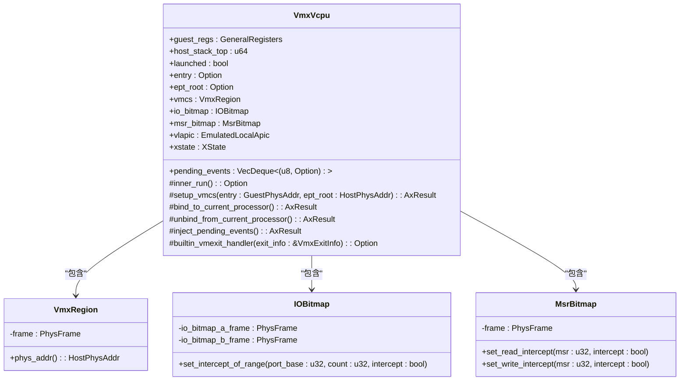
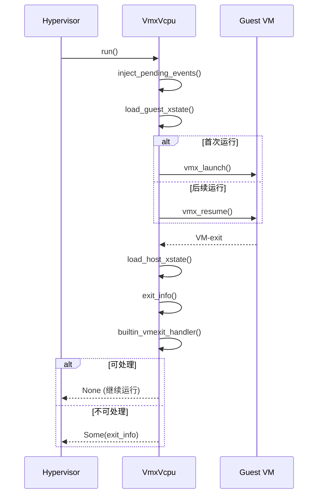
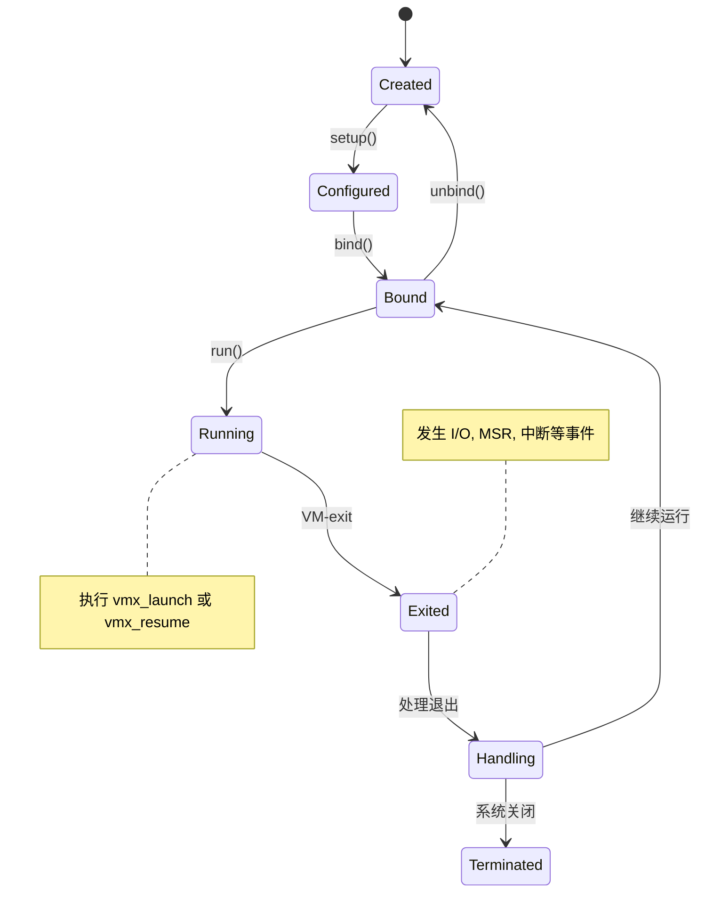

# vCPU状态管理

<cite>
**本文档中引用的文件**
- [vcpu.rs](file://src/vmx/vcpu.rs)
- [vmcs.rs](file://src/vmx/vmcs.rs)
- [structs.rs](file://src/vmx/structs.rs)
</cite>

## 目录
1. [引言](#引言)
2. [VmxVcpu结构体与状态机模型](#vmxvcpu结构体与状态机模型)
3. [launched标志位的设计意义](#launched标志位的设计意义)
4. [vCPU生命周期中的状态流转](#vcpu生命周期中的状态流转)
5. [run()方法与VM-exit机制](#run方法与vm-exit机制)
6. [寄存器状态保存与恢复](#寄存器状态保存与恢复)
7. [异常与中断注入](#异常与中断注入)
8. [状态转换图示](#状态转换图示)
9. [典型场景与常见陷阱](#典型场景与常见陷阱)

## 引言
本文档详细描述了`VmxVcpu`结构体所体现的状态机模型及其在虚拟CPU（vCPU）生命周期中的作用。重点分析了`launched`标志位的设计，该设计确保了符合Intel SDM规范中关于重复启动的约束条件。文档将阐述vCPU从创建、配置（如设置RIP、RSP）、运行到处理VM-exit事件的完整状态流转过程，并结合代码实现进行深入解析。

## VmxVcpu结构体与状态机模型
`VmxVcpu`结构体是虚拟CPU的核心数据结构，它不仅包含了guest的通用寄存器和VMCS（Virtual Machine Control Structure）区域，还通过其内部状态字段实现了对vCPU生命周期的精确控制。

**Diagram sources**
- [vcpu.rs](file://src/vmx/vcpu.rs#L160-L180)
- [structs.rs](file://src/vmx/structs.rs#L10-L40)

**Section sources**
- [vcpu.rs](file://src/vmx/vcpu.rs#L160-L180)

## launched标志位的设计意义
`launched`标志位是`VmxVcpu`结构体中的一个关键布尔字段，其核心设计意义在于区分首次调用VMLAUNCH指令与后续调用VMRESUME指令，从而严格遵守Intel SDM（Software Developer's Manual）规范。

根据Intel VT-x技术规范，一个VMCS（虚拟机控制结构）必须通过VMLAUNCH指令进行首次激活。一旦成功执行VMLAUNCH并发生VM-exit后，若要重新进入该虚拟机，则必须使用VMRESUME指令，而不能再使用VMLAUNCH。重复使用VMLAUNCH会导致VM-entry失败。

在代码中，`launched`标志位的逻辑清晰地体现了这一规范：
1.  **初始化为false**：当通过`new()`方法创建一个新的`VmxVcpu`实例时，`launched`被初始化为`false`。
2.  **首次运行**：在`inner_run()`方法中，会检查`self.launched`。如果为`false`，则执行`vmx_launch()`，并在执行前将`launched`置为`true`。
3.  **后续运行**：之后再次调用`inner_run()`时，由于`launched`已为`true`，将直接执行`vmx_resume()`。

这种设计确保了VMLAUNCH仅在vCPU生命周期的第一次运行时被调用，完美地满足了硬件规范的要求。

**Section sources**
- [vcpu.rs](file://src/vmx/vcpu.rs#L166-L167)
- [vcpu.rs](file://src/vmx/vcpu.rs#L302-L305)

## vCPU生命周期中的状态流转
vCPU的生命周期是一个由多个离散状态组成的状态机，其完整的状态流转过程如下：

1.  **创建 (Created)**：通过`VmxVcpu::new()`静态方法创建`VmxVcpu`实例。此时，`launched`标志为`false`，VMCS区域已分配但未加载。
2.  **配置 (Configured)**：调用`setup()`或`AxArchVCpu::setup()`方法。此阶段会配置VMCS，包括设置guest的入口点（`entry`）、EPT根地址（`ept_root`），以及初始化各种控制域（CR0, CR3, RIP, RSP等）。这是vCPU准备运行前的关键步骤。
3.  **绑定 (Bound)**：调用`bind_to_current_processor()`方法。此操作将当前逻辑处理器（物理CPU核心）与该vCPU的VMCS关联起来，即执行`vmptrld`指令，使VMCS成为当前活动的控制结构。
4.  **运行 (Running)**：调用`run()`方法。这会触发`inner_run()`，进而根据`launched`标志决定执行`vmx_launch`或`vmx_resume`，从而将控制权交给guest操作系统。
5.  **VM-exit (Exited)**：当发生预设的事件（如I/O访问、MSR访问、外部中断等）时，处理器会自动退出VMX非根模式，产生VM-exit。控制权返回给hypervisor。
6.  **处理 (Handling)**：Hypervisor在`inner_run()`中处理VM-exit。内置的`builtin_vmexit_handler`会尝试处理一些可以自处理的事件（如APIC MSR访问、CPUID等）。如果无法处理，则返回`Some(VmxExitInfo)`，由上层调度器决定下一步操作。
7.  **循环或终止**：处理完VM-exit后，流程可能回到“运行”状态继续执行guest代码，或者因系统调用（如QEMU退出）而终止。

**Section sources**
- [vcpu.rs](file://src/vmx/vcpu.rs#L200-L210)
- [vcpu.rs](file://src/vmx/vcpu.rs#L250-L260)
- [vcpu.rs](file://src/vmx/vcpu.rs#L280-L360)

## run()方法与VM-exit机制
`run()`方法是vCPU对外暴露的主要接口，它封装了底层的`inner_run()`逻辑。`inner_run()`方法是整个状态流转的核心。

**Diagram sources**
- [vcpu.rs](file://src/vmx/vcpu.rs#L280-L360)
- [vcpu.rs](file://src/vmx/vcpu.rs#L892-L911)

**Section sources**
- [vcpu.rs](file://src/vmx/vcpu.rs#L280-L360)

`inner_run()`方法的执行流程如下：
1.  **注入待处理事件**：首先调用`inject_pending_events()`，尝试将之前排队的中断或异常注入到guest中。
2.  **切换至guest上下文**：调用`load_guest_xstate()`，保存宿主机的XCR0和IA32_XSS，并加载guest的值。
3.  **进入guest**：根据`launched`标志，选择执行`vmx_launch`或`vmx_resume`汇编指令。这两个指令都是`naked`函数，它们会保存宿主机寄存器，然后跳转到guest的RIP开始执行。
4.  **等待VM-exit**：当guest执行导致VM-exit的指令时，处理器会自动保存guest状态，并跳转到`vmx_exit`标签处。
5.  **返回宿主机**：`vmx_exit`函数负责恢复宿主机的栈指针和寄存器，最终返回到`inner_run()`。
6.  **处理VM-exit**：调用`exit_info()`获取VM-exit的原因和信息，然后交由`builtin_vmexit_handler`处理。如果handler能处理，则返回`None`，表示vCPU可以立即再次运行；否则返回`Some(VmxExitInfo)`，通知上层需要干预。

## 寄存器状态保存与恢复
在VM-exit和VM-entry过程中，处理器硬件会自动保存和恢复大部分guest寄存器状态，这些状态都存储在VMCS中。`VmxVcpu`结构体中的`guest_regs`字段主要用于在hypervisor代码中临时持有这些值。

*   **保存**：当发生VM-exit时，处理器会将guest的通用寄存器（RAX, RBX, ...）的值写入VMCS的相应字段（如`VmcsGuestNW::RIP`, `VmcsGuestNW::RSP`）。
*   **恢复**：当执行VM-entry时，处理器会从VMCS中读取这些值并加载到物理CPU的寄存器中。
*   **访问**：Hypervisor可以通过`regs()`和`regs_mut()`方法安全地访问和修改这些寄存器的快照。例如，在处理`IO_INSTRUCTION`类型的VM-exit时，hypervisor可能会读取`rax`寄存器来获取I/O端口的数据。

此外，对于扩展状态（XSAVE/XRSTOR），`XState`结构体负责在宿主机和guest之间切换XCR0和IA32_XSS寄存器。

**Section sources**
- [vcpu.rs](file://src/vmx/vcpu.rs#L140-L155)
- [vcpu.rs](file://src/vmx/vcpu.rs#L310-L315)

## 异常与中断注入
`VmxVcpu`通过`queue_event()`方法支持向guest注入虚拟中断或异常。这些事件会被添加到`pending_events`队列中。

在每次`inner_run()`开始时，`inject_pending_events()`方法会被调用。该方法会检查队列头部的事件：
*   如果是异常（vector < 32）或guest允许中断（`allow_interrupt()`返回true），则直接调用`vmcs::inject_event()`将事件注入到VM-entry的中断信息字段中。
*   如果是中断但被阻塞，则启用“中断窗口退出”（interrupt window exiting）功能。这样，当下一次guest清除了IF标志（允许中断）时，就会立即发生一次VM-exit，hypervisor可以在那时注入中断。

**Section sources**
- [vcpu.rs](file://src/vmx/vcpu.rs#L270-L275)
- [vcpu.rs](file://src/vmx/vcpu.rs#L920-L940)

## 状态转换图示
下图展示了vCPU主要状态之间的转换关系。

**Diagram sources**
- [vcpu.rs](file://src/vmx/vcpu.rs#L280-L360)
- [vcpu.rs](file://src/vmx/vcpu.rs#L1428)

## 典型场景与常见陷阱
### 典型场景
*   **重启vCPU**：当需要重置一个vCPU时，必须调用`unbind_from_current_processor()`。此方法在内部会将`launched`标志重置为`false`。这样，当下次`bind()`并`run()`时，将强制执行`vmx_launch`，相当于重新初始化VMCS，符合规范。

### 常见陷阱
*   **未正确处理VM-exit导致死循环**：如果hypervisor未能正确处理某个VM-exit（例如，没有推进guest的RIP），那么guest会反复执行同一条导致VM-exit的指令，从而陷入无限循环。例如，在处理`IO_INSTRUCTION`退出时，必须调用`advance_rip()`来增加guest的RIP，使其指向下一条指令。如果忘记这一步，guest将永远卡在原地。

**Section sources**
- [vcpu.rs](file://src/vmx/vcpu.rs#L1428)
- [vcpu.rs](file://src/vmx/vcpu.rs#L1350-L1370)