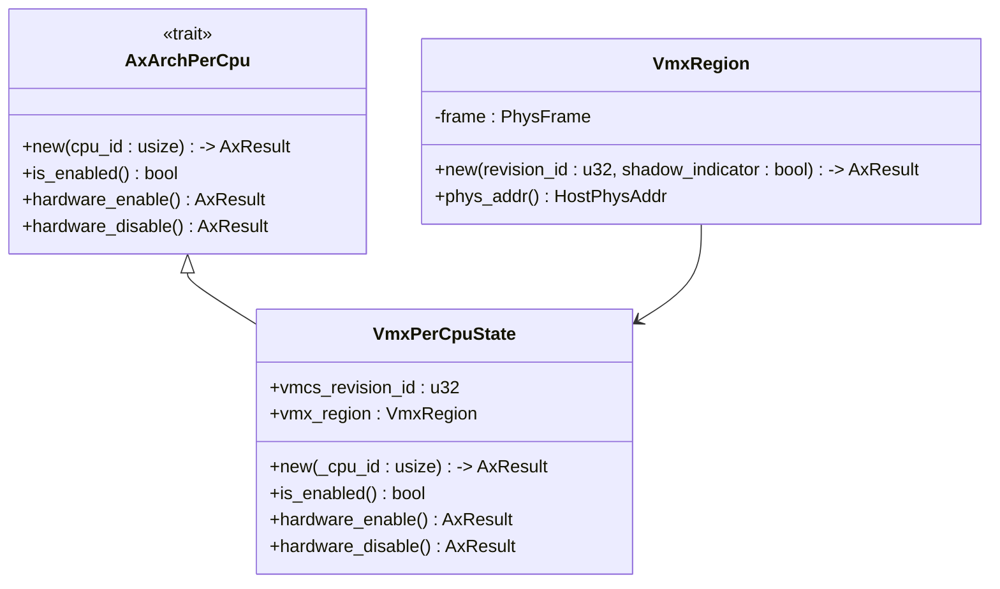
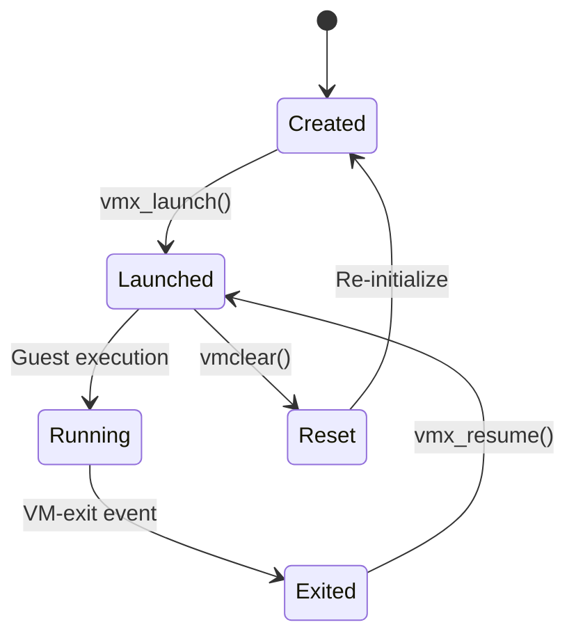
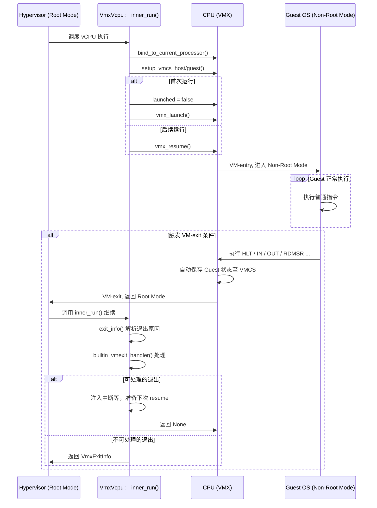

# 核心概念

<cite>
**本文档中引用的文件**  
- [vmcs.rs](file://src/vmx/vmcs.rs)
- [vcpu.rs](file://src/vmx/vcpu.rs)
- [percpu.rs](file://src/vmx/percpu.rs)
- [definitions.rs](file://src/vmx/definitions.rs)
- [structs.rs](file://src/vmx/structs.rs)
</cite>

## 目录
1. [Intel VMX架构基础](#intel-vmx架构基础)  
2. [VMCS结构详解](#vmcs结构详解)  
3. [VmxPerCpuState与CPU核心状态管理](#vmxpercpustate与cpu核心状态管理)  
4. [vCPU状态机与launched标志位](#vcpu状态机与launched标志位)  
5. [VM-exit事件类型与处理流程](#vm-exit事件类型与处理流程)  
6. [控制流转换示意图](#控制流转换示意图)

## Intel VMX架构基础

Intel虚拟机扩展（VMX）架构是x86平台实现硬件辅助虚拟化的核心机制。该架构引入了两种处理器操作模式：根模式（Root Mode）和非根模式（Non-Root Mode）。根模式是虚拟机监控器（Hypervisor）运行的特权环境，拥有对物理硬件的完全控制权；而非根模式则是客户操作系统（Guest OS）运行的隔离环境，其对敏感指令和资源的访问会触发VM-exit，从而将控制权交还给Hypervisor进行模拟或授权。

这种双模式设计通过硬件级别的隔离确保了虚拟化的安全性和效率。当处理器处于非根模式时，执行某些特定指令（如INVD、HLT）、访问关键寄存器（如CR0、CR3）或发生外部中断等事件，都会导致自动退出（VM-exit），处理器随即切换至根模式并跳转到Hypervisor预设的处理例程。反之，Hypervisor通过VM-entry指令可将控制权安全地交还给客户机，使其重新进入非根模式继续执行。

**Section sources**  
- [vcpu.rs](file://src/vmx/vcpu.rs#L183-L221)
- [definitions.rs](file://src/vmx/definitions.rs#L79-L274)

## VMCS结构详解

虚拟机控制结构（VMCS）是VMX架构中的核心数据结构，它是一个驻留在内存中的区域，用于存储客户机状态、宿主机状态以及控制VM-exit和VM-entry行为的各项配置。在代码实现中，`src/vmx/vmcs.rs` 文件定义了VMCS字段的枚举类型，如 `VmcsGuestNW`（自然宽度客户机状态字段）、`VmcsHostNW`（自然宽度宿主机状态字段）和 `VmcsControlNW`（自然宽度控制字段）等。

这些字段通过自然对齐的方式进行访问，以确保读写操作的原子性。例如，`VmcsGuestNW::RIP` 用于保存客户机的指令指针，而 `VmcsHostNW::RIP` 则保存Hypervisor的返回地址。VMCS的设计允许Hypervisor精确地控制哪些事件会触发VM-exit。例如，通过设置 `VmcsControl32::EXCEPTION_BITMAP` 可以指定需要拦截的异常向量，而 `VmcsControl64::EPTP` 字段则指向扩展页表（EPT）的根地址，用于实现客户机物理地址到宿主机物理地址的透明转换。

VMCS的读写操作由 `vmread` 和 `vmwrite` 汇编指令完成，并通过 `vmcs_read!` 和 `vmcs_write!` 宏在Rust代码中封装，确保了对VMCS字段的安全访问。此外，`set_control` 函数利用MSR（模型特定寄存器）中的能力位来验证控制字段的合法性，防止设置不被硬件支持的选项。

```mermaid
erDiagram
VMCS ||--o{ VmcsGuestState : "包含"
VMCS ||--o{ VmcsHostState : "包含"
VMCS ||--o{ VmcsControls : "包含"
VMCS ||--o{ VmcsReadOnlyData : "包含"
class VmcsGuestState {
+u16 CS_SELECTOR
+u32 CS_LIMIT
+u32 CS_ACCESS_RIGHTS
+usize CS_BASE
+usize RIP
+usize RSP
+usize CR0
+u64 IA32_EFER
}
class VmcsHostState {
+u16 TR_SELECTOR
+usize TR_BASE
+usize GDTR_BASE
+usize IDTR_BASE
+usize RIP
+usize CR0
+usize CR3
+usize CR4
}
class VmcsControls {
+u32 EXCEPTION_BITMAP
+u32 PINBASED_EXEC_CONTROLS
+u32 PRIMARY_PROCBASED_EXEC_CONTROLS
+u64 IO_BITMAP_A_ADDR
+u64 IO_BITMAP_B_ADDR
+u64 MSR_BITMAPS_ADDR
+u64 EPTP
}
class VmcsReadOnlyData {
+u32 EXIT_REASON
+u32 VMEXIT_INTERRUPTION_INFO
+usize EXIT_QUALIFICATION
+usize GUEST_LINEAR_ADDR
}
```

**Diagram sources**  
- [vmcs.rs](file://src/vmx/vmcs.rs#L96-L485)

**Section sources**  
- [vmcs.rs](file://src/vmx/vmcs.rs#L154-L485)
- [structs.rs](file://src/vmx/structs.rs#L1-L470)

## VmxPerCpuState与CPU核心状态管理

每个CPU核心必须独立管理其VMX启用状态，这是为了防止跨核心干扰并保证虚拟化环境的稳定性。`VmxPerCpuState` 结构体（定义于 `src/vmx/percpu.rs`）正是为此目的而设计。它为每个逻辑处理器维护一个私有的VMCS区域和VMCS修订ID，确保了多核环境下虚拟化状态的隔离性。

该结构体实现了 `AxArchPerCpu` trait，提供了 `hardware_enable` 和 `hardware_disable` 方法来开启和关闭VMX功能。在启用过程中，系统首先检查CPU是否支持VMX特性，并通过MSR寄存器确认BIOS已启用该功能。随后，它会验证CR0和CR4控制寄存器的状态是否符合VMX操作的要求，并分配一个大小为4KB的VMCS区域。最后，通过执行 `vmxon` 指令激活VMX模式。这一系列操作都必须在单个CPU核心上原子地完成，因此每个核心都需要自己的 `VmxPerCpuState` 实例来跟踪其独占的VMX上下文。



**Diagram sources**  
- [percpu.rs](file://src/vmx/percpu.rs#L1-L220)
- [structs.rs](file://src/vmx/structs.rs#L1-L470)

**Section sources**  
- [percpu.rs](file://src/vmx/percpu.rs#L1-L220)

## vCPU状态机与launched标志位

`VmxVcpu` 结构体（定义于 `src/vmx/vcpu.rs`）代表了一个虚拟CPU实例，其内部的状态机模型是虚拟化调度的核心。其中，`launched` 布尔标志位具有关键意义：它区分了首次VM启动（VM-launch）和后续的VM恢复（VM-resume）操作。

当一个 `VmxVcpu` 实例被创建时，`launched` 被初始化为 `false`。在第一次调用 `inner_run` 方法时，系统会检测到此标志位为假，于是执行 `vmx_launch` 指令，这要求VMCS处于“清除”状态。成功执行后，`launched` 被置为 `true`。此后，每当该vCPU需要重新进入非根模式时，都将执行 `vmx_resume` 指令，因为此时VMCS已被标记为“已启动”。这种区分至关重要，因为 `vmx_launch` 对VMCS的完整性有更严格的检查，而重复使用 `vmx_launch` 会导致VM-instruction错误。

该状态机确保了虚拟机生命周期的正确性。任何试图在已启动的VMCS上再次执行 `vmx_launch` 的行为都会被硬件拒绝，从而避免了状态混乱。只有当VMCS被显式地 `vmclear` 后，才能重新开始一个新的 `vmx_launch` 周期。



**Diagram sources**  
- [vcpu.rs](file://src/vmx/vcpu.rs#L183-L221)

**Section sources**  
- [vcpu.rs](file://src/vmx/vcpu.rs#L183-L221)

## VM-exit事件类型与处理流程

VM-exit事件是虚拟化控制流转的关键节点。根据 `VmxExitReason` 枚举（定义于 `src/vmx/definitions.rs`），VM-exit可分为多种类型，包括外部中断（EXTERNAL_INTERRUPT）、I/O指令执行（IO_INSTRUCTION）、控制寄存器访问（CR_ACCESS）、MSR读写（MSR_READ/MSR_WRITE）以及EPT违例（EPT_VIOLATION）等。

当VM-exit发生时，处理器会自动保存当前的客户机状态到VMCS中，并跳转到Hypervisor的入口点。`VmxVcpu::inner_run` 方法负责处理这一流程。它首先调用 `exit_info()` 从VMCS的只读字段（如 `EXIT_REASON` 和 `EXIT_QUALIFICATION`）中提取退出信息，然后根据退出原因进行分发处理。对于某些内置可处理的退出（如中断窗口打开），Hypervisor会直接注入事件并返回；而对于无法处理的退出，则将其返回给上层调度器。

例如，当发生I/O指令退出时，`io_exit_info()` 函数会解析 `EXIT_QUALIFICATION` 字段，获取端口号、访问方向和数据大小等信息，以便Hypervisor模拟相应的设备行为。同样，`nested_page_fault_info()` 函数能从EPT违例中提取出错的客户机物理地址和访问权限，为影子页表或EPT的更新提供依据。

**Section sources**  
- [vcpu.rs](file://src/vmx/vcpu.rs#L320-L359)
- [definitions.rs](file://src/vmx/definitions.rs#L79-L274)
- [vmcs.rs](file://src/vmx/vmcs.rs#L525-L548)

## 控制流转换示意图

下图展示了在 `VmxVcpu` 管理下的完整控制流转换过程，涵盖了从Hypervisor调度到客户机执行，再到因事件触发而返回的整个循环。



**Diagram sources**  
- [vcpu.rs](file://src/vmx/vcpu.rs#L254-L284)
- [vmcs.rs](file://src/vmx/vmcs.rs#L320-L359)