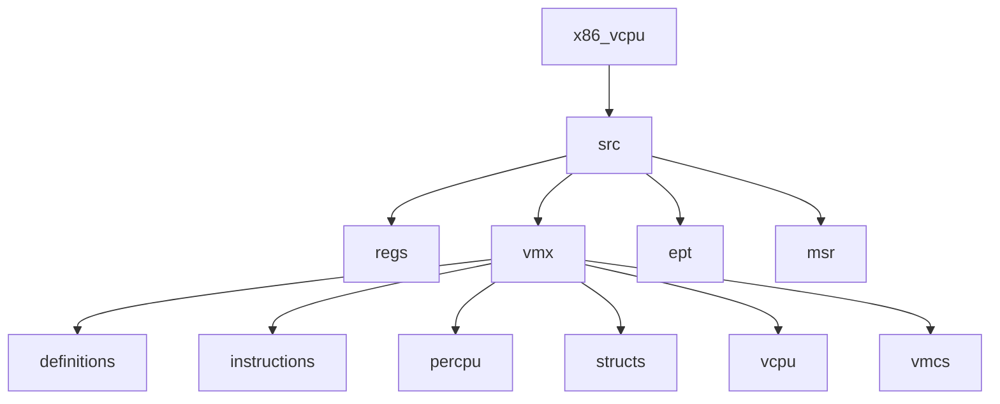
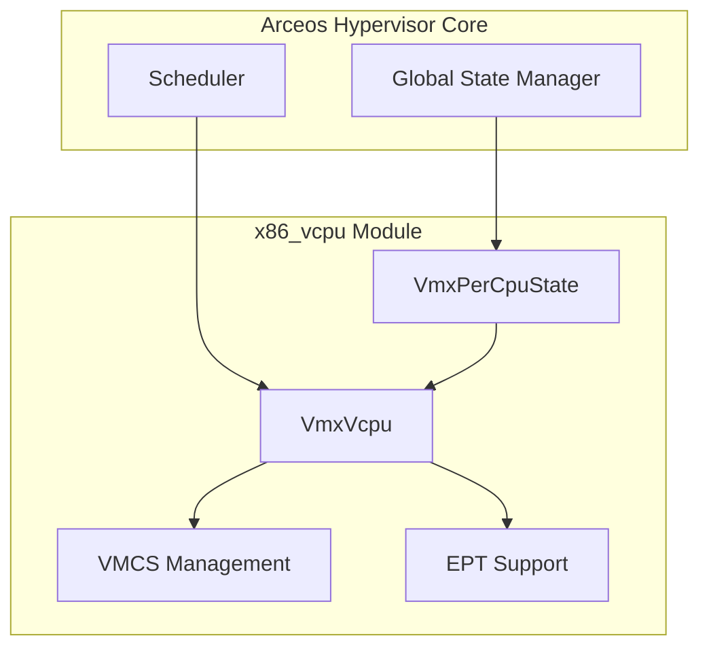
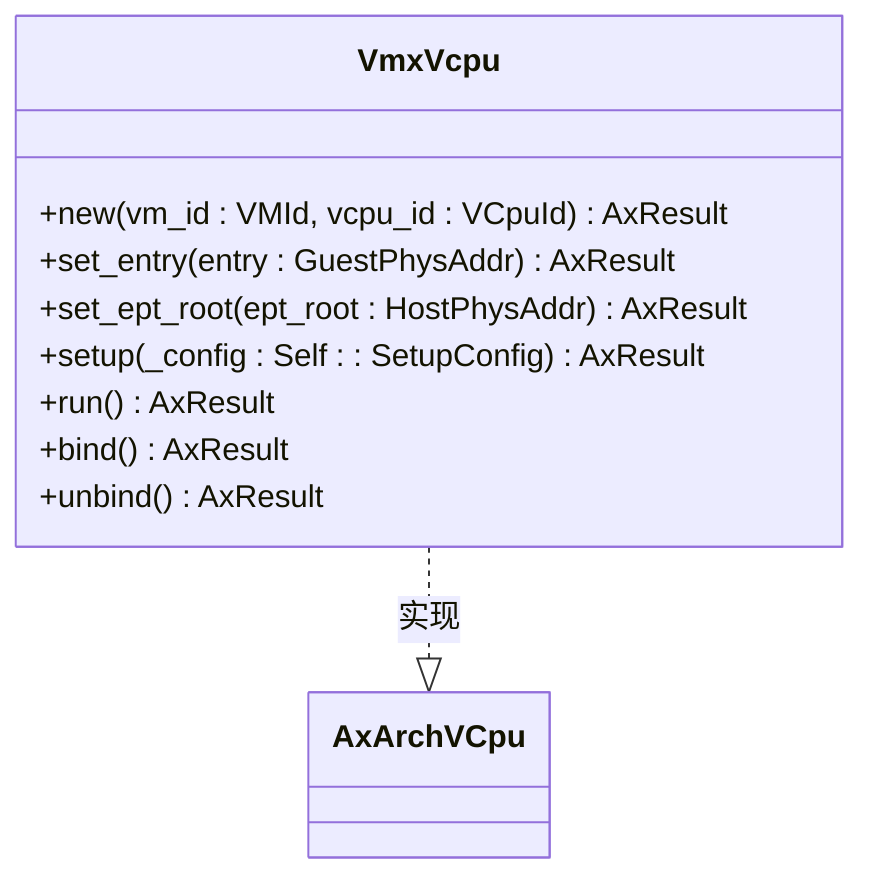
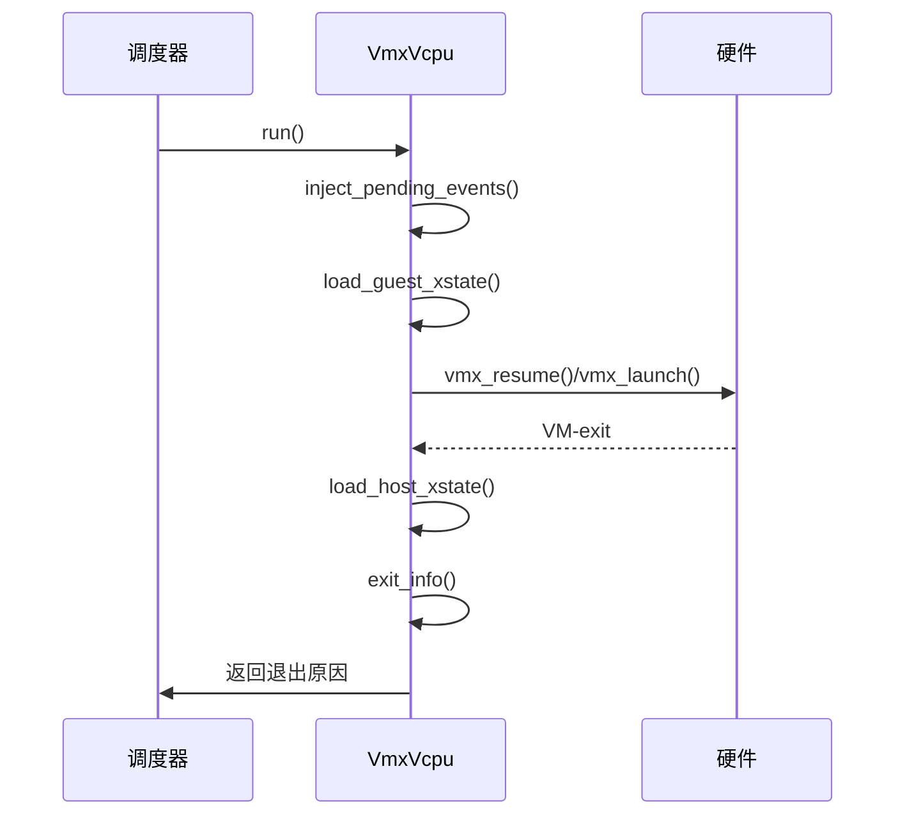
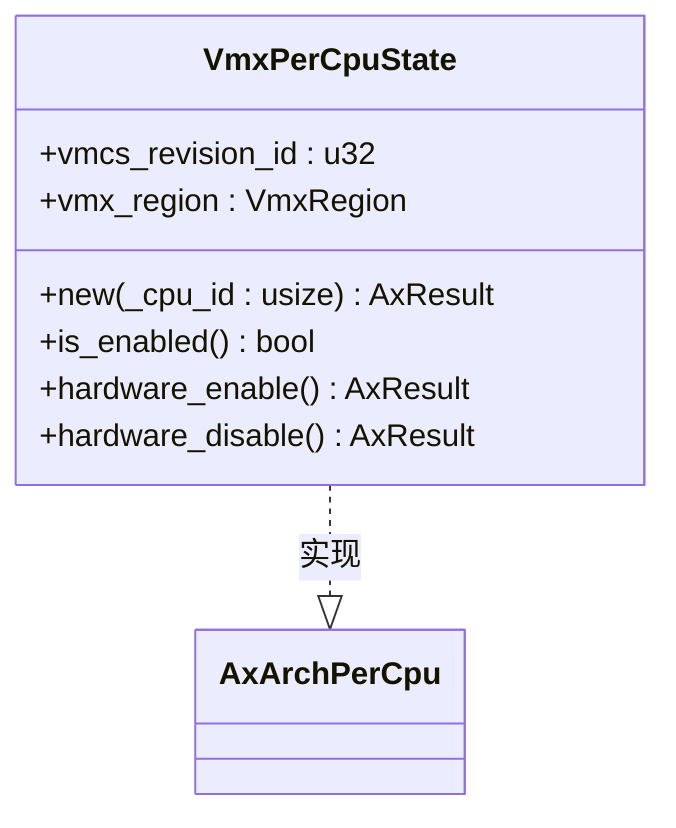
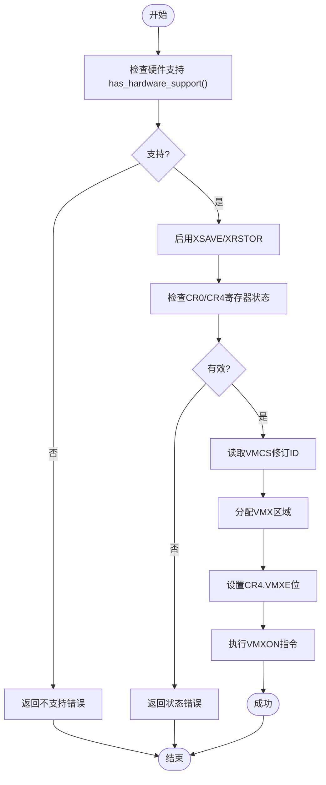
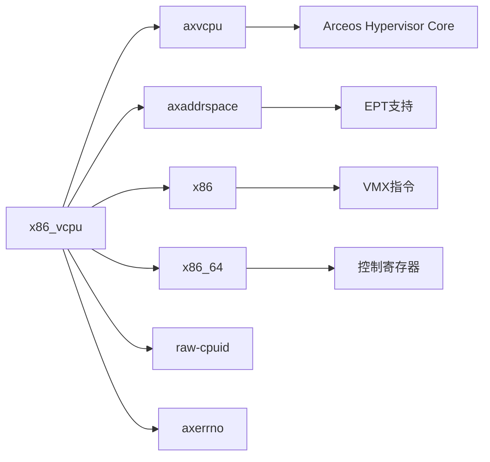

# 与Arceos核心集成

<cite>
**本文档引用的文件**  
- [vcpu.rs](file://src/vmx/vcpu.rs)
- [percpu.rs](file://src/vmx/percpu.rs)
- [mod.rs](file://src/vmx/mod.rs)
- [lib.rs](file://src/lib.rs)
</cite>

## 目录
1. [简介](#简介)
2. [项目结构](#项目结构)
3. [核心组件](#核心组件)
4. [架构概述](#架构概述)
5. [详细组件分析](#详细组件分析)
6. [依赖分析](#依赖分析)
7. [性能考虑](#性能考虑)
8. [故障排除指南](#故障排除指南)
9. [结论](#结论)

## 简介
本文档详细说明了如何将x86_vcpu模块通过AxArchVCpu trait与Arceos Hypervisor核心进行集成。重点解释了trait中定义的vCPU生命周期方法在x86架构下的具体实现机制，包括创建、运行、暂停和恢复等操作。文档还展示了如何注册该实现以供调度器调用，并提供了初始化VmxPerCpuState并绑定到特定CPU核心的代码示例，确保VMX操作的正确执行环境。同时描述了错误传播路径及与Arceos全局状态管理器的交互方式，指导开发者处理多核启动时的同步问题，避免重复启用VMX或资源竞争。

## 项目结构
x86_vcpu模块采用分层架构设计，主要包含寄存器访问、VMX指令、每CPU状态、虚拟CPU实现等组件。核心功能集中在vmx子目录下，其中vcpu.rs实现了虚拟CPU的主要逻辑，percpu.rs管理每个物理CPU的VMX状态。

**Diagram sources**
- [lib.rs](file://src/lib.rs#L0-L31)
- [mod.rs](file://src/vmx/mod.rs#L0-L35)

**Section sources**
- [lib.rs](file://src/lib.rs#L0-L31)
- [mod.rs](file://src/vmx/mod.rs#L0-L35)

## 核心组件
本模块的核心是VmxVcpu结构体，它实现了AxArchVCpu trait，提供了x86架构下虚拟CPU的完整功能。另一个关键组件是VmxPerCpuState，用于管理每个物理CPU的VMX状态。

**Section sources**
- [vcpu.rs](file://src/vmx/vcpu.rs#L1299-L1498)
- [percpu.rs](file://src/vmx/percpu.rs#L31-L41)

## 架构概述
x86_vcpu模块通过AxArchVCpu trait与Arceos Hypervisor核心集成，形成一个清晰的分层架构。上层是抽象的虚拟CPU接口，下层是具体的x86硬件虚拟化实现。

**Diagram sources**
- [vcpu.rs](file://src/vmx/vcpu.rs#L1299-L1498)
- [percpu.rs](file://src/vmx/percpu.rs#L31-L41)

## 详细组件分析

### VmxVcpu分析
VmxVcpu是x86架构虚拟CPU的主要实现，通过实现AxArchVCpu trait与Arceos核心集成。

#### 生命周期方法实现

**Diagram sources**
- [vcpu.rs](file://src/vmx/vcpu.rs#L1299-L1320)

#### 运行流程序列图

**Diagram sources**
- [vcpu.rs](file://src/vmx/vcpu.rs#L1321-L1349)

### VmxPerCpuState分析
VmxPerCpuState管理每个物理CPU的VMX状态，确保VMX操作的正确执行环境。

#### 每CPU状态实现

**Diagram sources**
- [percpu.rs](file://src/vmx/percpu.rs#L31-L41)

#### 初始化流程

**Diagram sources**
- [percpu.rs](file://src/vmx/percpu.rs#L42-L120)

**Section sources**
- [percpu.rs](file://src/vmx/percpu.rs#L0-L220)
- [vcpu.rs](file://src/vmx/vcpu.rs#L0-L1719)

## 依赖分析
x86_vcpu模块依赖于多个外部crate和内部模块，形成了复杂的依赖关系网络。

**Diagram sources**
- [Cargo.toml](file://Cargo.toml#L0-L42)
- [lib.rs](file://src/lib.rs#L0-L31)

**Section sources**
- [Cargo.toml](file://Cargo.toml#L0-L42)
- [lib.rs](file://src/lib.rs#L0-L31)

## 性能考虑
在多核环境下使用VMX时需要特别注意性能影响。每次VM-entry和VM-exit都会产生显著的开销，因此应尽量减少不必要的VM-exits。建议合理配置VMCS中的控制字段，只拦截必要的事件。对于频繁访问的MSR和I/O端口，可以通过修改MSR bitmap和I/O bitmap来优化性能。

## 故障排除指南
### 常见集成错误
1. **未正确设置CR4.VMXE位**：在执行VMXON指令前必须先设置CR4寄存器的VMXE位。
2. **重复启用VMX**：在已经启用VMX的CPU上再次执行hardware_enable()会导致ResourceBusy错误。
3. **BIOS禁用VMX**：如果Feature Control MSR被锁定且VMXON位未设置，则VMX被BIOS禁用。

### 错误诊断步骤
1. 首先调用has_hardware_support()确认CPU支持VMX。
2. 检查CR0和CR4寄存器是否符合VMX操作要求。
3. 确保Feature Control MSR已正确配置。
4. 使用is_enabled()检查VMX当前状态。

**Section sources**
- [percpu.rs](file://src/vmx/percpu.rs#L42-L167)
- [vcpu.rs](file://src/vmx/vcpu.rs#L1278-L1320)

## 结论
x86_vcpu模块通过AxArchVCpu和AxArchPerCpu trait与Arceos Hypervisor核心实现了良好的集成。VmxVcpu提供了完整的虚拟CPU生命周期管理，而VmxPerCpuState确保了VMX操作的正确执行环境。开发者在集成时应注意多核同步问题，避免重复启用VMX，并正确处理各种可能的错误情况。通过合理配置VMCS控制字段，可以有效优化虚拟化性能。