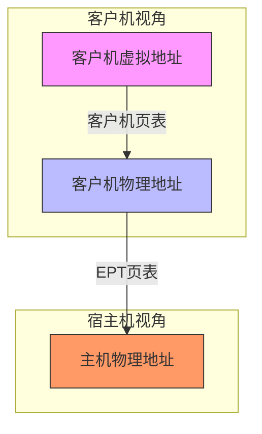
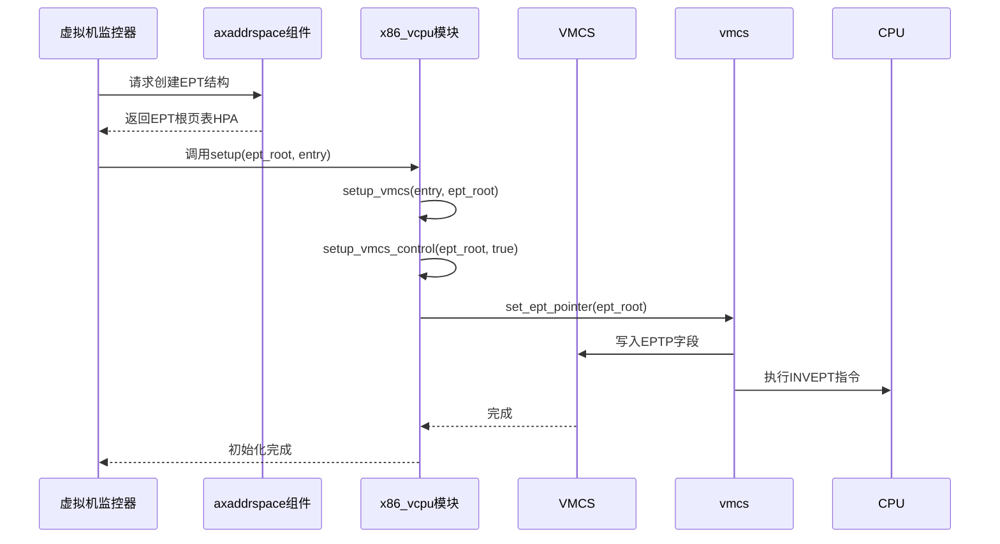
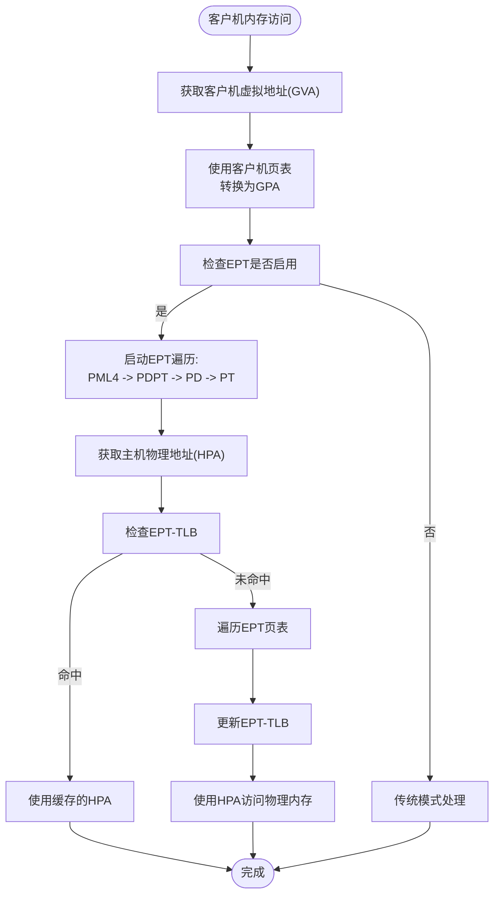
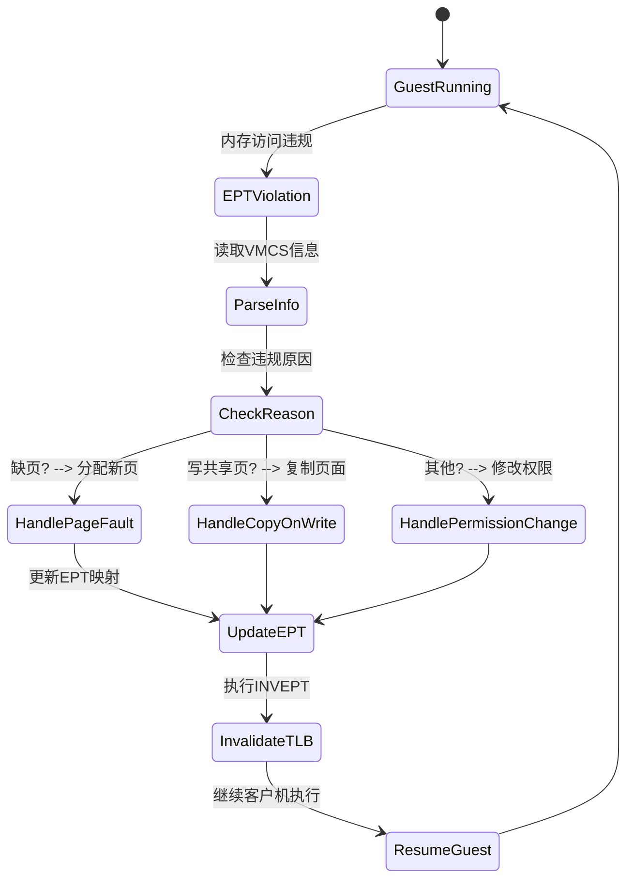

# 内存子系统集成

<cite>
**本文档中引用的文件**  
- [ept.rs](file://src/ept.rs)
- [vcpu.rs](file://src/vmx/vcpu.rs)
- [vmcs.rs](file://src/vmx/vmcs.rs)
- [structs.rs](file://src/vmx/structs.rs)
</cite>

## 目录
1. [引言](#引言)
2. [x86_vcpu与axaddrspace协同机制](#x86_vcpu与axaddrspace协同机制)
3. [嵌套页表（EPT）架构实现](#嵌套页表ept架构实现)
4. [EPT分页结构创建流程](#ept分页结构创建流程)
5. [客户机物理地址映射机制](#客户机物理地址映射机制)
6. [EPT权限位配置实践](#ept权限位配置实践)
7. [EPT违规事件处理](#ept违规事件处理)
8. [性能优化策略](#性能优化策略)
9. [调试与日志策略](#调试与日志策略)

## 引言
本文深入讲解x86_vcpu如何与Arceos的axaddrspace组件协同工作，构建支持嵌套页表（NPT/EPT）的内存虚拟化架构。详细阐述EptPagingStructures的创建流程及其作为VMCS中EPTP字段值的注入机制，说明客户机物理地址（GPA）到主机物理地址（HPA）的映射原理和TLB一致性保障。提供EPT权限位配置、EPT违规事件处理的完整实践指南，并包含使用大页减少遍历开销等性能优化建议。

## x86_vcpu与axaddrspace协同机制
x86_vcpu模块通过实现`AxArchVCpu` trait与Arceos的axaddrspace组件进行深度集成，共同构建完整的内存虚拟化解决方案。该协同机制的核心在于利用Intel VT-x技术中的扩展页表（EPT）功能，实现客户机虚拟地址到主机物理地址的高效转换。

在初始化阶段，`VmxVcpu`结构体通过`set_ept_root`方法接收由axaddrspace组件提供的EPT根页表的主机物理地址（HPA）。这一地址随后被注入到虚拟机控制结构（VMCS）的EPTP字段中，从而建立客户机内存视图与宿主机物理内存之间的映射桥梁。整个过程确保了客户机操作系统可以透明地访问其分配的内存区域，而所有内存访问请求都会经过EPT硬件单元的翻译和权限检查。

这种设计实现了严格的内存隔离，同时保持了接近原生的性能表现。axaddrspace负责管理底层物理内存的分配和EPT页表的构建，而x86_vcpu则专注于CPU虚拟化层面的控制流管理和VM-exit事件处理，两者分工明确，协同工作。

**Section sources**
- [vcpu.rs](file://src/vmx/vcpu.rs#L100-L150)
- [vmcs.rs](file://src/vmx/vmcs.rs#L500-L550)

## 嵌套页表（EPT）架构实现
嵌套页表（Extended Page Tables, EPT）是Intel VT-x技术中用于实现内存虚拟化的关键组件。它通过引入第二层页表转换，解决了传统影子页表带来的高开销问题。EPT架构允许客户机操作系统维护自己的页表（GVA到GPA的转换），同时由VMM维护另一套页表（GPA到HPA的转换），这两套页表由硬件自动级联使用。

在本实现中，EPT的启用通过配置VMCS中的二级处理器控制域（Secondary Processor-Based VM-Execution Controls）来完成。具体而言，`setup_vmcs_control`函数会设置`ENABLE_EPT`标志位，指示处理器在客户机执行内存访问时激活EPT机制。当此功能启用后，所有客户机发起的内存访问都将触发EPT遍历过程，硬件会根据EPTP寄存器指向的根页表逐级查找，最终完成从客户机物理地址（GPA）到主机物理地址（HPA）的转换。

EPT不仅提供地址转换功能，还包含丰富的权限控制机制。每个EPT页表项都包含读、写、执行权限位，以及脏位和访问位支持，这些特性共同构成了一个强大且灵活的内存保护框架。

**Diagram sources**
- [vmcs.rs](file://src/vmx/vmcs.rs#L400-L450)
- [structs.rs](file://src/vmx/structs.rs#L150-L200)

## EPT分页结构创建流程
EPT分页结构的创建是一个多步骤的初始化过程，始于VMM对`VmxVcpu`实例的配置，终于EPTP字段在VMCS中的成功注入。该流程确保了客户机在首次运行前就具备正确的内存映射环境。

首先，axaddrspace组件负责分配并初始化EPT的四级页表结构（PML4、PDPT、PD、PT），并将最顶层的PML4表的主机物理地址返回给x86_vcpu模块。随后，在`VmxVcpu::setup`方法中，这个物理地址被传递给`setup_vmcs`函数。该函数进一步调用`setup_vmcs_control`，后者通过`set_ept_pointer`辅助函数将EPT根地址写入VMCS。

`set_ept_pointer`函数是整个流程的关键，它不仅将EPTP值写入VMCS的`EPTP`字段，还会构造一个符合规范的`EPTPointer`结构体。这个结构体除了包含页表基地址外，还设置了内存类型（通常为Write-back）、页表遍历长度（4级）以及启用访问/脏位等重要属性。最后，该函数会执行`invept`指令刷新EPT相关的TLB条目，确保新的映射立即生效。

**Diagram sources**
- [vcpu.rs](file://src/vmx/vcpu.rs#L200-L300)
- [vmcs.rs](file://src/vmx/vmcs.rs#L500-L550)
- [structs.rs](file://src/vmx/structs.rs#L250-L300)

## 客户机物理地址映射机制
客户机物理地址（GPA）到主机物理地址（HPA）的映射是通过EPT硬件自动完成的。当客户机代码执行一条内存访问指令时，处理器首先使用客户机自身的页表将虚拟地址（GVA）转换为客户机物理地址（GPA），然后启动EPT遍历过程。

EPT遍历从VMCS的EPTP字段指定的PML4表开始。硬件会将GPA的高位部分作为索引，在PML4表中查找对应的PDPTE项。如果该项有效，硬件继续使用GPA的下一级位段作为索引，在PDPTE指向的PDPT表中查找PDE项，此过程依次类推，直到找到最终的页表项（PTE）。这个PTE包含了目标页面的主机物理地址（HPA）以及访问权限信息。

为了保证映射的一致性，系统必须维护TLB（Translation Lookaside Buffer）的有效性。每当EPT页表发生变更（如添加新映射或修改权限），VMM必须执行`INVEPT`指令来使所有逻辑处理器上缓存的EPT相关TLB条目失效。这确保了后续的内存访问能够基于最新的页表内容进行翻译，避免了陈旧映射导致的安全漏洞或数据不一致。

此外，EPT还支持大页（Huge Page）映射，可以在PD或PDPTE级别直接指向一个2MB或1GB的大页面，从而减少页表层级和TLB压力，显著提升性能。

**Diagram sources**
- [vmcs.rs](file://src/vmx/vmcs.rs#L500-L550)
- [ept.rs](file://src/ept.rs#L1-L20)

## EPT权限位配置实践
正确配置EPT权限位是防止越权访问、保障系统安全的关键。每个EPT页表项都包含独立的读、写、执行权限位，这些位由VMM在创建页表时根据内存区域的用途进行设置。

例如，对于存放客户机内核代码的内存页，应设置为可读、可执行但不可写（R-X），以防止恶意代码修改自身指令。而对于堆栈区域，则应设置为可读、可写但不可执行（RW-），以抵御缓冲区溢出攻击。只读的数据段则应严格禁止写入操作。

在代码实现中，这些权限通常由`MappingFlags`枚举表示，并在调用axaddrspace的映射接口时作为参数传入。当发生EPT违规（EPT Violation）时，VM-exit信息会包含具体的访问类型（读、写或执行），VMM可以根据这些信息判断违规性质，并采取相应措施，如动态调整权限或终止客户机。

最佳实践包括：
1. 遵循最小权限原则，仅授予必要的访问权限。
2. 对于敏感内存区域（如VMM自身代码），应完全禁止客户机访问。
3. 利用EPT的访问位（Accessed Flag）和脏位（Dirty Flag）来优化内存管理和页面回收策略。

**Section sources**
- [vmcs.rs](file://src/vmx/vmcs.rs#L550-L600)
- [ept.rs](file://src/ept.rs#L1-L20)

## EPT违规事件处理
EPT违规（EPT Violation）是一种重要的VM-exit事件，当客户机尝试以违反EPT权限的方式访问内存时触发。该事件的处理是实现按需分页、写时复制（Copy-on-Write）等高级内存管理功能的基础。

当EPT违规发生时，处理器会退出到VMM，并填充VMCS中的相关字段。`nested_page_fault_info`函数可以解析这些字段，返回一个`NestedPageFaultInfo`结构体，其中包含违规的客户机物理地址（GPA）和引发违规的访问类型（读、写、执行）。

VMM的事件处理循环会捕获这个exit reason，并根据具体情况做出响应。常见的处理场景包括：
- **缺页处理**：如果目标GPA尚未映射，VMM可以分配一个主机物理页并建立新的EPT映射。
- **写时复制**：对于共享页面的写操作，VMM可以复制一份新的页面，并更新EPT映射，使写操作发生在副本上。
- **权限升级**：某些情况下，可能需要将只读页面临时改为可写，以满足客户机的合法需求。

处理完成后，VMM只需简单地让客户机重新执行引发违规的指令即可，硬件会自动使用更新后的EPT页表完成地址转换。

**Diagram sources**
- [vmcs.rs](file://src/vmx/vmcs.rs#L550-L600)
- [vcpu.rs](file://src/vmx/vcpu.rs#L1000-L1100)

## 性能优化策略
为了最大化EPT的性能优势，应采用以下优化策略：

**使用大页（Huge Pages）**：通过在EPT的PD或PDPTE级别使用2MB或1GB的大页映射，可以显著减少页表遍历的开销和EPT-TLB的压力。这对于大块连续内存的映射尤其有效，能大幅提升内存密集型应用的性能。

**预取和批处理**：在客户机启动或加载大型程序时，VMM可以预先建立常用的EPT映射，避免运行时频繁的缺页中断。同时，对于连续的内存分配请求，应尽量合并为一次性的大页映射操作。

**减少VM-exits**：精心配置VMCS的控制位，尽可能将I/O和MSR访问等操作设为非拦截模式，或者在VMM内部高效处理，以减少不必要的VM-exit次数，因为每次VM-exit都伴随着高昂的上下文切换成本。

**利用硬件特性**：确保启用了EPT的访问位和脏位功能，这使得VMM无需依赖软件模拟就能准确追踪页面的使用情况，从而优化内存换出和页面回收算法。

**Section sources**
- [structs.rs](file://src/vmx/structs.rs#L250-L300)
- [vmcs.rs](file://src/vmx/vmcs.rs#L400-L450)

## 调试与日志策略
有效的调试和日志记录对于开发和维护基于EPT的内存虚拟化系统至关重要。建议采用分层的日志策略：

**详细跟踪（Tracing）**：在开发阶段，启用`tracing`编译特性，记录每一次VM-exit的详细信息，包括退出原因、GPA、访问类型等。这对于诊断EPT违规、理解客户机行为模式非常有帮助。

**关键事件日志**：在生产环境中，应记录关键事件，如EPT结构的创建、重大权限变更、频繁发生的特定类型VM-exit等。这些日志有助于监控系统健康状况和排查潜在问题。

**工具支持**：利用QEMU等模拟器的调试端口（如代码中的`QEMU_EXIT_PORT`）来实现自定义的调试命令，例如转储当前EPT树结构、查询特定GPA的映射状态等。

通过结合静态分析和动态日志，可以快速定位内存虚拟化相关的复杂问题，确保系统的稳定性和安全性。

**Section sources**
- [vcpu.rs](file://src/vmx/vcpu.rs#L50-L100)
- [vmcs.rs](file://src/vmx/vmcs.rs#L10-L50)