# 设备模拟扩展

<cite>
**本文档引用的文件**   
- [vcpu.rs](file://src/vmx/vcpu.rs)
- [structs.rs](file://src/vmx/structs.rs)
- [vmcs.rs](file://src/vmx/vmcs.rs)
- [definitions.rs](file://src/vmx/definitions.rs)
- [msr.rs](file://src/msr.rs)
</cite>

## 目录
1. [简介](#简介)
2. [VM-exit拦截机制概述](#vm-exit拦截机制概述)
3. [I/O指令退出处理](#io指令退出处理)
4. [MSR访问退出处理](#msr访问退出处理)
5. [CR控制退出处理](#cr控制退出处理)
6. [虚拟设备模型构建范例](#虚拟设备模型构建范例)
7. [上下文信息解析与响应](#上下文信息解析与响应)
8. [vCPU状态修改与恢复执行](#vcpu状态修改与恢复执行)
9. [性能优化与最佳实践](#性能优化与最佳实践)

## 简介
本指南详细阐述了如何利用x86_vcpu提供的VM-exit拦截机制实现自定义设备模拟功能。文档重点介绍了I/O指令、MSR访问、CR控制等关键退出类型的处理流程，展示了如何注册回调函数捕获IN/OUT、RDMSR/WRMSR等敏感操作。通过具体示例说明了如何构建虚拟设备模型，如模拟串口输出或CMOS时钟寄存器。同时解释了如何解析VM-exit原因码并提取上下文信息以做出响应，以及如何安全地修改vCPU状态以返回模拟结果并恢复guest执行。

## VM-exit拦截机制概述
x86_vcpu通过VMX（Virtual Machine Extensions）技术提供了一套完整的虚拟化支持机制。当guest操作系统执行某些敏感指令时，会触发VM-exit事件，控制权交还给hypervisor进行处理。这种机制为实现自定义设备模拟提供了基础。

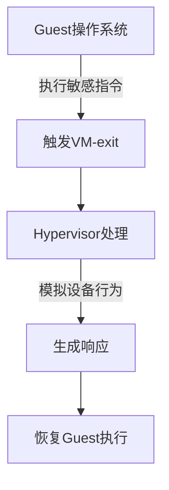

**图源**
- [vcpu.rs](file://src/vmx/vcpu.rs#L223-L258)
- [vmcs.rs](file://src/vmx/vmcs.rs#L682-L709)

## I/O指令退出处理
I/O指令退出是设备模拟中最常见的类型之一，主要涉及IN和OUT指令的拦截与处理。

### 拦截配置
通过IOBitmap可以精确控制哪些端口需要被拦截：

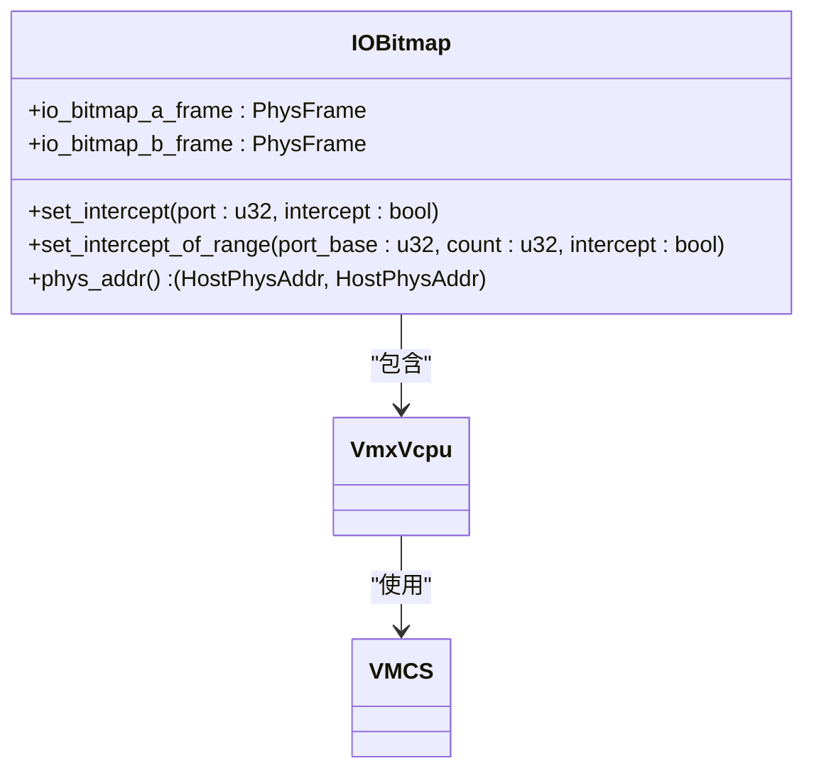

**图源**
- [structs.rs](file://src/vmx/structs.rs#L75-L123)
- [vcpu.rs](file://src/vmx/vcpu.rs#L499-L529)

### 处理流程
当发生I/O退出时，系统会解析退出信息并根据方向（读/写）进行相应处理：

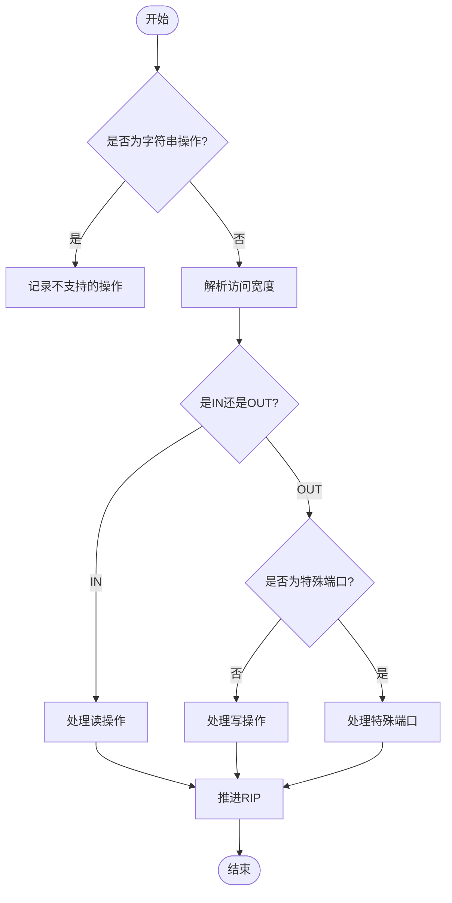

**图源**
- [vcpu.rs](file://src/vmx/vcpu.rs#L1318-L1399)
- [vmcs.rs](file://src/vmx/vmcs.rs#L745-L781)

## MSR访问退出处理
MSR（Model-Specific Register）访问退出用于拦截对特定寄存器的读写操作。

### 拦截配置
MsrBitmap用于管理MSR访问的拦截策略：

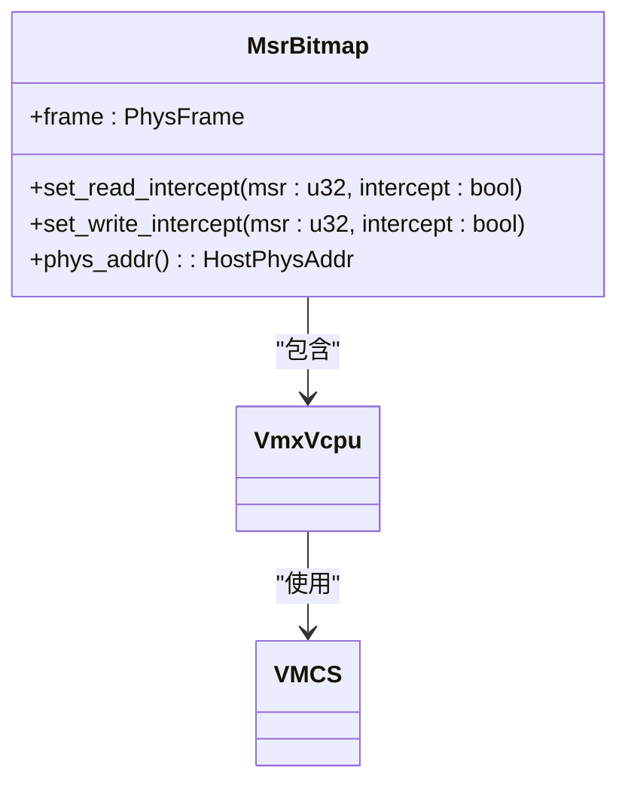

**图源**
- [structs.rs](file://src/vmx/structs.rs#L121-L160)
- [vcpu.rs](file://src/vmx/vcpu.rs#L531-L565)

### 处理流程
MSR访问的处理需要区分读和写操作，并正确提取相关寄存器值：

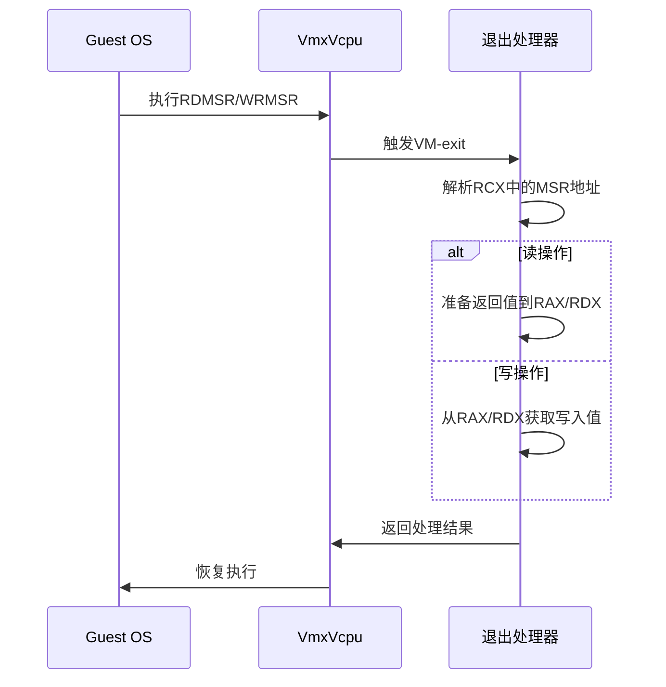

**图源**
- [vcpu.rs](file://src/vmx/vcpu.rs#L1398-L1421)
- [definitions.rs](file://src/vmx/definitions.rs#L61-L101)

## CR控制退出处理
控制寄存器（Control Register）访问退出主要用于监控和控制guest系统的运行状态。

### 处理逻辑
CR访问处理主要关注MOV to/from CR指令：

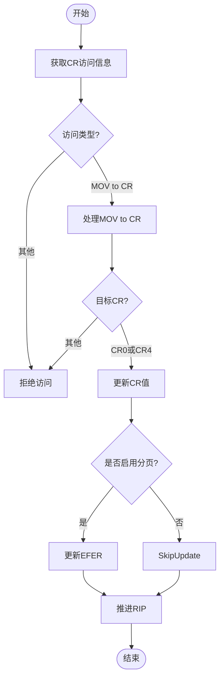

**图源**
- [vcpu.rs](file://src/vmx/vcpu.rs#L1073-L1111)
- [vmcs.rs](file://src/vmx/vmcs.rs#L550-L581)

## 虚拟设备模型构建范例
以下展示两个典型的虚拟设备模拟实例。

### 串口输出模拟
模拟COM端口的输出功能，将guest的串口输出重定向到host的日志系统：

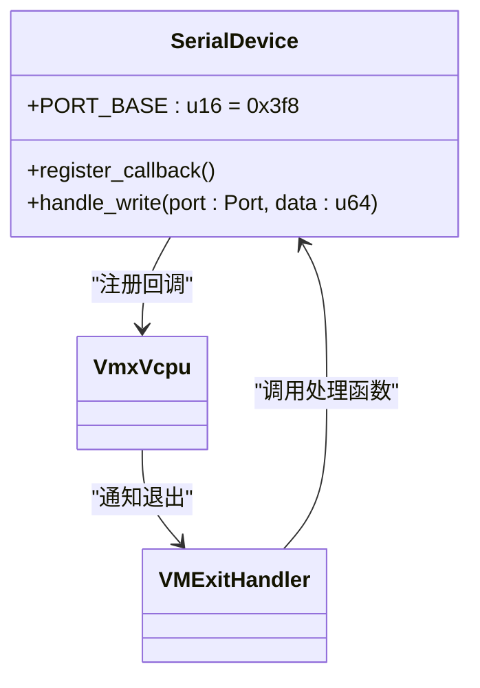

**代码路径**
- [vcpu.rs](file://src/vmx/vcpu.rs#L499-L529)
- [vcpu.rs](file://src/vmx/vcpu.rs#L1318-L1399)

### CMOS时钟寄存器模拟
模拟RTC（实时时钟）寄存器的读写操作：

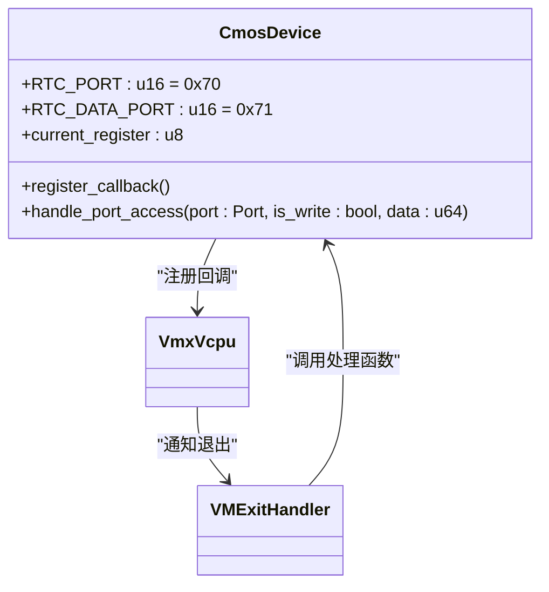

**代码路径**
- [vcpu.rs](file://src/vmx/vcpu.rs#L499-L529)
- [vcpu.rs](file://src/vmx/vcpu.rs#L1318-L1399)

## 上下文信息解析与响应
正确解析VM-exit产生的上下文信息是实现准确模拟的关键。

### 退出信息结构
VM-exit信息包含多个重要字段：

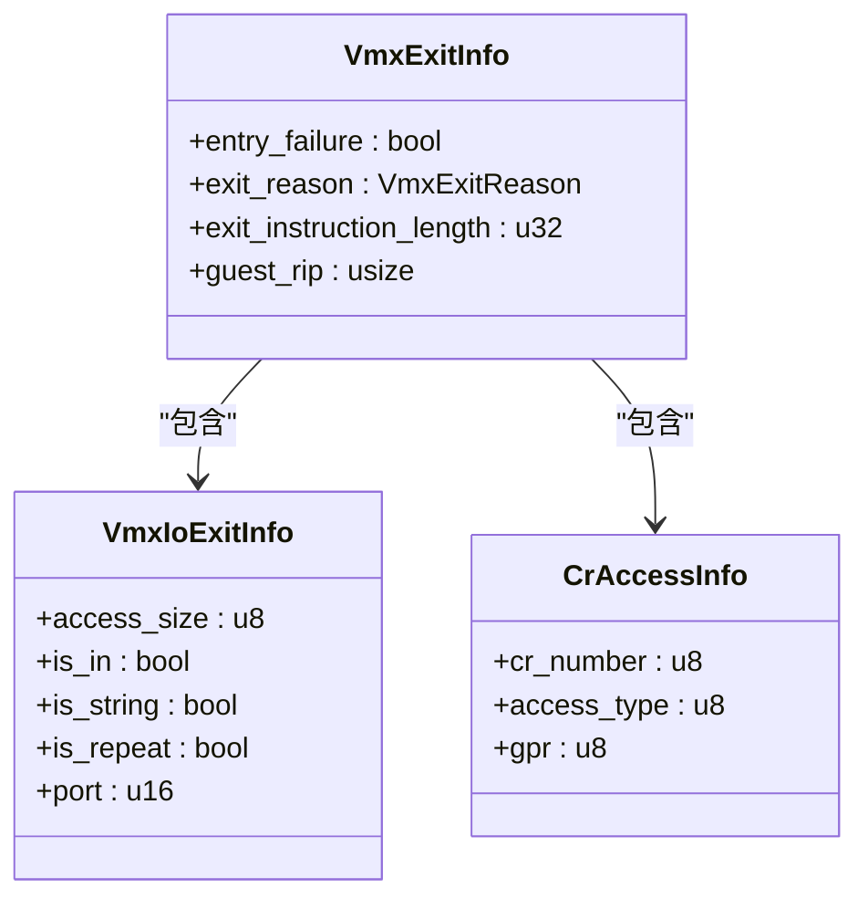

**图源**
- [vmcs.rs](file://src/vmx/vmcs.rs#L487-L523)
- [vmcs.rs](file://src/vmx/vmcs.rs#L525-L548)
- [vmcs.rs](file://src/vmx/vmcs.rs#L550-L581)

### 原因码解析
不同退出类型对应不同的处理策略：

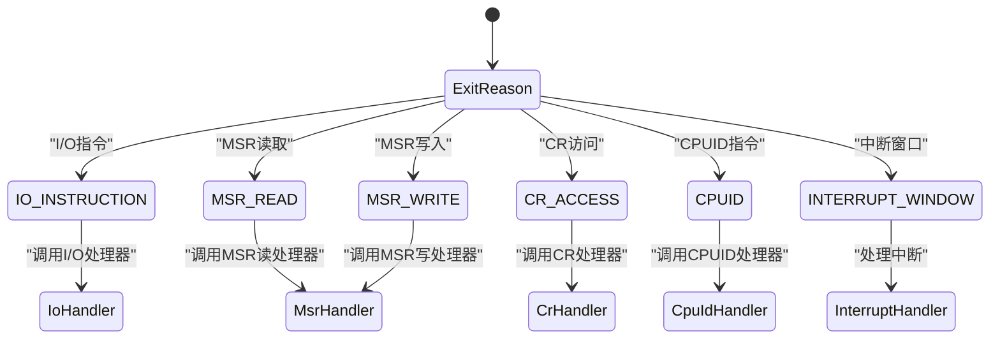

**图源**
- [definitions.rs](file://src/vmx/definitions.rs#L61-L101)
- [vcpu.rs](file://src/vmx/vcpu.rs#L962-L992)

## vCPU状态修改与恢复执行
在处理完VM-exit后，需要正确修改vCPU状态并恢复guest执行。

### 状态修改
主要包括推进指令指针和设置返回值：

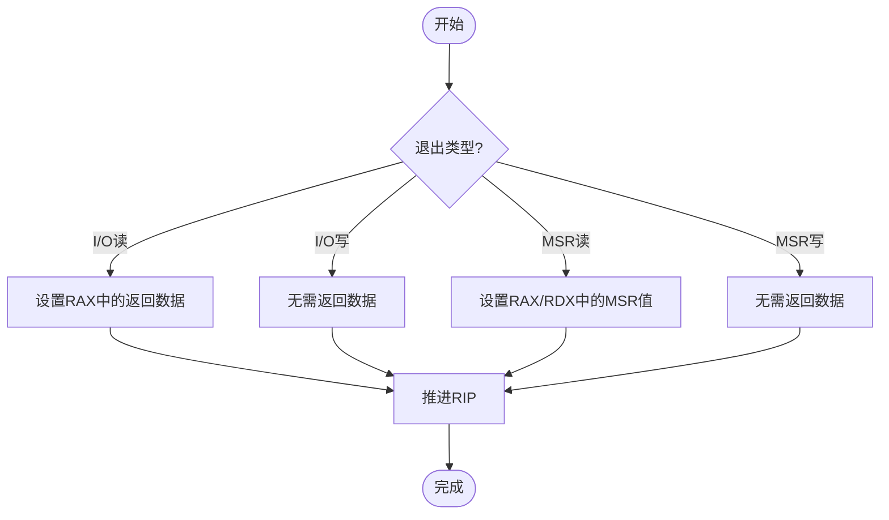

**代码路径**
- [vcpu.rs](file://src/vmx/vcpu.rs#L1318-L1399)
- [vcpu.rs](file://src/vmx/vcpu.rs#L1398-L1421)

### 恢复执行
通过VMRESUME或VMLAUNCH继续guest执行：

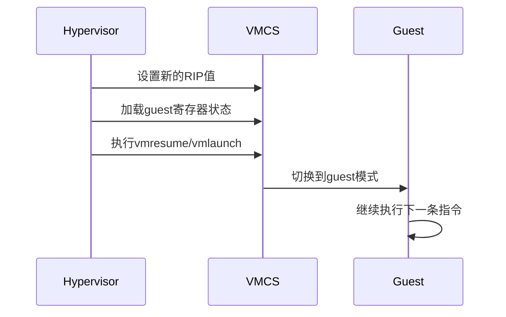

**图源**
- [vcpu.rs](file://src/vmx/vcpu.rs#L283-L322)
- [vcpu.rs](file://src/vmx/vcpu.rs#L892-L940)

## 性能优化与最佳实践
为确保系统性能，需要注意以下几点。

### 避免死锁
确保在处理VM-exit时不持有长时间的锁：

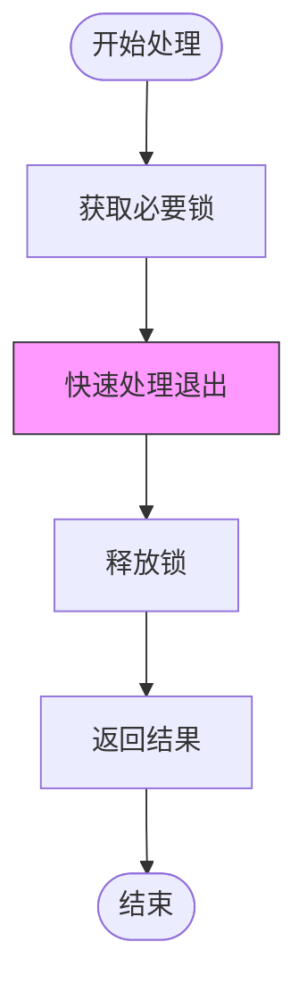

**建议**
- 尽量减少临界区代码量
- 避免在VM-exit处理中进行复杂计算
- 使用无锁数据结构替代互斥锁

### 控制退出频率
合理配置拦截策略以降低VM-exit频率：

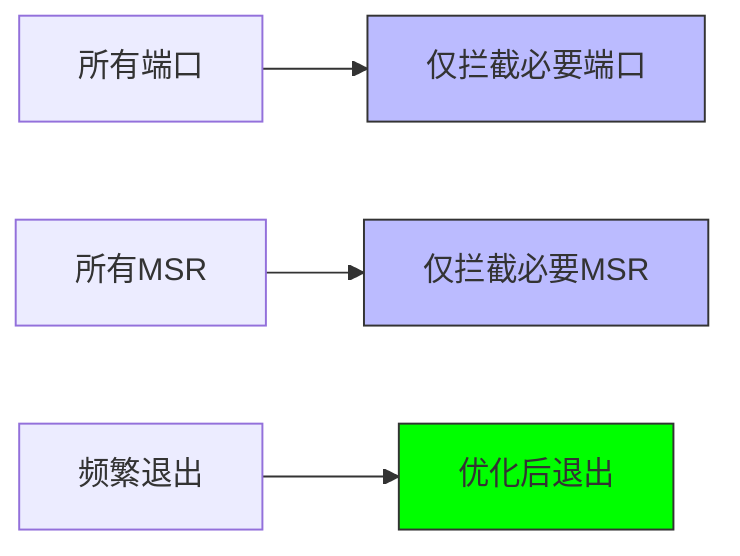

**最佳实践**
- 只拦截真正需要模拟的设备端口
- 对于不需要特殊处理的MSR采用passthrough策略
- 定期评估和优化拦截列表

**章节来源**
- [vcpu.rs](file://src/vmx/vcpu.rs#L499-L529)
- [vcpu.rs](file://src/vmx/vcpu.rs#L531-L565)
- [structs.rs](file://src/vmx/structs.rs#L75-L123)
- [structs.rs](file://src/vmx/structs.rs#L121-L160)