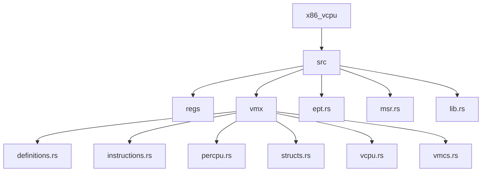
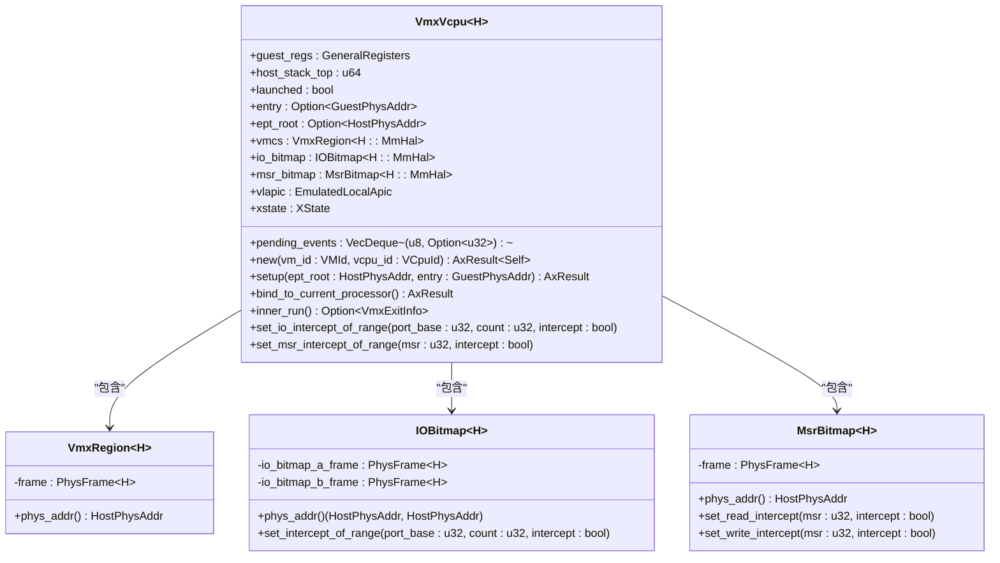
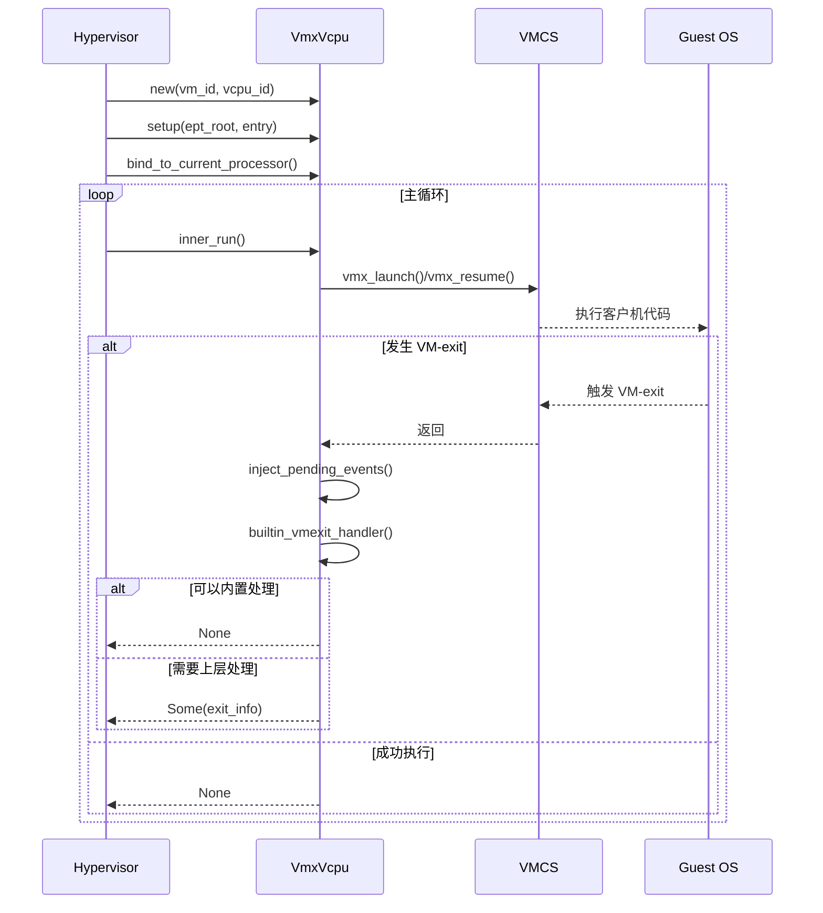
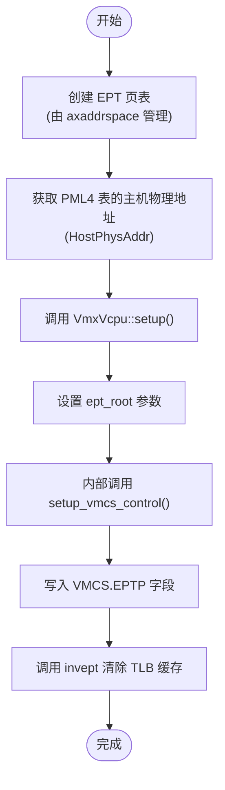
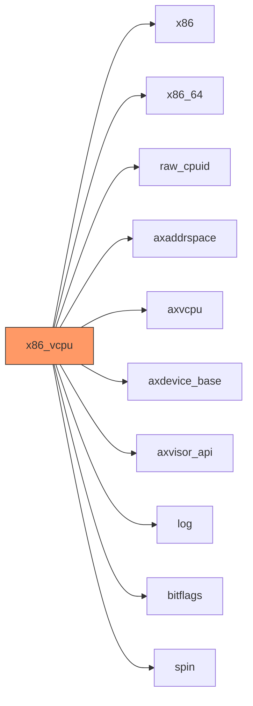

# 集成指南

<cite>
**本文档中引用的文件**  
- [Cargo.toml](file://Cargo.toml)
- [src/lib.rs](file://src/lib.rs)
- [src/vmx/vcpu.rs](file://src/vmx/vcpu.rs)
- [src/vmx/mod.rs](file://src/vmx/mod.rs)
- [src/ept.rs](file://src/ept.rs)
- [src/vmx/vmcs.rs](file://src/vmx/vmcs.rs)
- [src/vmx/structs.rs](file://src/vmx/structs.rs)
</cite>

## 目录
1. [简介](#简介)
2. [项目结构](#项目结构)
3. [核心组件](#核心组件)
4. [架构概述](#架构概述)
5. [详细组件分析](#详细组件分析)
6. [依赖关系分析](#依赖关系分析)
7. [性能考虑](#性能考虑)
8. [故障排除指南](#故障排除指南)
9. [结论](#结论)

## 简介
`x86_vcpu` 模块为 Arceos 虚拟机监控器（Hypervisor）提供了一个基于 Intel VMX 技术的 x86 架构虚拟 CPU 实现。本集成指南旨在为开发者提供详细的步骤和说明，以将此模块无缝集成到完整的 Hypervisor 系统中。文档涵盖了 vCPU 生命周期管理、嵌套页表（NPT/EPT）配置、VM-exit 处理回调注册以及 Cargo feature 的使用方法。通过遵循本指南，开发者可以构建一个功能完整、支持客户机操作系统运行的虚拟化环境。

## 项目结构
`x86_vcpu` 模块采用分层设计，其源代码组织清晰，主要分为以下几个部分：
- `src/regs`: 管理 vCPU 的通用寄存器。
- `src/vmx`: 包含所有与 Intel VMX 技术相关的实现，是模块的核心。
- `src/ept.rs`: 定义了用于客户机页表遍历的信息结构。
- `src/msr.rs`: 提供对模型特定寄存器（MSR）的访问接口。
- `src/lib.rs`: 模块的入口点，负责条件编译和公共 API 的导出。



**Diagram sources**
- [src/lib.rs](file://src/lib.rs#L0-L31)
- [src/vmx/mod.rs](file://src/vmx/mod.rs#L0-L35)

**Section sources**
- [src/lib.rs](file://src/lib.rs#L0-L31)
- [src/vmx/mod.rs](file://src/vmx/mod.rs#L0-L35)

## 核心组件
`x86_vcpu` 模块的核心在于其实现了 `AxArchVCpu` trait，该 trait 是上层 Hypervisor 与底层 vCPU 交互的桥梁。通过 `VmxVcpu` 结构体，模块提供了创建、配置、运行和销毁 vCPU 的完整生命周期管理能力。vCPU 的状态由 VMCS（虚拟机控制结构）精确维护，而硬件虚拟化功能则通过调用底层的 VMX 指令集来激活和控制。

**Section sources**
- [src/lib.rs](file://src/lib.rs#L0-L31)
- [src/vmx/vcpu.rs](file://src/vmx/vcpu.rs#L0-L799)
- [src/vmx/mod.rs](file://src/vmx/mod.rs#L0-L35)

## 架构概述
该模块的架构围绕 Intel VMX 技术构建。`VmxVcpu` 作为核心实体，封装了 vCPU 的所有状态和行为。它依赖于 `axaddrspace` 组件来管理物理内存，并利用其提供的 `NestedPageFaultInfo` 结构处理 EPT 违规。vCPU 的运行通过 `vmx_launch` 和 `vmx_resume` 指令进入客户机模式，当发生 VM-exit 时，控制权返回给 Hypervisor，由 `inner_run` 方法中的内置处理器或上层自定义回调进行处理。

```mermaid
graph TB
subgraph "Hypervisor (Host)"
HV[VmxVcpu<br/>vCPU State & Control]
VMCS[VMCS Region<br/>Virtual Machine Control Structure]
IOB[IO Bitmap]
MSRB[MSR Bitmap]
EPT[EPT Root Page Table]
end
subgraph "Guest OS"
GuestOS[Guest Operating System]
end
HV < --> VMCS
HV < --> IOB
HV < --> MSRB
HV < --> EPT
HV -- "VM Entry" --> GuestOS
GuestOS -- "VM Exit" --> HV
style HV fill:#f9f,stroke:#333
style GuestOS fill:#bbf,stroke:#333
```

**Diagram sources**
- [src/vmx/vcpu.rs](file://src/vmx/vcpu.rs#L0-L799)
- [src/vmx/vmcs.rs](file://src/vmx/vmcs.rs#L0-L799)
- [src/ept.rs](file://src/ept.rs#L0-L27)

## 详细组件分析

### VmxVcpu 分析
`VmxVcpu<H: AxVCpuHal>` 是模块的核心数据结构，代表一个虚拟 CPU。它持有一个 `VmcsRegion` 来存储 VMCS 数据，并通过 `bind_to_current_processor` 和 `unbind_from_current_processor` 方法在物理 CPU 上绑定和解绑自身。

#### 对象导向组件


**Diagram sources**
- [src/vmx/vcpu.rs](file://src/vmx/vcpu.rs#L0-L799)
- [src/vmx/structs.rs](file://src/vmx/structs.rs#L0-L470)

#### API/服务组件


**Diagram sources**
- [src/vmx/vcpu.rs](file://src/vmx/vcpu.rs#L0-L799)
- [src/vmx/instructions.rs](file://src/vmx/instructions.rs#L0-L50)

### 嵌套页表（EPT）配置分析
为了实现客户机虚拟内存隔离，`x86_vcpu` 模块利用 Intel EPT 技术。开发者需要与 `axaddrspace` 组件协作，为每个虚拟机构建独立的嵌套页表。

#### 复杂逻辑组件


**Diagram sources**
- [src/vmx/vcpu.rs](file://src/vmx/vcpu.rs#L0-L799)
- [src/vmx/vmcs.rs](file://src/vmx/vmcs.rs#L0-L799)
- [src/vmx/structs.rs](file://src/vmx/structs.rs#L0-L470)

**Section sources**
- [src/vmx/vcpu.rs](file://src/vmx/vcpu.rs#L0-L799)
- [src/vmx/vmcs.rs](file://src/vmx/vmcs.rs#L0-L799)
- [src/ept.rs](file://src/ept.rs#L0-L27)

## 依赖关系分析
`x86_vcpu` 模块依赖于多个外部 crate 来实现其功能。这些依赖项清晰地划分了职责：`x86` 和 `x86_64` 提供底层汇编指令和寄存器操作；`axaddrspace` 负责地址空间和内存管理；`axvcpu` 定义了跨架构的 vCPU 接口；`axdevice_base` 支持设备模拟。



**Diagram sources**
- [Cargo.toml](file://Cargo.toml#L0-L43)

**Section sources**
- [Cargo.toml](file://Cargo.toml#L0-L43)

## 性能考虑
模块的设计充分考虑了性能。通过使用 `cfg_if!` 宏进行条件编译，未启用的功能（如 SVM 支持）不会产生任何运行时开销。`tracing` feature 允许在调试时记录寄存器变化，但在生产环境中禁用以避免性能损失。此外，`spin` 库的无默认特性的使用确保了最小的依赖体积。

## 故障排除指南
常见的集成问题通常与硬件支持和配置错误有关。首先，应通过 `has_hardware_support()` 函数确认 CPU 支持 VMX 功能。其次，确保在调用 `vmx_launch` 前已正确配置 VMCS 中的所有必需字段。对于 EPT 违规，可以通过 `nested_page_fault_info()` 获取详细的故障信息，检查客户机物理地址映射是否正确建立。

**Section sources**
- [src/lib.rs](file://src/lib.rs#L0-L31)
- [src/vmx/vcpu.rs](file://src/vmx/vcpu.rs#L0-L799)
- [src/vmx/vmcs.rs](file://src/vmx/vmcs.rs#L0-L799)

## 结论
`x86_vcpu` 模块为构建 Arceos Hypervisor 提供了一个强大且灵活的基础。通过遵循本指南，开发者可以成功地将 vCPU 集成到系统中，实现对客户机操作系统的有效管理和隔离。关键在于理解 `AxArchVCpu` trait 的交互方式、正确配置 EPT 以支持内存虚拟化，并利用 VM-exit 机制来扩展 Hypervisor 的功能。