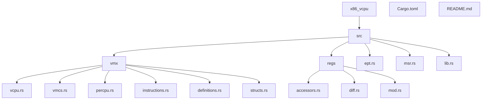
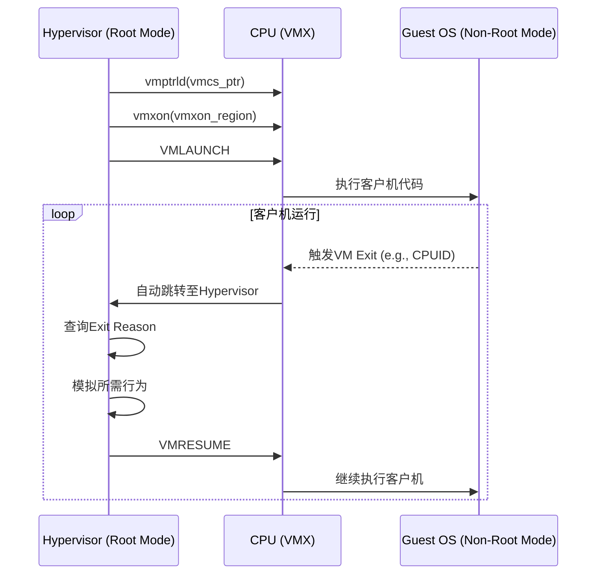
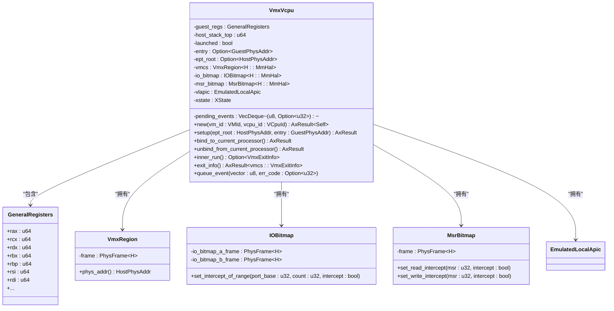
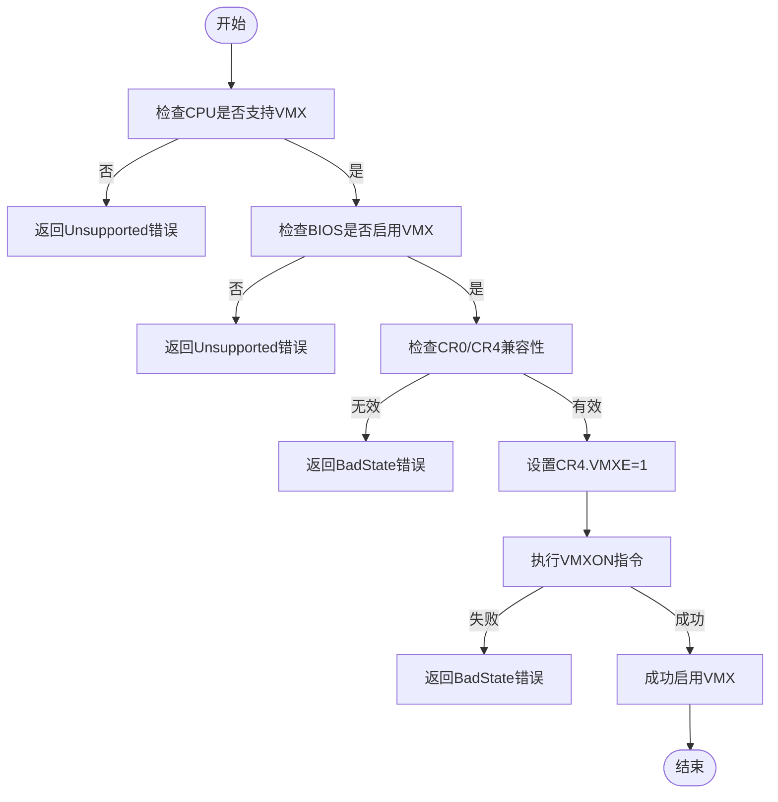
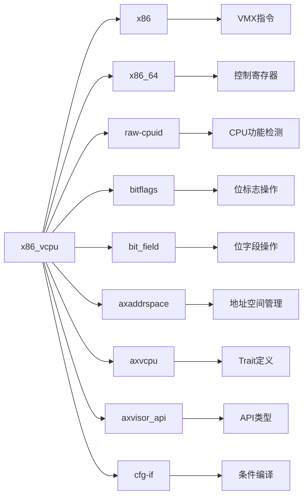

# 项目概述

<cite>
**本文档引用的文件**   
- [Cargo.toml](file://Cargo.toml)
- [README.md](file://README.md)
- [src/lib.rs](file://src/lib.rs)
- [src/vmx/vcpu.rs](file://src/vmx/vcpu.rs)
- [src/vmx/percpu.rs](file://src/vmx/percpu.rs)
- [src/vmx/mod.rs](file://src/vmx/mod.rs)
- [src/regs/mod.rs](file://src/regs/mod.rs)
- [src/ept.rs](file://src/ept.rs)
- [src/vmx/vmcs.rs](file://src/vmx/vmcs.rs)
- [src/vmx/structs.rs](file://src/vmx/structs.rs)
- [src/vmx/instructions.rs](file://src/vmx/instructions.rs)
- [src/vmx/definitions.rs](file://src/vmx/definitions.rs)
- [src/msr.rs](file://src/msr.rs)
</cite>

## 目录
1. [简介](#简介)
2. [项目结构](#项目结构)
3. [核心组件](#核心组件)
4. [架构概览](#架构概览)
5. [详细组件分析](#详细组件分析)
6. [依赖分析](#依赖分析)
7. [性能考虑](#性能考虑)
8. [故障排除指南](#故障排除指南)
9. [结论](#结论)

## 简介
`x86_vcpu` 是 Arceos 虚拟机管理程序中负责 x86 架构虚拟 CPU 功能的核心模块。该项目旨在为使用 Rust 编写的 Hypervisor 提供一个安全、高效的 VMX 虚拟化抽象层，专门用于实现 Intel VT-x 硬件虚拟化技术。其设计目标是封装复杂的底层硬件细节，为上层虚拟机监控器提供一个稳定、可预测的接口。

该库不仅支持完整的 Intel VT-x 虚拟化功能，还通过条件编译（`svm` 特性）预留了对 AMD SVM 虚拟化的支持。它提供了全面的虚拟 CPU 状态管理，包括寄存器状态、内存虚拟化（EPT）、模型特定寄存器（MSR）处理以及中断和异常的虚拟化。用户需要实现 `AxVCpuHal` trait 来提供必要的低级操作，从而将此库集成到具体的 Hypervisor 实现中。

**Section sources**
- [README.md](file://README.md#L1-L102)

## 项目结构
`x86_vcpu` 项目的目录结构清晰地反映了其模块化的设计理念。源代码位于 `src` 目录下，主要分为以下几个部分：

*   **`vmx/`**: 这是项目的核心，包含了所有与 Intel VMX (VT-x) 虚拟化相关的实现。
    *   `vcpu.rs`: 定义了 `VmxVcpu` 结构体，是虚拟 CPU 的主要实现。
    *   `vmcs.rs`: 管理虚拟机控制结构（VMCS），这是 VMX 虚拟化的心脏。
    *   `percpu.rs`: 管理每个逻辑处理器的 VMX 状态。
    *   `instructions.rs`: 封装了 VMX 指令（如 `vmxon`, `vmclear`）。
    *   `definitions.rs`: 定义了 VMX 常量和退出原因等枚举。
    *   `structs.rs`: 定义了 VMX 使用的数据结构，如 `VmxRegion` 和 `IOBitmap`。
*   **`regs/`**: 负责 x86 寄存器的状态管理。
    *   `accessors.rs`: 提供寄存器访问的工具函数。
    *   `diff.rs`: 用于比较寄存器状态的差异。
    *   `mod.rs`: 定义了通用寄存器结构 `GeneralRegisters`。
*   **`ept.rs`**: 实现扩展页表（Extended Page Tables），用于内存虚拟化。
*   **`msr.rs`**: 处理模型特定寄存器（Model-Specific Register）的读写。
*   **`lib.rs`**: 项目的根模块，负责重新导出关键类型，并根据特性标志（feature flag）选择性地启用 `vmx` 或 `svm` 模块。

此外，`Cargo.toml` 文件定义了项目元数据、依赖项和特性，而 `README.md` 则提供了快速入门指南和基本示例。

**Diagram sources **
- [src/lib.rs](file://src/lib.rs#L1-L32)
- [README.md](file://README.md#L1-L102)

**Section sources**
- [src/lib.rs](file://src/lib.rs#L1-L32)
- [README.md](file://README.md#L1-L102)

## 核心组件
`x86_vcpu` 的核心在于其对虚拟 CPU 状态的精确建模和对硬件虚拟化指令的安全封装。最关键的组件是 `VmxVcpu` 结构体，它代表了一个运行在客户机中的虚拟 CPU。该结构体不仅保存了客户机的通用寄存器状态 (`guest_regs`)，还持有一个指向 VMCS 区域的句柄，该区域由硬件直接读取以控制虚拟机的执行。

另一个核心是 `VmxPerCpuState`，它管理着每个物理 CPU 核心上的 VMX 状态。在启动虚拟机之前，必须先通过 `hardware_enable()` 方法在当前处理器上启用 VMX 操作模式。这涉及到设置控制寄存器（CR4）并执行 `vmxon` 指令，这是一个典型的“不安全”操作，但被该库安全地封装了起来。

为了实现内存隔离和地址转换，`ept.rs` 模块实现了 EPT（扩展页表）。当客户机尝试访问内存时，硬件会使用 EPT 进行第二次地址转换，从客户机物理地址映射到宿主机物理地址，从而实现了强大的内存虚拟化。

**Section sources**
- [src/vmx/vcpu.rs](file://src/vmx/vcpu.rs#L1-L799)
- [src/vmx/percpu.rs](file://src/vmx/percpu.rs#L1-L220)
- [src/ept.rs](file://src/ept.rs#L1-L27)

## 架构概览
`x86_vcpu` 库的架构围绕着 Intel VT-x 硬件虚拟化技术构建。其工作流程始于 Hypervisor 在物理 CPU 上启用 VMX 模式。随后，为每个虚拟 CPU 创建一个 `VmxVcpu` 实例，并配置其 VMCS，其中包含了客户机的初始状态（如入口点、寄存器值）和各种控制标志。

当调用 `inner_run()` 方法时，库会执行 `VMLAUNCH` 或 `VMRESUME` 指令，将控制权交给客户机操作系统。客户机开始执行，直到发生一个“VM Exit”事件（例如，客户机执行了 `CPUID` 指令或发生了外部中断）。此时，CPU 会自动切换回 VMX Root 模式，并跳转到 Hypervisor 预设的处理程序。

Hypervisor 随后可以检查 VM Exit 的原因（通过 `exit_info()` 获取），模拟相应的硬件行为（如返回虚拟化的 CPUID 值），然后再次调用 `VMRESUME` 让客户机继续执行。这种“陷入-模拟-继续”的循环构成了整个虚拟化过程的基础。

**Diagram sources **
- [src/vmx/vcpu.rs](file://src/vmx/vcpu.rs#L1-L799)
- [src/vmx/instructions.rs](file://src/vmx/instructions.rs#L1-L50)
- [src/vmx/definitions.rs](file://src/vmx/definitions.rs#L1-L274)

## 详细组件分析

### VmxVcpu 分析
`VmxVcpu<H: AxVCpuHal>` 是整个库的核心数据结构，它将虚拟 CPU 的所有状态和行为封装在一起。其设计体现了几个关键原则。

首先，它使用了**资源的安全封装**。虽然内部涉及大量的 `unsafe` 代码来操作硬件，但这些不安全的操作都被限制在私有方法中，并通过公共的安全 API 对外暴露。例如，`bind_to_current_processor()` 方法安全地执行了 `vmptrld` 指令，而不会让调用者直接接触底层指针。

其次，它应用了**状态机模式**。`launched` 字段是一个布尔标志，明确区分了虚拟 CPU 的两种状态：未启动（需要 `VMLAUNCH`）和已启动（需要 `VMRESUME`）。这个简单的状态机确保了 VMX 指令序列的正确性，防止了因错误调用 `VMLAUNCH` 而导致的 VM Exit。

最后，它利用了 Rust 的**泛型和 trait**。`H: AxVCpuHal` 泛型参数允许库与不同的 Hypervisor 后端进行交互，而无需修改核心逻辑。这使得 `x86_vcpu` 成为一个高度可复用的组件。

**Diagram sources **
- [src/vmx/vcpu.rs](file://src/vmx/vcpu.rs#L1-L799)
- [src/regs/mod.rs](file://src/regs/mod.rs#L1-L108)
- [src/vmx/structs.rs](file://src/vmx/structs.rs#L1-L470)

**Section sources**
- [src/vmx/vcpu.rs](file://src/vmx/vcpu.rs#L1-L799)

### VmxPerCpuState 分析
`VmxPerCpuState` 负责管理单个物理 CPU 核心上的 VMX 状态。它的生命周期与物理核心紧密绑定。

在初始化时，`new()` 方法创建一个占位符实例。真正的激活发生在 `hardware_enable()` 方法中。该方法首先检查 CPU 是否支持 VMX 并且 BIOS 已启用该功能。接着，它会检查宿主机的 CR0 和 CR4 寄存器是否处于 VMX 兼容状态。如果一切正常，它会设置 `CR4.VMXE` 位并执行 `vmxon` 指令，从而进入 VMX Root 操作模式。

`is_enabled()` 方法通过检查 `CR4.VMXE` 位来确定 VMX 是否已在当前处理器上激活。`hardware_disable()` 方法则执行相反的操作，执行 `vmxoff` 指令并清除 `CR4.VMXE` 位，优雅地关闭 VMX 模式。

**Diagram sources **
- [src/vmx/percpu.rs](file://src/vmx/percpu.rs#L1-L220)

**Section sources**
- [src/vmx/percpu.rs](file://src/vmx/percpu.rs#L1-L220)

## 依赖分析
`x86_vcpu` 项目依赖于一系列精心挑选的 Rust crate，以实现其功能并保证安全性。

*   **`x86` 和 `x86_64`**: 这两个库提供了对 x86 架构指令集和寄存器的低级、安全的访问。它们是执行 `vmx` 指令、读写控制寄存器（CR）和模型特定寄存器（MSR）的基础。
*   **`raw-cpuid`**: 用于查询 CPU 的功能信息，例如通过 `has_vmx()` 方法检测硬件是否支持 VMX 指令集。
*   **`bitflags` 和 `bit_field`**: 用于安全地操作寄存器和数据结构中的位字段。例如，`FeatureControlFlags` 使用 `bitflags` 来表示 IA32_FEATURE_CONTROL MSR 中的各个标志位。
*   **`axaddrspace`, `axvcpu`, `axvisor_api`**: 这些是 Arceos 生态系统内的依赖项。`axaddrspace` 提供了物理和虚拟地址的抽象，`axvcpu` 定义了 `AxArchVCpu` 和 `AxArchPerCpu` trait，而 `axvisor_api` 提供了与虚拟机和虚拟 CPU 相关的 ID 类型。
*   **`cfg-if`**: 用于根据 Cargo 特性（如 `vmx` 或 `svm`）进行条件编译，使代码能够灵活地支持不同的虚拟化技术。

**Diagram sources **
- [Cargo.toml](file://Cargo.toml#L1-L43)

**Section sources**
- [Cargo.toml](file://Cargo.toml#L1-L43)

## 性能考虑
`x86_vcpu` 的性能在很大程度上取决于 VM Exit 的频率。每次 VM Exit 都会产生显著的上下文切换开销。因此，库的设计旨在最小化不必要的 VM Exit。

*   **I/O 和 MSR 截获**: 通过 `IOBitmap` 和 `MSRBitmap`，库可以精确地配置哪些 I/O 端口或 MSR 访问会触发 VM Exit。默认情况下，它只截获必要的端口（如 QEMU 退出端口），而让其他访问直接在硬件层面完成，从而避免了软件模拟的开销。
*   **EPT (扩展页表)**: EPT 允许硬件直接处理客户机的页表遍历，只有在发生嵌套页表错误（Nested Page Fault）时才会产生 VM Exit。这极大地加速了客户机的内存访问。
*   **批处理**: `pending_events` 队列允许 Hypervisor 将多个待注入的中断或异常批量处理，减少了 `VMRESUME` 的次数。

尽管如此，某些操作（如频繁的 MSR 访问或 I/O 操作）仍然可能导致性能瓶颈，需要在 Hypervisor 层面进行优化。

## 故障排除指南
当使用 `x86_vcpu` 时，最常见的问题通常与硬件支持或配置错误有关。

*   **`Unsupported` 错误**: 如果 `has_hardware_support()` 返回 `false`，请确认 CPU 支持 VMX 并且在 BIOS/UEFI 设置中已启用虚拟化技术（通常称为 Intel VT-x 或 AMD-V）。
*   **`ResourceBusy` 错误**: 如果 `hardware_enable()` 返回此错误，说明 VMX 已经在当前处理器上启用。确保没有其他进程或内核模块正在使用 VMX。
*   **`BadState` 错误**: 此错误可能由多种原因引起，例如 `vmxon` 指令失败。检查 `as_axerr` 函数的实现，它会将 `VmFail` 映射为更详细的错误信息，例如来自 `instruction_error()` 的字符串描述。
*   **VM Exit 处理失败**: 如果 `builtin_vmexit_handler` 返回 `None`，意味着 Hypervisor 无法处理该类型的 VM Exit。应检查 `exit_info().exit_reason` 以确定具体原因，并确保 Hypervisor 实现了相应的处理逻辑。

**Section sources**
- [src/vmx/vcpu.rs](file://src/vmx/vcpu.rs#L1-L799)
- [src/vmx/percpu.rs](file://src/vmx/percpu.rs#L1-L220)
- [src/vmx/definitions.rs](file://src/vmx/definitions.rs#L1-L274)

## 结论
`x86_vcpu` 项目为 Arceos Hypervisor 提供了一个坚实、安全且高效的 x86 虚拟 CPU 抽象层。它通过精妙的 Rust 设计，将复杂的 Intel VT-x 硬件虚拟化技术封装成一个易于使用的库。其核心组件 `VmxVcpu` 和 `VmxPerCpuState` 清晰地分离了虚拟 CPU 实例和物理 CPU 状态的管理。

该项目充分利用了 Rust 的语言特性，如 unsafe 代码的谨慎封装、trait 的多态性和条件编译，以实现灵活性和安全性。通过对 EPT、MSR 和 I/O 截获的精细控制，它能够在性能和功能之间取得良好的平衡。对于希望构建基于 Rust 的 Hypervisor 的开发者来说，`x86_vcpu` 是一个不可或缺的基石组件。