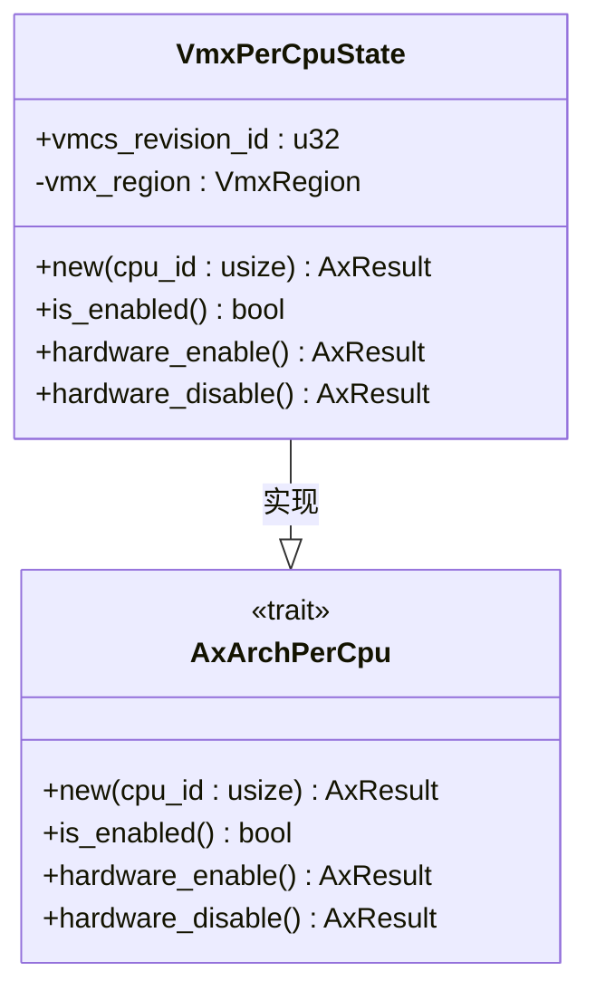
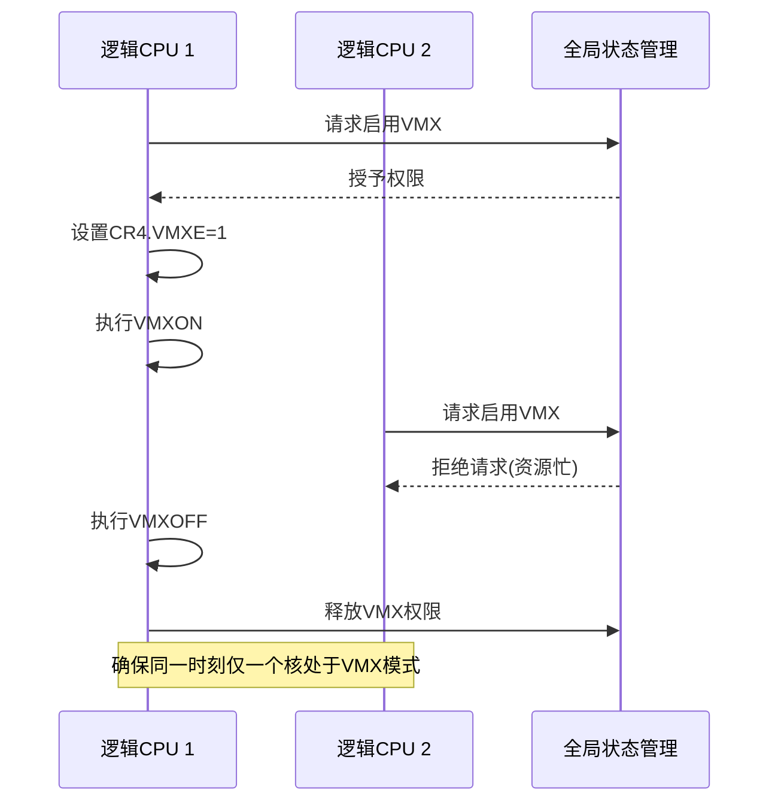
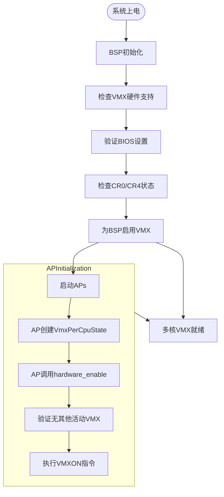

# 多核支持

<cite>
**本文档中引用的文件**
- [percpu.rs](file://src/vmx/percpu.rs)
- [vcpu.rs](file://src/vmx/vcpu.rs)
- [mod.rs](file://src/vmx/mod.rs)
</cite>

## 目录
1. [引言](#引言)
2. [VmxPerCpuState结构体设计与实现](#vmxpercpustate结构体设计与实现)
3. [多核环境下的VMX状态隔离机制](#多核环境下的vmx状态隔离机制)
4. [BSP与AP启动流程分析](#bsp与ap启动流程分析)
5. [vCPU调度约束与迁移限制](#vcpu调度约束与迁移限制)
6. [多核调试常见问题诊断](#多核调试常见问题诊断)

## 引言
本文详细阐述x86_vcpu在多核环境下的设计与实现机制，重点分析`VmxPerCpuState`结构体如何为每个逻辑CPU维护独立的VMX状态。通过代码路径展示系统如何确保同一时刻仅有一个核处于VMX root operation模式，并讨论per-CPU数据隔离对系统稳定性的重要影响。

**Section sources**
- [percpu.rs](file://src/vmx/percpu.rs#L0-L220)
- [mod.rs](file://src/vmx/mod.rs#L0-L35)

## VmxPerCpuState结构体设计与实现
`VmxPerCpuState<H: AxVCpuHal>`结构体用于表示虚拟机扩展（VMX）的每CPU状态，包含特定于CPU核心的状态信息。该结构体主要由两个关键字段组成：`vmcs_revision_id`和`vmx_region`。

`vmcs_revision_id`是VMCS（虚拟机控制结构）修订标识符，用于确保软件与CPU支持的VMCS版本兼容。`vmx_region`则存储了该CPU的VMX区域，通常包含VMCS和其他管理虚拟机所需的状态信息。

该结构体实现了`AxArchPerCpu` trait，提供了`new`、`is_enabled`、`hardware_enable`和`hardware_disable`等方法。其中`hardware_enable`方法负责启用VMX功能，包括检查硬件支持、验证BIOS设置、确认控制寄存器状态以及执行VMXON指令。



**Diagram sources**
- [percpu.rs](file://src/vmx/percpu.rs#L15-L220)

**Section sources**
- [percpu.rs](file://src/vmx/percpu.rs#L15-L220)

## 多核环境下的VMX状态隔离机制
在多核环境中，`VmxPerCpuState`通过per-CPU数据隔离机制确保系统稳定性。每个逻辑CPU都有独立的VMX状态实例，避免了跨核状态污染的风险。

系统通过CR4寄存器中的VMXE位来跟踪VMX启用状态。当调用`hardware_enable`时，首先检查当前CPU是否已启用VMX，若已启用则返回资源忙错误，防止重复启用。这种设计确保了同一物理核上不会出现并发的VMX操作。

更重要的是，系统通过严格的互斥机制保证同一时刻只有一个核能进入VMX root operation模式。这通过全局协调和CPU间通信实现，避免了多个核同时尝试执行VMXON指令导致的竞争条件。

测试用例`test_multiple_cpu_states_independence`验证了多CPU状态的独立性，创建四个CPU的状态实例并分别修改其`vmcs_revision_id`值，证明各实例之间互不影响。



**Diagram sources**
- [percpu.rs](file://src/vmx/percpu.rs#L50-L150)

**Section sources**
- [percpu.rs](file://src/vmx/percpu.rs#L50-L150)

## BSP与AP启动流程分析
在多核系统初始化过程中，BSP（Bootstrap Processor）承担着关键角色。它首先完成基本的系统初始化，包括检测VMX硬件支持、配置必要的MSR寄存器以及为自身启用VMX功能。

BSP通过读取IA32_VMX_BASIC MSR获取VMCS修订标识符，并验证其支持的特性是否符合要求。只有在成功为BSP启用VMX后，系统才会继续启动其他AP（Application Processor）。

每个AP在启动时都会创建自己的`VmxPerCpuState`实例，并通过`hardware_enable`方法独立地启用VMX功能。这种设计允许每个逻辑处理器维护自己的VMCS区域，同时遵守全局的VMX使用规则。



**Diagram sources**
- [percpu.rs](file://src/vmx/percpu.rs#L70-L130)
- [mod.rs](file://src/vmx/mod.rs#L20-L30)

**Section sources**
- [percpu.rs](file://src/vmx/percpu.rs#L70-L130)
- [mod.rs](file://src/vmx/mod.rs#L20-L30)

## vCPU调度约束与迁移限制
`VmxVcpu`结构体的设计体现了vCPU在多核环境中的调度约束。每个vCPU实例通过`bind_to_current_processor`方法绑定到当前逻辑处理器，该方法使用VMMPTRLD指令加载VMCS指针。

一旦vCPU绑定到某个物理核，就不能随意迁移到其他核上执行。这是因为VMCS状态与特定的CPU核心紧密关联，跨核迁移会导致VMCS指针无效。`unbind_from_current_processor`方法使用VMCLEAR指令解除绑定，为可能的迁移做准备。

系统通过`launched`标志位跟踪VMCS是否已启动，决定使用VMLAUNCH还是VMRESUME指令。这种机制确保了vCPU状态的一致性，防止因不当迁移导致的虚拟化异常。

```mermaid
stateDiagram-v2
[*] --> Unbound
Unbound --> Bound : bind_to_current_processor()
Bound --> Running : inner_run()
Running --> Exited : VM退出
Exited --> Handling : 处理退出原因
Handling --> Resumable : 可恢复退出
Resumable --> Running : VMRESUME
Handling --> Terminated : 不可恢复退出
Terminated --> Unbound : unbind_from_current_processor()
Bound --> Unbound : unbind_from_current_processor()
note right of Bound
绑定到特定物理核
不能直接迁移到其他核
end
```

**Diagram sources**
- [vcpu.rs](file://src/vmx/vcpu.rs#L100-L300)

**Section sources**
- [vcpu.rs](file://src/vmx/vcpu.rs#L100-L300)

## 多核调试常见问题诊断
在多核虚拟化环境中，常见的调试问题主要包括竞态条件和中断路由错误。竞态条件通常发生在多个CPU同时尝试访问共享资源时，可通过检查`hardware_enable`方法中的状态验证逻辑来诊断。

中断路由错误可能源于APIC访问配置不当。系统通过`setup_vmcs_control`方法配置中断相关控制，包括启用外部中断退出和NMI退出。调试时应检查`PinbasedControls`的配置是否正确。

使用`tracing`功能可以有效诊断问题，该功能记录VM退出时的寄存器状态，帮助分析异常行为。通过比较退出前后的寄存器差异，可以定位问题根源。

对于VMX状态不一致的问题，应检查`VmxPerCpuState`的生命周期管理，确保在适当的时候调用`hardware_enable`和`hardware_disable`方法，并验证每个CPU的VMCS区域是否正确初始化。

**Section sources**
- [percpu.rs](file://src/vmx/percpu.rs#L50-L150)
- [vcpu.rs](file://src/vmx/vcpu.rs#L500-L700)