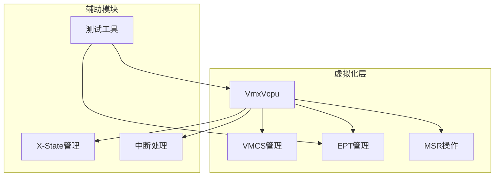
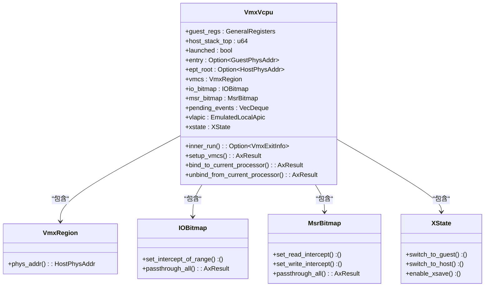
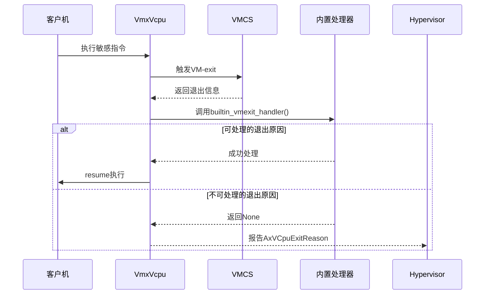
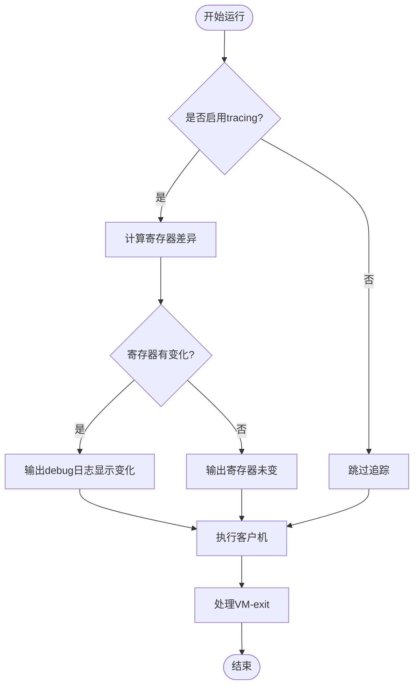
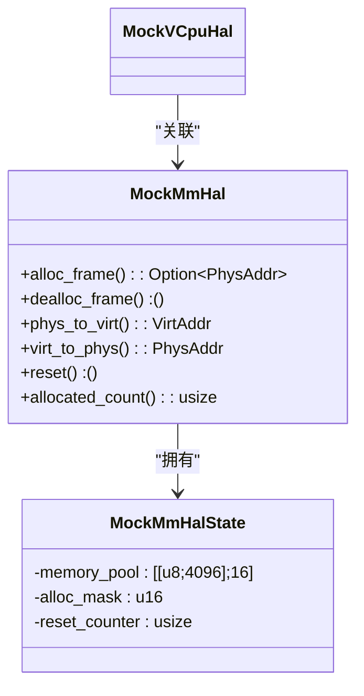
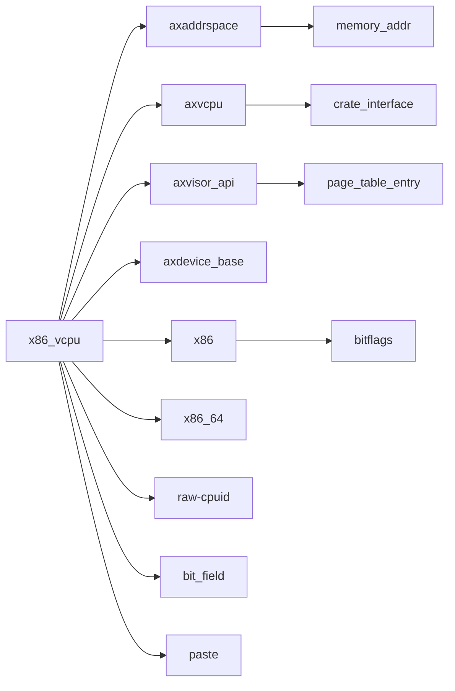

# 调试技巧与故障排除

<cite>
**本文档引用的文件**
- [test_utils.rs](file://src/test_utils.rs)
- [vcpu.rs](file://src/vmx/vcpu.rs)
- [vmcs.rs](file://src/vmx/vmcs.rs)
- [ept.rs](file://src/ept.rs)
- [msr.rs](file://src/msr.rs)
- [Cargo.toml](file://Cargo.toml)
</cite>

## 目录
1. [简介](#简介)
2. [项目结构](#项目结构)
3. [核心组件](#核心组件)
4. [架构概述](#架构概述)
5. [详细组件分析](#详细组件分析)
6. [依赖分析](#依赖分析)
7. [性能考虑](#性能考虑)
8. [故障排除指南](#故障排除指南)
9. [结论](#结论)

## 简介
本文档为开发者提供了一套实用的调试工具与故障排查指南，重点介绍如何启用并解读tracing日志以追踪VM-exit的频率、类型分布及耗时统计，帮助识别性能瓶颈。文档还演示了`test_utils.rs`中提供的测试辅助设施，如模拟VM-exit事件和构造特定寄存器状态，用于单元测试和集成验证。此外，指导如何使用GDB或其他调试器配合Rust代码进行底层调试，特别是在处理汇编指令嵌入和物理地址转换时的技巧，并列出常见问题清单及其解决步骤。

## 项目结构
本项目采用模块化设计，主要包含以下目录和文件：

```
.
├── src
│   ├── regs                  # 寄存器相关操作
│   ├── vmx                   # VMX虚拟化核心实现
│   ├── ept.rs                # 扩展页表管理
│   ├── lib.rs                # 库入口
│   ├── msr.rs                # 模型特定寄存器（MSR）操作
│   └── test_utils.rs         # 测试辅助工具
├── Cargo.toml                # 构建配置
└── README.md                 # 项目说明
```

其中`vmx`子目录包含了VMCS、VCPU、指令等关键虚拟化组件的实现。

**Section sources**
- [Cargo.toml](file://Cargo.toml#L1-L44)

## 核心组件

本节分析项目中的核心组件，包括VMX虚拟CPU实现、扩展页表（EPT）、模型特定寄存器（MSR）操作以及测试工具模块。

**Section sources**
- [vcpu.rs](file://src/vmx/vcpu.rs#L0-L1719)
- [ept.rs](file://src/ept.rs#L0-L28)
- [msr.rs](file://src/msr.rs#L0-L188)
- [test_utils.rs](file://src/test_utils.rs#L0-L160)

## 架构概述



**Diagram sources**
- [vcpu.rs](file://src/vmx/vcpu.rs#L0-L1719)
- [vmcs.rs](file://src/vmx/vmcs.rs#L0-L836)

## 详细组件分析

### VMX虚拟CPU组件分析

#### 类图展示


**Diagram sources**
- [vcpu.rs](file://src/vmx/vcpu.rs#L0-L1719)

#### VM-exit处理流程


**Diagram sources**
- [vcpu.rs](file://src/vmx/vcpu.rs#L965-L1200)
- [vcpu.rs](file://src/vmx/vcpu.rs#L324-L324)

### Tracing日志分析

当启用`tracing`特性时，系统会记录VM-exit前后的寄存器状态差异，帮助识别性能瓶颈。



**Diagram sources**
- [vcpu.rs](file://src/vmx/vcpu.rs#L150-L170)

### 测试工具组件分析

`test_utils.rs`模块提供了模拟内存分配器和虚拟CPU环境，用于单元测试。



**Diagram sources**
- [test_utils.rs](file://src/test_utils.rs#L0-L160)

## 依赖分析



**Diagram sources**
- [Cargo.toml](file://Cargo.toml#L15-L43)

## 性能考虑

在分析VM-exit性能时，应重点关注以下方面：
- 频繁的VM-exit可能导致性能下降
- 不同类型的VM-exit开销不同
- 寄存器状态切换的成本
- EPT违规导致的页面遍历开销
- MSR访问拦截的频率

建议通过启用tracing功能来监控这些指标，并根据实际负载调整VMCS配置以优化性能。

## 故障排除指南

### 常见问题及解决方案

| 问题现象 | 可能原因 | 解决方案 |
|---------|--------|--------|
| 频繁VM-exit | 过度拦截I/O或MSR访问 | 调整IOBitmap和MSRBitmap配置 |
| EPT违规死锁 | 页表映射错误 | 检查EPT指针设置和页表权限 |
| MSR访问拒绝 | 未正确配置MSR位图 | 使用set_msr_intercept_of_range()方法 |
| CR访问异常 | 尝试修改受保护的控制寄存器 | 检查CR访问处理器逻辑 |
| CPUID返回异常 | 虚拟化特征未正确模拟 | 修改handle_cpuid()方法 |

**Section sources**
- [vcpu.rs](file://src/vmx/vcpu.rs#L965-L1200)
- [vmcs.rs](file://src/vmx/vmcs.rs#L0-L836)

### GDB调试技巧

使用GDB调试Rust代码时，应注意：
- 在处理内联汇编时，需确保符号信息完整
- 物理地址转换可通过调用`phys_to_virt()`辅助函数
- 查看VMCS内容时，可直接读取`VmcsControl*`枚举值
- 分析寄存器状态变化时，参考`GeneralRegistersDiff`结构

## 结论

本文档全面介绍了x86_vcpu项目的调试技巧与故障排除方法。通过合理利用tracing日志、测试工具和调试器，开发者可以有效识别和解决虚拟化过程中的各种问题。建议在开发过程中充分利用提供的测试框架，并遵循最佳实践来保证代码质量和系统稳定性。