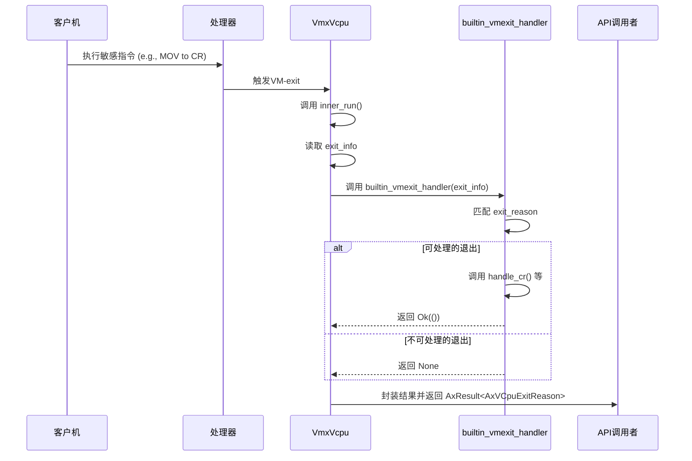

# 错误处理模型

<cite>
**本文档中引用的文件**
- [vcpu.rs](file://src/vmx/vcpu.rs)
- [mod.rs](file://src/vmx/mod.rs)
- [definitions.rs](file://src/vmx/definitions.rs)
- [vmcs.rs](file://src/vmx/vmcs.rs)
- [percpu.rs](file://src/vmx/percpu.rs)
</cite>

## 目录
1. [引言](#引言)
2. [错误类型与Result设计](#错误类型与result设计)
3. [硬件异常到API调用失败的传播链路](#硬件异常到api调用失败的传播链路)
4. [关键函数的错误返回场景与恢复策略](#关键函数的错误返回场景与恢复策略)
5. [panic安全保证措施](#panic安全保证措施)
6. [错误注入测试方法](#错误注入测试方法)
7. [结论](#结论)

## 引言
本项目`x86_vcpu`是一个为Arceos虚拟机监视器实现的x86架构虚拟CPU模块。其核心目标是提供一个安全、高效的虚拟化环境，通过Intel VT-x（VMX）技术来模拟和管理客户操作系统的行为。在这一过程中，错误处理机制扮演着至关重要的角色，它不仅需要捕获从底层硬件异常到高层API调用失败的各种问题，还必须确保系统在面对不可预知的故障时能够保持稳定或优雅地降级。

该模块的错误处理模型建立在Rust语言强大的类型系统之上，利用`Result<T, E>`枚举来显式表达操作的成功或失败状态。这种设计强制开发者在编译期就考虑所有可能的错误路径，从而极大地提高了代码的健壮性和可维护性。同时，对于那些无法恢复的严重错误，则使用`panic!`宏进行处理，以防止状态损坏并终止不安全的操作。

本文档旨在全面解析`x86_vcpu`中的错误处理机制，涵盖从底层硬件异常到高层API调用失败的完整传播链路。我们将详细描述各类`Result`类型的设计意图，如`VmxError`、`VCpuError`等，并分析它们在不同模块间传递的规范。此外，我们还将探讨如何在`unsafe`代码块中确保资源不泄漏或状态不损坏的`panic`安全保证措施，以及关键函数的错误返回场景及对应的恢复策略。

## 错误类型与result设计
在`x86_vcpu`模块中，错误处理的核心是`AxResult<T>`类型别名，它被定义为`Result<T, axerrno::AxError>`。这表明任何可能出错的操作都会返回一个包含成功值`T`或错误值`axerrno::AxError`的结果。`axerrno::AxError`是一个灵活的错误类型，支持携带错误码和上下文信息，使得错误诊断更加直观。

具体而言，`axerrno`库提供了多种构造错误的方法：
- `ax_err!(kind)`：创建一个指定类型的错误。
- `ax_err_type!(kind, msg)`：创建一个带有描述性消息的错误。
- `ax_err!(kind, format_args!(...))`：使用格式化字符串创建带参数的错误。

例如，在`src/vmx/percpu.rs`文件中，当尝试启用VMX但CPU不支持该特性时，会返回`ax_err!(Unsupported, "CPU does not support feature VMX")`；而如果VMX已被其他进程开启，则返回`ax_err!(ResourceBusy, "VMX is already turned on")`。这些具体的错误实例展示了如何根据不同的失败原因选择合适的错误种类，并附加上有助于调试的信息。

此外，`x86_vcpu`还通过`as_axerr`函数将来自`x86` crate的低级VMX指令失败（`VmFail`）转换为更高级别的`AxError`。例如，`VmFail::VmFailValid`会被映射为`BadState`错误，并附带由`vmcs::instruction_error().as_str()`提供的具体错误描述。这种转换机制实现了底层硬件细节与上层逻辑之间的解耦，使错误处理更加抽象且易于理解。

**Section sources**
- [percpu.rs](file://src/vmx/percpu.rs#L3-L120)
- [mod.rs](file://src/vmx/mod.rs#L31-L32)

## 硬件异常到api调用失败的传播链路
`x86_vcpu`中的错误传播遵循一条清晰的路径：从最底层的硬件事件触发VM退出（VM-exit），经过一系列内部处理，最终转化为对上层API调用者的反馈。这一过程涉及多个组件协同工作，确保了错误信息的准确传递和适当处理。

首先，当客户机执行某些敏感指令（如访问控制寄存器CR）或发生外部中断时，处理器会产生一个VM-exit。此时，`VmxVcpu::inner_run`方法会被调用，它负责读取VMCS（虚拟机控制结构）中的退出信息（`exit_info`）。此信息包括退出原因（`exit_reason`）、退出指令长度等关键数据。

接着，`builtin_vmexit_handler`函数会根据`exit_reason`匹配相应的处理分支。例如，对于`CR_ACCESS`类型的退出，它会调用`handle_cr`方法。在这个方法内部，如果检测到不允许的CR访问模式，就会直接触发`panic!`，因为这是违反预期行为的严重错误。而对于可以处理的情况，比如合法的MOV to CR操作，则会更新相应的寄存器状态并返回`Ok(())`。

一旦`builtin_vmexit_handler`完成了它的职责，无论是成功处理还是未能识别的退出原因，结果都会被封装成`AxResult`并通过`run`方法向上传递给调用者。如果处理过程中出现了可恢复的错误（如无效输入），则会立即返回相应的`Err`；如果是不可恢复的错误，则会导致`panic`，进而终止当前VCPU的执行流。

值得注意的是，整个链路中大量使用了`?`操作符来简化错误传播。这意味着只要任何一个步骤返回了`Err`，后续的所有操作都将被短路，错误将迅速向上冒泡直至被捕获或导致程序崩溃。这种方式既保证了代码的简洁性，又确保了错误不会被意外忽略。

**Diagram sources**
- [vcpu.rs](file://src/vmx/vcpu.rs#L254-L359)
- [vcpu.rs](file://src/vmx/vcpu.rs#L962-L992)

**Section sources**
- [vcpu.rs](file://src/vmx/vcpu.rs#L254-L359)
- [vcpu.rs](file://src/vmx/vcpu.rs#L962-L992)

## 关键函数的错误返回场景与恢复策略
在`x86_vcpu`中，几个关键函数承担着初始化、运行和清理VCPU实例的重要任务。它们各自有着明确的错误返回场景和相应的恢复策略。

首先是`VmxPerCpuState::hardware_enable`，该函数用于在物理CPU上启用VMX功能。其主要错误场景包括：
- **Unsupported**: CPU本身不支持VMX扩展，或者BIOS禁用了该功能。
- **ResourceBusy**: VMX已经被另一个实体激活。
- **BadState**: 主机的CR0或CR4寄存器配置不符合VMX操作的要求。

对于上述情况，除了`ResourceBusy`外，通常没有有效的恢复手段，因此函数会选择直接返回错误给调用者，由更高层次的逻辑决定是否重试或其他补救措施。

其次是`VmxVcpu::setup_vmcs`，这个函数负责配置VMCS以准备启动客户机。潜在的错误来源主要是VMX指令执行失败，例如`vmclear`或`vmptrld`失败。这类错误通常归类为`BadState`，并且由于涉及到硬件状态的一致性，一般认为是不可恢复的。一旦发生，应立即放弃当前VCPU的创建流程，并释放已分配的资源。

最后是`VmxVcpu::run`，它是驱动客户机执行的主要入口点。此函数可能遇到的错误包括VM-entry失败（`FailEntry`）或各种VM-exit无法处理的情形。针对`FailEntry`，虽然理论上可以通过修正VMCS配置后重试，但在实践中往往意味着严重的配置错误，故倾向于报告错误而非自动重试。而对于其他类型的退出，则依据具体情况采取行动，如模拟I/O操作、注入中断等。

综上所述，`x86_vcpu`的恢复策略偏向保守，优先保证系统的整体稳定性而不是盲目尝试修复每一个错误。只有在确定安全的前提下才会考虑有限度的重试机制。

**Section sources**
- [percpu.rs](file://src/vmx/percpu.rs#L32-L120)
- [vcpu.rs](file://src/vmx/vcpu.rs#L254-L284)
- [vcpu.rs](file://src/vmx/vcpu.rs#L1318-L1349)

## panic安全保证措施
在`x86_vcpu`的实现中，尤其是在涉及`unsafe`代码块的部分，确保`panic`安全性至关重要。这是因为`panic`可能导致资源泄漏或状态不一致，特别是在直接操作硬件或内存的情况下。

为了达到这一目标，开发团队采用了多种策略：
1. **RAII（资源获取即初始化）**: 所有拥有资源所有权的对象都实现了`Drop` trait。例如，`VmxVcpu`结构体在其`Drop`实现中调用了`vmclear`来清除VMCS，即使是在`panic`发生时也能确保资源得到正确释放。
2. **最小化`unsafe`作用域**: `unsafe`代码块被限制在尽可能小的范围内，仅用于执行必要的低级操作。这样可以减少因不当使用而导致的问题范围。
3. **防御性编程**: 在进入`unsafe`区域之前进行充分的检查，确保前提条件满足。例如，在调用`vmx::vmclear`前验证VMCS指针的有效性。
4. **避免在`unsafe`块内产生`panic`**: 尽量不在`unsafe`代码中引发`panic`，而是提前检查并返回适当的错误码。若确实需要`panic`，也应确保在此之前已完成所有关键资源的清理工作。

特别地，`VmxVcpu::drop`方法就是一个典型的例子。它使用`unsafe`调用`vmx::vmclear`来解除当前VCPU与物理CPU的绑定。尽管这是一个危险的操作，但由于它位于`Drop`实现中，即使在此处发生`panic`，也不会影响到其他部分的安全性，因为此时对象即将被销毁。

总之，通过结合Rust的所有权系统、`Drop`机制和谨慎的`unsafe`使用，`x86_vcpu`有效地保障了即使在极端情况下也能维持系统的完整性。

**Section sources**
- [vcpu.rs](file://src/vmx/vcpu.rs#L1233-L1276)

## 错误注入测试方法
为了验证`x86_vcpu`错误处理机制的健壮性，可以采用错误注入测试的方法。这种方法通过人为制造特定的错误条件，观察系统的行为是否符合预期，从而发现潜在的缺陷。

一种可行的方案是在单元测试中模拟`x86` crate的接口行为。例如，可以创建一个mock版本的`vmx`模块，其中`vmclear`、`vmlaunch`等函数总是返回预设的错误码（如`VmFail::VmFailInvalid`）。然后，使用这个mock模块替换真实依赖，运行现有的测试用例，检查`x86_vcpu`能否正确地将这些底层错误转换为高层的`AxError`并妥善处理。

另一种方法是利用条件编译特性，在测试构建时插入额外的逻辑分支。例如，在`builtin_vmexit_handler`中添加一个`#[cfg(test)]`标记的代码段，允许测试框架强制触发某个特定的`exit_reason`，即使实际硬件并未产生这样的事件。这样就可以针对每种退出情况进行独立的测试覆盖。

此外，还可以借助外部工具，如QEMU的GDB stub，动态修改客户机的状态或发送伪造的中断信号，以此来测试`x86_vcpu`对外部干扰的响应能力。

通过这些手段，不仅可以提高代码覆盖率，还能增强对复杂交互场景的理解，确保`x86_vcpu`在面对真实世界中的各种异常状况时依然可靠。

**Section sources**
- [vcpu.rs](file://src/vmx/vcpu.rs#L1472-L1515)
- [percpu.rs](file://src/vmx/percpu.rs#L121-L167)

## 结论
通过对`x86_vcpu`模块的深入分析，我们可以看到其错误处理机制设计得相当周密。从底层硬件异常的捕捉到高层API调用失败的反馈，整个链路清晰而高效。通过利用Rust语言的类型系统和`Result`枚举，开发者能够以一种声明式的方式表达错误，避免了传统C风格错误码容易被忽略的问题。

同时，`axerrno`库提供的丰富错误构造方式，使得错误信息更具描述性和实用性。结合`panic`安全的最佳实践，如RAII和`Drop` trait的应用，进一步增强了系统的鲁棒性。尽管目前的恢复策略相对保守，但这恰恰反映了在虚拟化环境中对稳定性的高度重视。

未来的工作方向可以集中在完善错误注入测试框架，增加更多边界条件和异常路径的测试用例，以及探索更智能的自动恢复机制，以便在不影响整体安全性的前提下提升用户体验。