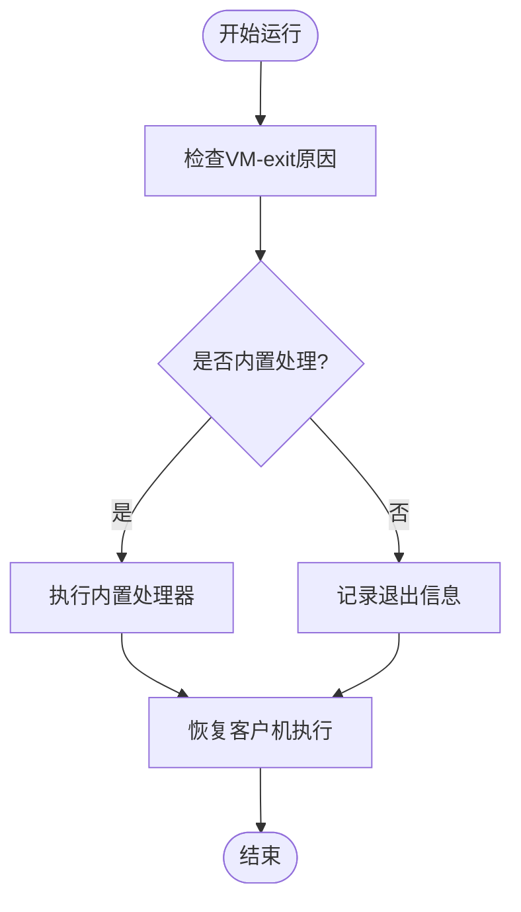

# 高级主题

<cite>
**本文档中引用的文件**
- [percpu.rs](file://src/vmx/percpu.rs)
- [vcpu.rs](file://src/vmx/vcpu.rs)
- [ept.rs](file://src/ept.rs)
- [test_utils.rs](file://src/test_utils.rs)
</cite>

## 目录
1. [多核环境下的vCPU调度与VMX状态管理](#多核环境下的vcpu调度与vmx状态管理)
2. [性能优化策略](#性能优化策略)
3. [错误处理模型与panic安全保证](#错误处理模型与panic安全保证)
4. [调试技巧与日志追踪](#调试技巧与日志追踪)
5. [unsafe代码使用边界与风险控制](#unsafe代码使用边界与风险控制)
6. [可扩展性建议：添加新的VM-exit处理器与自定义HAL实现](#可扩展性建议添加新的vm-exit处理器与自定义hal实现)

## 多核环境下的vCPU调度与VMX状态管理

在多核系统中，Intel VT-x技术要求同一时刻只能有一个逻辑核心处于VMX root operation模式。`VmxPerCpuState`结构体负责管理每个CPU核心的VMX状态，确保这一约束得以满足。该结构体通过CR4寄存器中的VMXE位来启用或禁用VMX操作，并利用`VMXON`和`VMXOFF`指令控制虚拟化功能的开启与关闭。当调用`hardware_enable`方法时，会检查硬件支持情况、BIOS设置以及控制寄存器的状态，以确保进入VMX模式的安全性。

**Section sources**
- [percpu.rs](file://src/vmx/percpu.rs#L0-L220)

## 性能优化策略

减少VM-exit次数是提升虚拟机性能的关键。本项目通过配置VMCS（虚拟机控制结构）中的各种控制字段来实现这一点。例如，在`setup_vmcs_control`函数中，通过设置适当的执行控制标志，可以避免对某些MSR访问或I/O操作产生不必要的VM-exit。此外，EPT（扩展页表）预映射技术允许直接在EPT中建立物理内存映射，从而减少因页面错误导致的VM-exit。同时，合理配置CR3加载/存储拦截等选项也能有效降低上下文切换开销。

**Section sources**
- [vcpu.rs](file://src/vmx/vcpu.rs#L700-L800)

## 错误处理模型与panic安全保证

本库采用`AxResult`类型进行错误传播，结合具体的错误码如`Unsupported`、`ResourceBusy`等提供详细的故障信息。所有可能引发异常的操作都封装在`Result`类型中，确保调用者能够正确处理潜在错误。对于关键路径上的操作，如`vmxon`和`vmxoff`指令执行失败时，会立即返回带有描述信息的错误结果，防止系统进入不一致状态。此外，通过`ax_err_type!`宏生成的错误消息包含格式化参数，增强了调试能力。

**Section sources**
- [percpu.rs](file://src/vmx/percpu.rs#L100-L150)
- [vcpu.rs](file://src/vmx/vcpu.rs#L50-L100)

## 调试技巧与日志追踪

利用`tracing`特性可启用详细的运行时日志记录功能，帮助开发者分析VM-exit频率及其类型分布。通过在`inner_run`方法中插入条件编译的调试输出，可以在每次VM-exit发生前后打印寄存器差异，便于定位问题根源。`test_utils.rs`模块提供了模拟内存分配器`MockMmHal`和虚拟CPU HAL实现`MockVCpuHal`，可用于构建单元测试和集成测试环境，验证各类边界条件下的行为一致性。

**Diagram sources**
- [vcpu.rs](file://src/vmx/vcpu.rs#L400-L500)
- [test_utils.rs](file://src/test_utils.rs#L0-L160)

## unsafe代码使用边界与风险控制

尽管大部分代码保持安全抽象，但在直接操作CPU控制寄存器和物理内存时仍需使用`unsafe`块。这些区域主要集中在`vmx::vmxon`、`vmclear`等底层指令调用以及物理地址到虚拟地址的转换逻辑中。为降低风险，所有`unsafe`代码均被严格限制在最小必要范围内，并辅以充分的前置条件校验。例如，在修改CR4之前先确认当前权限级别；在访问MSR前验证其可用性。此外，借助`paste`宏生成重复代码减少了手动编写指针操作的需求，进一步提升了安全性。

**Section sources**
- [percpu.rs](file://src/vmx/percpu.rs#L150-L200)
- [vcpu.rs](file://src/vmx/vcpu.rs#L300-L400)

## 可扩展性建议：添加新的VM-exit处理器与自定义HAL实现

为了支持新类型的VM-exit事件处理，用户可以通过扩展现有的`builtin_vmexit_handler`逻辑来实现定制化响应。具体做法是在匹配现有退出原因的基础上增加新的分支判断，并调用相应的处理函数。对于更深层次的定制需求，推荐实现自己的`AxVCpuHal` trait实例，覆盖默认的内存管理和设备I/O行为。参考`axvcpu`项目中的HAL实现，可以快速搭建符合特定平台要求的适配层，从而无缝集成到整个虚拟化框架之中。

**Section sources**
- [vcpu.rs](file://src/vmx/vcpu.rs#L500-L600)
- [test_utils.rs](file://src/test_utils.rs#L0-L50)